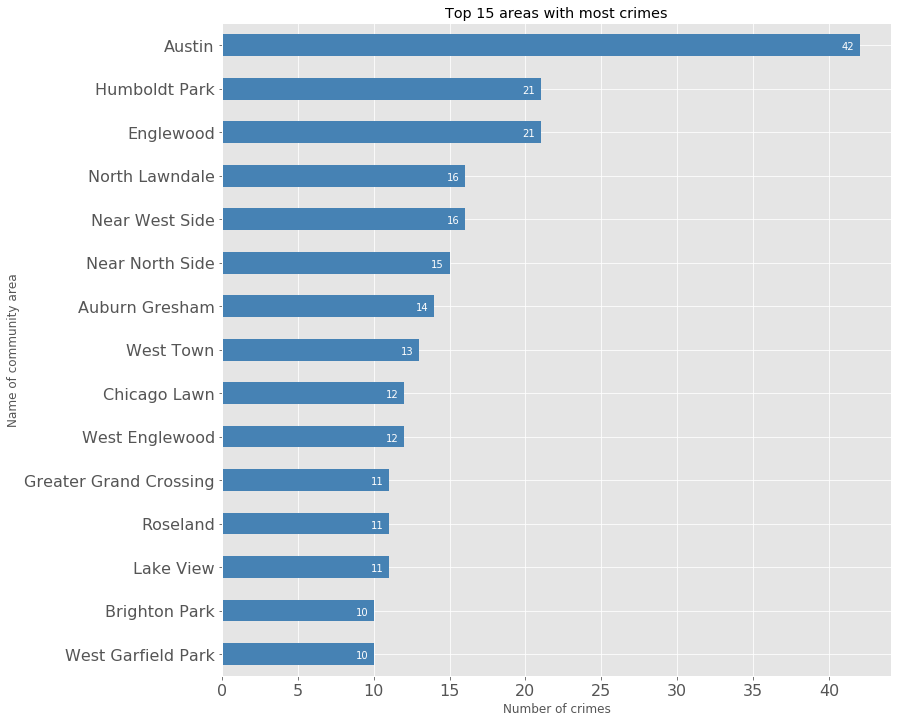
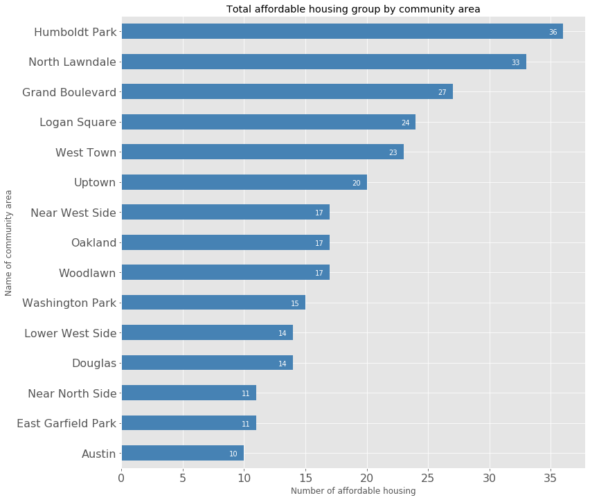
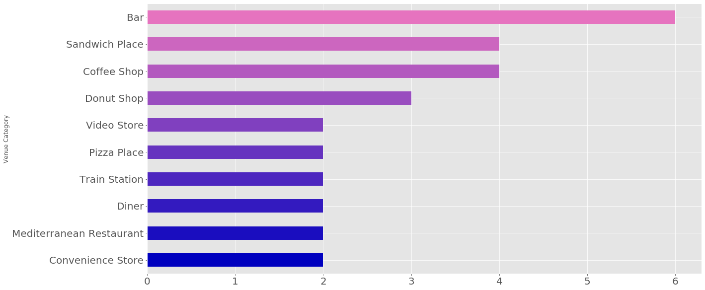

```python
import pandas as pd
```

# Final Report - The Battle of Neighborhoods

## Introduction & Business Problem:
---

One of the main problems when you decided to move to a new city to start a new life is where to find good neighborhoods. There are a whole host of things that need to be considered such as healthcare systems, safety and affordable housing price. A good community will be one of enough healthcare services, low rate of crime and affordable housing price. Throughout this report, we are going to analysis and visualize some community in Chicago. And finally, this report will give a great insight for people who are considering to relocate to Chicago for helping them to make the decision.

The main purpose of this report is going to figure out what are the best living places in Chicago in terms of good healthcare systems, affordable housing price and low rate of crime. 

## Data

### Data - 1: Crimes - 2001 to present
---

https://data.cityofchicago.org/Public-Safety/Crimes-2001-to-present/ijzp-q8t2

This dataset reflects reported incidents of crime (with the exception of murders where data exists for each victim) that occurred in the City of Chicago from 2001 to present, minus the most recent seven days.

This dataset is useful for us to measure safety between each community in the City of Chicago. Since low rate of crime is most important for us to move to a new state. In this report, we are going to use this dataset counting the amount of crime between each community.


```python
df_crime = pd.read_csv('Chicago_Crime_Data-v2.csv')
df_crime.head()
```


<div>
<style scoped>
    .dataframe tbody tr th:only-of-type {
        vertical-align: middle;
    }

    .dataframe tbody tr th {
        vertical-align: top;
    }

    .dataframe thead th {
        text-align: right;
    }
</style>
<table border="1" class="dataframe">
  <thead>
    <tr style="text-align: right;">
      <th></th>
      <th>ID</th>
      <th>CASE_NUMBER</th>
      <th>DATE</th>
      <th>BLOCK</th>
      <th>IUCR</th>
      <th>PRIMARY_TYPE</th>
      <th>DESCRIPTION</th>
      <th>LOCATION_DESCRIPTION</th>
      <th>ARREST</th>
      <th>DOMESTIC</th>
      <th>...</th>
      <th>WARD</th>
      <th>COMMUNITY_AREA_NUMBER</th>
      <th>FBICODE</th>
      <th>X_COORDINATE</th>
      <th>Y_COORDINATE</th>
      <th>YEAR</th>
      <th>UPDATEDON</th>
      <th>LATITUDE</th>
      <th>LONGITUDE</th>
      <th>LOCATION</th>
    </tr>
  </thead>
  <tbody>
    <tr>
      <td>0</td>
      <td>3512276</td>
      <td>HK587712</td>
      <td>08/28/2004 05:50:56 PM</td>
      <td>047XX S KEDZIE AVE</td>
      <td>890</td>
      <td>THEFT</td>
      <td>FROM BUILDING</td>
      <td>SMALL RETAIL STORE</td>
      <td>False</td>
      <td>False</td>
      <td>...</td>
      <td>14.0</td>
      <td>58.0</td>
      <td>6</td>
      <td>1155838.0</td>
      <td>1873050.0</td>
      <td>2004</td>
      <td>02/10/2018 03:50:01 PM</td>
      <td>41.807441</td>
      <td>-87.703956</td>
      <td>(41.8074405, -87.703955849)</td>
    </tr>
    <tr>
      <td>1</td>
      <td>3406613</td>
      <td>HK456306</td>
      <td>06/26/2004 12:40:00 PM</td>
      <td>009XX N CENTRAL PARK AVE</td>
      <td>820</td>
      <td>THEFT</td>
      <td>$500 AND UNDER</td>
      <td>OTHER</td>
      <td>False</td>
      <td>False</td>
      <td>...</td>
      <td>27.0</td>
      <td>23.0</td>
      <td>6</td>
      <td>1152206.0</td>
      <td>1906127.0</td>
      <td>2004</td>
      <td>02/28/2018 03:56:25 PM</td>
      <td>41.898280</td>
      <td>-87.716406</td>
      <td>(41.898279962, -87.716405505)</td>
    </tr>
    <tr>
      <td>2</td>
      <td>8002131</td>
      <td>HT233595</td>
      <td>04/04/2011 05:45:00 AM</td>
      <td>043XX S WABASH AVE</td>
      <td>820</td>
      <td>THEFT</td>
      <td>$500 AND UNDER</td>
      <td>NURSING HOME/RETIREMENT HOME</td>
      <td>False</td>
      <td>False</td>
      <td>...</td>
      <td>3.0</td>
      <td>38.0</td>
      <td>6</td>
      <td>1177436.0</td>
      <td>1876313.0</td>
      <td>2011</td>
      <td>02/10/2018 03:50:01 PM</td>
      <td>41.815933</td>
      <td>-87.624642</td>
      <td>(41.815933131, -87.624642127)</td>
    </tr>
    <tr>
      <td>3</td>
      <td>7903289</td>
      <td>HT133522</td>
      <td>12/30/2010 04:30:00 PM</td>
      <td>083XX S KINGSTON AVE</td>
      <td>840</td>
      <td>THEFT</td>
      <td>FINANCIAL ID THEFT: OVER $300</td>
      <td>RESIDENCE</td>
      <td>False</td>
      <td>False</td>
      <td>...</td>
      <td>7.0</td>
      <td>46.0</td>
      <td>6</td>
      <td>1194622.0</td>
      <td>1850125.0</td>
      <td>2010</td>
      <td>02/10/2018 03:50:01 PM</td>
      <td>41.743665</td>
      <td>-87.562463</td>
      <td>(41.743665322, -87.562462756)</td>
    </tr>
    <tr>
      <td>4</td>
      <td>10402076</td>
      <td>HZ138551</td>
      <td>02/02/2016 07:30:00 PM</td>
      <td>033XX W 66TH ST</td>
      <td>820</td>
      <td>THEFT</td>
      <td>$500 AND UNDER</td>
      <td>ALLEY</td>
      <td>False</td>
      <td>False</td>
      <td>...</td>
      <td>15.0</td>
      <td>66.0</td>
      <td>6</td>
      <td>1155240.0</td>
      <td>1860661.0</td>
      <td>2016</td>
      <td>02/10/2018 03:50:01 PM</td>
      <td>41.773455</td>
      <td>-87.706480</td>
      <td>(41.773455295, -87.706480471)</td>
    </tr>
  </tbody>
</table>
<p>5 rows × 22 columns</p>
</div>


### Data - 2: Chicago Department of Public Health Clinic Locations
---

https://data.cityofchicago.org/Health-Human-Services/Chicago-Department-of-Public-Health-Clinic-Locatio/kcki-hnch

This dataset reflects the location of Public Health Clinic of Chicago Department in the City of Chicago. In addition, the dataset included the Mental Health, Sexually Transmitted Infection and Women Infant Children clinic locations, hours of operation and contact information.

This dataset provided the list of Public Health Clinic information and we will display those information on fulium map.


```python
df_health_clinic = pd.read_csv('Chicago_Department_of_Public_Health_Clinic_Locations.csv')
df_health_clinic.head()
```


<div>
<style scoped>
    .dataframe tbody tr th:only-of-type {
        vertical-align: middle;
    }

    .dataframe tbody tr th {
        vertical-align: top;
    }

    .dataframe thead th {
        text-align: right;
    }
</style>
<table border="1" class="dataframe">
  <thead>
    <tr style="text-align: right;">
      <th></th>
      <th>Site Name</th>
      <th>Clinic Type</th>
      <th>Site Number</th>
      <th>Hours of Operation</th>
      <th>Street Address</th>
      <th>City</th>
      <th>State</th>
      <th>ZIP</th>
      <th>Phone 1</th>
      <th>Phone 2</th>
      <th>...</th>
      <th>Phone 5</th>
      <th>Fax</th>
      <th>Public Health Nursing</th>
      <th>Family Case Management</th>
      <th>Healthy Start Program</th>
      <th>Healthy Families Program</th>
      <th>WIC</th>
      <th>Latitude</th>
      <th>Longitude</th>
      <th>Location</th>
    </tr>
  </thead>
  <tbody>
    <tr>
      <td>0</td>
      <td>Austin STI Specialty Clinic</td>
      <td>STI Specialty Clinic</td>
      <td>NaN</td>
      <td>Mon and Wed: 8:00 a.m. - 4:00 p.m.; Tues: 9:00...</td>
      <td>4909 W. Division St., Suite 411</td>
      <td>Chicago</td>
      <td>IL</td>
      <td>60651</td>
      <td>312-746-4871</td>
      <td>NaN</td>
      <td>...</td>
      <td>NaN</td>
      <td>312-746-4637</td>
      <td>NaN</td>
      <td>NaN</td>
      <td>NaN</td>
      <td>NaN</td>
      <td>NaN</td>
      <td>41.902212</td>
      <td>-87.748845</td>
      <td>(41.902212, -87.748845)</td>
    </tr>
    <tr>
      <td>1</td>
      <td>Englewood MHC</td>
      <td>Mental Health Clinic</td>
      <td>NaN</td>
      <td>Mon - Fri: 8:30 a.m. – 4:30 p.m.</td>
      <td>641 W. 63rd St</td>
      <td>Chicago</td>
      <td>IL</td>
      <td>60621</td>
      <td>312-747-7496</td>
      <td>NaN</td>
      <td>...</td>
      <td>NaN</td>
      <td>NaN</td>
      <td>NaN</td>
      <td>NaN</td>
      <td>NaN</td>
      <td>NaN</td>
      <td>NaN</td>
      <td>41.779692</td>
      <td>-87.641428</td>
      <td>(41.779692, -87.641428)</td>
    </tr>
    <tr>
      <td>2</td>
      <td>Englewood STI Specialty Clinic</td>
      <td>STI Specialty Clinic</td>
      <td>NaN</td>
      <td>Mon, Wed &amp; Fri: 8:00 a.m. - 4:00 p.m.; Tues &amp; ...</td>
      <td>641 W. 63rd St., Lower Level</td>
      <td>Chicago</td>
      <td>IL</td>
      <td>60621</td>
      <td>312-747-8900</td>
      <td>NaN</td>
      <td>...</td>
      <td>NaN</td>
      <td>312-747-0292</td>
      <td>NaN</td>
      <td>NaN</td>
      <td>NaN</td>
      <td>NaN</td>
      <td>NaN</td>
      <td>41.779692</td>
      <td>-87.641428</td>
      <td>(41.779692, -87.641428)</td>
    </tr>
    <tr>
      <td>3</td>
      <td>Greater Grand/MID-South MHC</td>
      <td>Mental Health Clinic</td>
      <td>NaN</td>
      <td>Mon - Fri: 8:30 a.m. – 4:30 p.m.</td>
      <td>4314 S. Cottage Grove</td>
      <td>Chicago</td>
      <td>IL</td>
      <td>60653</td>
      <td>312-747-0036</td>
      <td>NaN</td>
      <td>...</td>
      <td>NaN</td>
      <td>NaN</td>
      <td>NaN</td>
      <td>NaN</td>
      <td>NaN</td>
      <td>NaN</td>
      <td>NaN</td>
      <td>41.816326</td>
      <td>-87.606847</td>
      <td>(41.816326, -87.606847)</td>
    </tr>
    <tr>
      <td>4</td>
      <td>Alivio Medical Center</td>
      <td>WIC Clinic</td>
      <td>106.0</td>
      <td>Mon, Tues, Thurs &amp; Fri: 8:00 a.m. - 4:30 p.m.;...</td>
      <td>2355 S. Western Ave.</td>
      <td>Chicago</td>
      <td>IL</td>
      <td>60608</td>
      <td>773-843-4220</td>
      <td>773-650-1205</td>
      <td>...</td>
      <td>NaN</td>
      <td>773-650-1232</td>
      <td>NaN</td>
      <td>NaN</td>
      <td>NaN</td>
      <td>NaN</td>
      <td>Y</td>
      <td>41.848583</td>
      <td>-87.685394</td>
      <td>(41.848583, -87.685394)</td>
    </tr>
  </tbody>
</table>
<p>5 rows × 22 columns</p>
</div>


### Data - 3: Affordable Rental Housing Developments
---

https://data.cityofchicago.org/Community-Economic-Development/Affordable-Rental-Housing-Developments/s6ha-ppgi

This dataset reflects the rental housing developments among the thousands of affordable units that are supported by City of Chicago programs to affordability in local neighborhoods.

We will use to display affordable rental housing development projects location information on a map and used to form a cluster.


```python
df_affordable_rental_housing = pd.read_csv('Affordable_Rental_Housing_Developments.csv')
df_affordable_rental_housing.head()
```


<div>
<style scoped>
    .dataframe tbody tr th:only-of-type {
        vertical-align: middle;
    }

    .dataframe tbody tr th {
        vertical-align: top;
    }

    .dataframe thead th {
        text-align: right;
    }
</style>
<table border="1" class="dataframe">
  <thead>
    <tr style="text-align: right;">
      <th></th>
      <th>Community Area Name</th>
      <th>Community Area Number</th>
      <th>Property Type</th>
      <th>Property Name</th>
      <th>Address</th>
      <th>Zip Code</th>
      <th>Phone Number</th>
      <th>Management Company</th>
      <th>Units</th>
      <th>X Coordinate</th>
      <th>Y Coordinate</th>
      <th>Latitude</th>
      <th>Longitude</th>
      <th>Location</th>
    </tr>
  </thead>
  <tbody>
    <tr>
      <td>0</td>
      <td>Portage Park</td>
      <td>15</td>
      <td>ARO</td>
      <td>4812-15 W. Montrose Apts.</td>
      <td>4812-15 W. Montrose Ave.</td>
      <td>60641</td>
      <td>630-694-6968</td>
      <td>@properties</td>
      <td>2</td>
      <td>NaN</td>
      <td>NaN</td>
      <td>NaN</td>
      <td>NaN</td>
      <td>NaN</td>
    </tr>
    <tr>
      <td>1</td>
      <td>West Englewood</td>
      <td>67</td>
      <td>Multifamily</td>
      <td>New West Englewood Homes</td>
      <td>2109 W. 63rd St.</td>
      <td>60636</td>
      <td>773-434-4929</td>
      <td>Interfaith Housing Corp.</td>
      <td>12</td>
      <td>NaN</td>
      <td>NaN</td>
      <td>NaN</td>
      <td>NaN</td>
      <td>NaN</td>
    </tr>
    <tr>
      <td>2</td>
      <td>Englewood</td>
      <td>68</td>
      <td>Multifamily</td>
      <td>Antioch Homes II</td>
      <td>301 W. Marquette Road</td>
      <td>60621</td>
      <td>773-994-4546</td>
      <td>Universal Management Service, Inc.</td>
      <td>69</td>
      <td>1.175445e+06</td>
      <td>1.860492e+06</td>
      <td>41.772564</td>
      <td>-87.632419</td>
      <td>(41.7725637689, -87.6324193182)</td>
    </tr>
    <tr>
      <td>3</td>
      <td>Washington Park</td>
      <td>40</td>
      <td>Senior HUD 202</td>
      <td>St. Edmund's Corners</td>
      <td>5556 S. Michigan Ave.</td>
      <td>60637</td>
      <td>773-667-7583</td>
      <td>St. Edmund's Redevelopment Corp.</td>
      <td>53</td>
      <td>1.178070e+06</td>
      <td>1.867952e+06</td>
      <td>41.792975</td>
      <td>-87.622569</td>
      <td>(41.7929745219, -87.6225685185)</td>
    </tr>
    <tr>
      <td>4</td>
      <td>Humboldt Park</td>
      <td>23</td>
      <td>Multifamily</td>
      <td>Nelson Mandela Apts.</td>
      <td>526 N. Troy St.</td>
      <td>60624</td>
      <td>773-227-6332</td>
      <td>Bickerdike Apts.</td>
      <td>6</td>
      <td>1.155238e+06</td>
      <td>1.903559e+06</td>
      <td>41.891173</td>
      <td>-87.705338</td>
      <td>(41.8911727354, -87.7053383382)</td>
    </tr>
  </tbody>
</table>
</div>


## Methodology

### Business Understanding:
Our main goal is to find good neighorhoods community area in the City of Chicago.

### Analytic Approach:
The City of Chicago has a total of 77 community areas. In this project we are going to visualize the dataset and put it on the map to observe the best community area.

### Import necessary libraries


```python
!conda install -c conda-forge geopy --yes
!conda install -c conda-forge folium --yes
```

    Collecting package metadata (current_repodata.json): done
    Solving environment: done
    
    # All requested packages already installed.
    
    Collecting package metadata (current_repodata.json): done
    Solving environment: done
    
    # All requested packages already installed.
    


```python
import requests
import pandas as pd
import numpy as np
import folium
from geopy.geocoders import Nominatim
```

### Fetch list of community area in the City of Chicago from Wikipedia


```python
wikipedia_chicago_community_area_link = 'https://en.wikipedia.org/wiki/Community_areas_in_Chicago'
response = requests.get(wikipedia_chicago_community_area_link)
html_page_sources = response.text
```


```python
from bs4 import BeautifulSoup
beautiful_soup = BeautifulSoup(html_page_sources, 'html.parser')
tables = beautiful_soup.find_all('table')
# tables
```


```python
columns = ['Community_Area_Number', 'Community_Area', 'Neighborhoods']
pd_tables = pd.read_html(str(tables))
table_frames = []
for index, table in enumerate(pd_tables):
    df_table = pd.DataFrame.from_dict(table)
    if index == 9:
        break
    df_table.columns = columns
    table_frames.append(df_table)

df_community_area = pd.concat(table_frames)
df_community_area.head()
```


<div>
<style scoped>
    .dataframe tbody tr th:only-of-type {
        vertical-align: middle;
    }

    .dataframe tbody tr th {
        vertical-align: top;
    }

    .dataframe thead th {
        text-align: right;
    }
</style>
<table border="1" class="dataframe">
  <thead>
    <tr style="text-align: right;">
      <th></th>
      <th>Community_Area_Number</th>
      <th>Community_Area</th>
      <th>Neighborhoods</th>
    </tr>
  </thead>
  <tbody>
    <tr>
      <td>0</td>
      <td>8</td>
      <td>Near North Side</td>
      <td>Cabrini–Green The Gold Coast Goose Island Magn...</td>
    </tr>
    <tr>
      <td>1</td>
      <td>32</td>
      <td>Loop</td>
      <td>Loop New Eastside South Loop West Loop Gate</td>
    </tr>
    <tr>
      <td>2</td>
      <td>33</td>
      <td>Near South Side</td>
      <td>Dearborn Park Printer's Row South Loop Prairie...</td>
    </tr>
    <tr>
      <td>0</td>
      <td>5</td>
      <td>North Center</td>
      <td>Horner Park Roscoe Village</td>
    </tr>
    <tr>
      <td>1</td>
      <td>6</td>
      <td>Lake View</td>
      <td>Boystown Lake View East Graceland West South E...</td>
    </tr>
  </tbody>
</table>
</div>


**Data 1** - the list of community area in the City of Chicago from Wikipedia
1. We scrape the list from wikipedia website.
2. Convert the html page source into pandas data frame object.


```python
df_community_area.dtypes
```


    Community_Area_Number     int64
    Community_Area           object
    Neighborhoods            object
    dtype: object


### Visualize the data set of crime in some communities


```python
df_crime.dropna(inplace=True)
df_crime = df_crime.apply(pd.to_numeric, errors='ignore')
df_crime.dtypes
```


    ID                         int64
    CASE_NUMBER               object
    DATE                      object
    BLOCK                     object
    IUCR                      object
    PRIMARY_TYPE              object
    DESCRIPTION               object
    LOCATION_DESCRIPTION      object
    ARREST                      bool
    DOMESTIC                    bool
    BEAT                       int64
    DISTRICT                   int64
    WARD                     float64
    COMMUNITY_AREA_NUMBER    float64
    FBICODE                   object
    X_COORDINATE             float64
    Y_COORDINATE             float64
    YEAR                       int64
    UPDATEDON                 object
    LATITUDE                 float64
    LONGITUDE                float64
    LOCATION                  object
    dtype: object


```python
df_crime_grouped_by_community = df_crime.groupby('COMMUNITY_AREA_NUMBER', as_index=False)['COMMUNITY_AREA_NUMBER'].agg({'Count': 'count'})

df_crime_grouped_by_community.rename(columns={'COMMUNITY_AREA_NUMBER': 'Community_Area_Number'}, inplace=True)
df_crime_grouped_by_community = pd.merge(
    df_crime_grouped_by_community,
    df_community_area,
    how='left',
    on=['Community_Area_Number']).drop(['Community_Area_Number'], axis=1)

df_top15 = df_crime_grouped_by_community.set_index(['Community_Area'])
df_top15.sort_values(by='Count', ascending=True, inplace=True)

df_top15 = df_top15['Count'].tail(15)
df_top15
```


    Community_Area
    West Garfield Park        10
    Brighton Park             10
    Lake View                 11
    Roseland                  11
    Greater Grand Crossing    11
    West Englewood            12
    Chicago Lawn              12
    West Town                 13
    Auburn Gresham            14
    Near North Side           15
    Near West Side            16
    North Lawndale            16
    Englewood                 21
    Humboldt Park             21
    Austin                    42
    Name: Count, dtype: int64


```python
%matplotlib inline

import matplotlib as mpl
import matplotlib.pyplot as plt

mpl.style.use('ggplot')

print('Matplotlib version: ', mpl.__version__)
```

    Matplotlib version:  3.1.1


```python
df_top15.plot(
    kind='barh',
    figsize=(12, 12),
    color='steelblue',
    fontsize=16,
)
plt.title('Top 15 areas with most crimes')
plt.xlabel('Number of crimes')
plt.ylabel('Name of community area')

for index, value in enumerate(df_top15):
    label = str(value)
    plt.annotate(label, xy=(value-1.2, index-0.10), color='white')

plt.show()
```





**Figure 1**: the most violent community area in the City of Chicago


```python
df_top15 = df_crime_grouped_by_community.copy()
df_top15.sort_values(by='Count', ascending=True, inplace=True)

df_top15 = df_top15.head(15)

lats = []
lngs = []
geolocator = Nominatim(user_agent='Chicago_explorer')
for area in df_top15.loc[:, 'Community_Area']:
    location = geolocator.geocode(area)
    lats.append(location.latitude)
    lngs.append(location.longitude)
    
df_top15['Latitude'] = lats
df_top15['Longitude'] = lngs
df_top15.drop(['Count'], axis=1, inplace=True)
df_top15.reset_index(inplace=True)
df_top15.head()
```


<div>
<style scoped>
    .dataframe tbody tr th:only-of-type {
        vertical-align: middle;
    }

    .dataframe tbody tr th {
        vertical-align: top;
    }

    .dataframe thead th {
        text-align: right;
    }
</style>
<table border="1" class="dataframe">
  <thead>
    <tr style="text-align: right;">
      <th></th>
      <th>index</th>
      <th>Community_Area</th>
      <th>Neighborhoods</th>
      <th>Latitude</th>
      <th>Longitude</th>
    </tr>
  </thead>
  <tbody>
    <tr>
      <td>0</td>
      <td>30</td>
      <td>Near South Side</td>
      <td>Dearborn Park Printer's Row South Loop Prairie...</td>
      <td>41.856700</td>
      <td>-87.624774</td>
    </tr>
    <tr>
      <td>1</td>
      <td>67</td>
      <td>Morgan Park</td>
      <td>Beverly Woods Kennedy Park West Morgan Park</td>
      <td>41.690312</td>
      <td>-87.666716</td>
    </tr>
    <tr>
      <td>2</td>
      <td>41</td>
      <td>Burnside</td>
      <td>NaN</td>
      <td>-34.944479</td>
      <td>138.647266</td>
    </tr>
    <tr>
      <td>3</td>
      <td>53</td>
      <td>Bridgeport</td>
      <td>NaN</td>
      <td>41.167041</td>
      <td>-73.204835</td>
    </tr>
    <tr>
      <td>4</td>
      <td>49</td>
      <td>Hegewisch</td>
      <td>NaN</td>
      <td>41.653646</td>
      <td>-87.546988</td>
    </tr>
  </tbody>
</table>
</div>


```python
address = 'Chicago'

geolocator = Nominatim(user_agent='Chicago_explorer')

location = geolocator.geocode(address)
latitude = location.latitude
longitude = location.longitude

print(f'The geographical coordinates of Chicago are {latitude}, {longitude}')

map_chicago = folium.Map(location=[latitude, longitude], zoom_start=10)
```

    The geographical coordinates of Chicago are 41.8755616, -87.6244212


### Display the most higher rate of crime of communities location on Map


```python
for lat, lon, label in zip(df_top15['Latitude'], df_top15['Longitude'], df_top15['Community_Area']):
    label = folium.Popup(label, parse_html=True)
    folium.CircleMarker(
        [lat, lon],
        radius=10,
        popup=label,
        color='red',
        fill=True,
        fill_color='#3186cc',
        fill_capacity=0.7,
        parse_html=False,
    ).add_to(map_chicago)

map_chicago
```


<div style="width:100%;"><div style="position:relative;width:100%;height:0;padding-bottom:60%;"><iframe src="about:blank" style="position:absolute;width:100%;height:100%;left:0;top:0;border:none !important;" data-html=PCFET0NUWVBFIGh0bWw+CjxoZWFkPiAgICAKICAgIDxtZXRhIGh0dHAtZXF1aXY9ImNvbnRlbnQtdHlwZSIgY29udGVudD0idGV4dC9odG1sOyBjaGFyc2V0PVVURi04IiAvPgogICAgCiAgICAgICAgPHNjcmlwdD4KICAgICAgICAgICAgTF9OT19UT1VDSCA9IGZhbHNlOwogICAgICAgICAgICBMX0RJU0FCTEVfM0QgPSBmYWxzZTsKICAgICAgICA8L3NjcmlwdD4KICAgIAogICAgPHNjcmlwdCBzcmM9Imh0dHBzOi8vY2RuLmpzZGVsaXZyLm5ldC9ucG0vbGVhZmxldEAxLjUuMS9kaXN0L2xlYWZsZXQuanMiPjwvc2NyaXB0PgogICAgPHNjcmlwdCBzcmM9Imh0dHBzOi8vY29kZS5qcXVlcnkuY29tL2pxdWVyeS0xLjEyLjQubWluLmpzIj48L3NjcmlwdD4KICAgIDxzY3JpcHQgc3JjPSJodHRwczovL21heGNkbi5ib290c3RyYXBjZG4uY29tL2Jvb3RzdHJhcC8zLjIuMC9qcy9ib290c3RyYXAubWluLmpzIj48L3NjcmlwdD4KICAgIDxzY3JpcHQgc3JjPSJodHRwczovL2NkbmpzLmNsb3VkZmxhcmUuY29tL2FqYXgvbGlicy9MZWFmbGV0LmF3ZXNvbWUtbWFya2Vycy8yLjAuMi9sZWFmbGV0LmF3ZXNvbWUtbWFya2Vycy5qcyI+PC9zY3JpcHQ+CiAgICA8bGluayByZWw9InN0eWxlc2hlZXQiIGhyZWY9Imh0dHBzOi8vY2RuLmpzZGVsaXZyLm5ldC9ucG0vbGVhZmxldEAxLjUuMS9kaXN0L2xlYWZsZXQuY3NzIi8+CiAgICA8bGluayByZWw9InN0eWxlc2hlZXQiIGhyZWY9Imh0dHBzOi8vbWF4Y2RuLmJvb3RzdHJhcGNkbi5jb20vYm9vdHN0cmFwLzMuMi4wL2Nzcy9ib290c3RyYXAubWluLmNzcyIvPgogICAgPGxpbmsgcmVsPSJzdHlsZXNoZWV0IiBocmVmPSJodHRwczovL21heGNkbi5ib290c3RyYXBjZG4uY29tL2Jvb3RzdHJhcC8zLjIuMC9jc3MvYm9vdHN0cmFwLXRoZW1lLm1pbi5jc3MiLz4KICAgIDxsaW5rIHJlbD0ic3R5bGVzaGVldCIgaHJlZj0iaHR0cHM6Ly9tYXhjZG4uYm9vdHN0cmFwY2RuLmNvbS9mb250LWF3ZXNvbWUvNC42LjMvY3NzL2ZvbnQtYXdlc29tZS5taW4uY3NzIi8+CiAgICA8bGluayByZWw9InN0eWxlc2hlZXQiIGhyZWY9Imh0dHBzOi8vY2RuanMuY2xvdWRmbGFyZS5jb20vYWpheC9saWJzL0xlYWZsZXQuYXdlc29tZS1tYXJrZXJzLzIuMC4yL2xlYWZsZXQuYXdlc29tZS1tYXJrZXJzLmNzcyIvPgogICAgPGxpbmsgcmVsPSJzdHlsZXNoZWV0IiBocmVmPSJodHRwczovL3Jhd2Nkbi5naXRoYWNrLmNvbS9weXRob24tdmlzdWFsaXphdGlvbi9mb2xpdW0vbWFzdGVyL2ZvbGl1bS90ZW1wbGF0ZXMvbGVhZmxldC5hd2Vzb21lLnJvdGF0ZS5jc3MiLz4KICAgIDxzdHlsZT5odG1sLCBib2R5IHt3aWR0aDogMTAwJTtoZWlnaHQ6IDEwMCU7bWFyZ2luOiAwO3BhZGRpbmc6IDA7fTwvc3R5bGU+CiAgICA8c3R5bGU+I21hcCB7cG9zaXRpb246YWJzb2x1dGU7dG9wOjA7Ym90dG9tOjA7cmlnaHQ6MDtsZWZ0OjA7fTwvc3R5bGU+CiAgICAKICAgICAgICAgICAgPG1ldGEgbmFtZT0idmlld3BvcnQiIGNvbnRlbnQ9IndpZHRoPWRldmljZS13aWR0aCwKICAgICAgICAgICAgICAgIGluaXRpYWwtc2NhbGU9MS4wLCBtYXhpbXVtLXNjYWxlPTEuMCwgdXNlci1zY2FsYWJsZT1ubyIgLz4KICAgICAgICAgICAgPHN0eWxlPgogICAgICAgICAgICAgICAgI21hcF80NTY0NDVlZDVhOWI0ODFlOTkyYmQ0NTI4YzY4YjI0NCB7CiAgICAgICAgICAgICAgICAgICAgcG9zaXRpb246IHJlbGF0aXZlOwogICAgICAgICAgICAgICAgICAgIHdpZHRoOiAxMDAuMCU7CiAgICAgICAgICAgICAgICAgICAgaGVpZ2h0OiAxMDAuMCU7CiAgICAgICAgICAgICAgICAgICAgbGVmdDogMC4wJTsKICAgICAgICAgICAgICAgICAgICB0b3A6IDAuMCU7CiAgICAgICAgICAgICAgICB9CiAgICAgICAgICAgIDwvc3R5bGU+CiAgICAgICAgCjwvaGVhZD4KPGJvZHk+ICAgIAogICAgCiAgICAgICAgICAgIDxkaXYgY2xhc3M9ImZvbGl1bS1tYXAiIGlkPSJtYXBfNDU2NDQ1ZWQ1YTliNDgxZTk5MmJkNDUyOGM2OGIyNDQiID48L2Rpdj4KICAgICAgICAKPC9ib2R5Pgo8c2NyaXB0PiAgICAKICAgIAogICAgICAgICAgICB2YXIgbWFwXzQ1NjQ0NWVkNWE5YjQ4MWU5OTJiZDQ1MjhjNjhiMjQ0ID0gTC5tYXAoCiAgICAgICAgICAgICAgICAibWFwXzQ1NjQ0NWVkNWE5YjQ4MWU5OTJiZDQ1MjhjNjhiMjQ0IiwKICAgICAgICAgICAgICAgIHsKICAgICAgICAgICAgICAgICAgICBjZW50ZXI6IFs0MS44NzU1NjE2LCAtODcuNjI0NDIxMl0sCiAgICAgICAgICAgICAgICAgICAgY3JzOiBMLkNSUy5FUFNHMzg1NywKICAgICAgICAgICAgICAgICAgICB6b29tOiAxMCwKICAgICAgICAgICAgICAgICAgICB6b29tQ29udHJvbDogdHJ1ZSwKICAgICAgICAgICAgICAgICAgICBwcmVmZXJDYW52YXM6IGZhbHNlLAogICAgICAgICAgICAgICAgfQogICAgICAgICAgICApOwoKICAgICAgICAgICAgCgogICAgICAgIAogICAgCiAgICAgICAgICAgIHZhciB0aWxlX2xheWVyX2MyMDFlOTE2MTc4ZjQ2NGFiODlmZjVhYzk4MGZlZjkzID0gTC50aWxlTGF5ZXIoCiAgICAgICAgICAgICAgICAiaHR0cHM6Ly97c30udGlsZS5vcGVuc3RyZWV0bWFwLm9yZy97en0ve3h9L3t5fS5wbmciLAogICAgICAgICAgICAgICAgeyJhdHRyaWJ1dGlvbiI6ICJEYXRhIGJ5IFx1MDAyNmNvcHk7IFx1MDAzY2EgaHJlZj1cImh0dHA6Ly9vcGVuc3RyZWV0bWFwLm9yZ1wiXHUwMDNlT3BlblN0cmVldE1hcFx1MDAzYy9hXHUwMDNlLCB1bmRlciBcdTAwM2NhIGhyZWY9XCJodHRwOi8vd3d3Lm9wZW5zdHJlZXRtYXAub3JnL2NvcHlyaWdodFwiXHUwMDNlT0RiTFx1MDAzYy9hXHUwMDNlLiIsICJkZXRlY3RSZXRpbmEiOiBmYWxzZSwgIm1heE5hdGl2ZVpvb20iOiAxOCwgIm1heFpvb20iOiAxOCwgIm1pblpvb20iOiAwLCAibm9XcmFwIjogZmFsc2UsICJvcGFjaXR5IjogMSwgInN1YmRvbWFpbnMiOiAiYWJjIiwgInRtcyI6IGZhbHNlfQogICAgICAgICAgICApLmFkZFRvKG1hcF80NTY0NDVlZDVhOWI0ODFlOTkyYmQ0NTI4YzY4YjI0NCk7CiAgICAgICAgCiAgICAKICAgICAgICAgICAgdmFyIGNpcmNsZV9tYXJrZXJfMzg1NTgyMGZhMjZkNDQwZDllODUyN2FmNmY3MDQ4MDAgPSBMLmNpcmNsZU1hcmtlcigKICAgICAgICAgICAgICAgIFs0MS44NTY2OTk5LCAtODcuNjI0NzczOF0sCiAgICAgICAgICAgICAgICB7ImJ1YmJsaW5nTW91c2VFdmVudHMiOiB0cnVlLCAiY29sb3IiOiAicmVkIiwgImRhc2hBcnJheSI6IG51bGwsICJkYXNoT2Zmc2V0IjogbnVsbCwgImZpbGwiOiB0cnVlLCAiZmlsbENvbG9yIjogIiMzMTg2Y2MiLCAiZmlsbE9wYWNpdHkiOiAwLjIsICJmaWxsUnVsZSI6ICJldmVub2RkIiwgImxpbmVDYXAiOiAicm91bmQiLCAibGluZUpvaW4iOiAicm91bmQiLCAib3BhY2l0eSI6IDEuMCwgInJhZGl1cyI6IDEwLCAic3Ryb2tlIjogdHJ1ZSwgIndlaWdodCI6IDN9CiAgICAgICAgICAgICkuYWRkVG8obWFwXzQ1NjQ0NWVkNWE5YjQ4MWU5OTJiZDQ1MjhjNjhiMjQ0KTsKICAgICAgICAKICAgIAogICAgICAgIHZhciBwb3B1cF9jYmI0YmM2YzNlNzk0YWJhOTkxZWEyZTgxNmE4OWRjNCA9IEwucG9wdXAoeyJtYXhXaWR0aCI6ICIxMDAlIn0pOwoKICAgICAgICAKICAgICAgICAgICAgdmFyIGh0bWxfMzlkZWE4ZDQ1OTNkNGE4YWI2OTRmNjhiOGExNGEwZjUgPSAkKGA8ZGl2IGlkPSJodG1sXzM5ZGVhOGQ0NTkzZDRhOGFiNjk0ZjY4YjhhMTRhMGY1IiBzdHlsZT0id2lkdGg6IDEwMC4wJTsgaGVpZ2h0OiAxMDAuMCU7Ij5OZWFyIFNvdXRoIFNpZGU8L2Rpdj5gKVswXTsKICAgICAgICAgICAgcG9wdXBfY2JiNGJjNmMzZTc5NGFiYTk5MWVhMmU4MTZhODlkYzQuc2V0Q29udGVudChodG1sXzM5ZGVhOGQ0NTkzZDRhOGFiNjk0ZjY4YjhhMTRhMGY1KTsKICAgICAgICAKCiAgICAgICAgY2lyY2xlX21hcmtlcl8zODU1ODIwZmEyNmQ0NDBkOWU4NTI3YWY2ZjcwNDgwMC5iaW5kUG9wdXAocG9wdXBfY2JiNGJjNmMzZTc5NGFiYTk5MWVhMmU4MTZhODlkYzQpCiAgICAgICAgOwoKICAgICAgICAKICAgIAogICAgCiAgICAgICAgICAgIHZhciBjaXJjbGVfbWFya2VyXzc0NWViYjRhZTQ5ODQ0ZTZhZGQwMDUxZTAzYzYxMGM1ID0gTC5jaXJjbGVNYXJrZXIoCiAgICAgICAgICAgICAgICBbNDEuNjkwMzExNywgLTg3LjY2NjcxNTZdLAogICAgICAgICAgICAgICAgeyJidWJibGluZ01vdXNlRXZlbnRzIjogdHJ1ZSwgImNvbG9yIjogInJlZCIsICJkYXNoQXJyYXkiOiBudWxsLCAiZGFzaE9mZnNldCI6IG51bGwsICJmaWxsIjogdHJ1ZSwgImZpbGxDb2xvciI6ICIjMzE4NmNjIiwgImZpbGxPcGFjaXR5IjogMC4yLCAiZmlsbFJ1bGUiOiAiZXZlbm9kZCIsICJsaW5lQ2FwIjogInJvdW5kIiwgImxpbmVKb2luIjogInJvdW5kIiwgIm9wYWNpdHkiOiAxLjAsICJyYWRpdXMiOiAxMCwgInN0cm9rZSI6IHRydWUsICJ3ZWlnaHQiOiAzfQogICAgICAgICAgICApLmFkZFRvKG1hcF80NTY0NDVlZDVhOWI0ODFlOTkyYmQ0NTI4YzY4YjI0NCk7CiAgICAgICAgCiAgICAKICAgICAgICB2YXIgcG9wdXBfMDc3MjU5ZWM1ZGQ2NDdjNGFhMDNmOGJhZGEyN2QzNzcgPSBMLnBvcHVwKHsibWF4V2lkdGgiOiAiMTAwJSJ9KTsKCiAgICAgICAgCiAgICAgICAgICAgIHZhciBodG1sX2I0MDVkZGZmMjg0MjRlYTBiN2FhMTNlNDhkOTczODI5ID0gJChgPGRpdiBpZD0iaHRtbF9iNDA1ZGRmZjI4NDI0ZWEwYjdhYTEzZTQ4ZDk3MzgyOSIgc3R5bGU9IndpZHRoOiAxMDAuMCU7IGhlaWdodDogMTAwLjAlOyI+TW9yZ2FuIFBhcms8L2Rpdj5gKVswXTsKICAgICAgICAgICAgcG9wdXBfMDc3MjU5ZWM1ZGQ2NDdjNGFhMDNmOGJhZGEyN2QzNzcuc2V0Q29udGVudChodG1sX2I0MDVkZGZmMjg0MjRlYTBiN2FhMTNlNDhkOTczODI5KTsKICAgICAgICAKCiAgICAgICAgY2lyY2xlX21hcmtlcl83NDVlYmI0YWU0OTg0NGU2YWRkMDA1MWUwM2M2MTBjNS5iaW5kUG9wdXAocG9wdXBfMDc3MjU5ZWM1ZGQ2NDdjNGFhMDNmOGJhZGEyN2QzNzcpCiAgICAgICAgOwoKICAgICAgICAKICAgIAogICAgCiAgICAgICAgICAgIHZhciBjaXJjbGVfbWFya2VyXzkwMTYyMjczYzdiNzRlZTQ4MTQyOTNhMGQyOGM4ZjRmID0gTC5jaXJjbGVNYXJrZXIoCiAgICAgICAgICAgICAgICBbLTM0Ljk0NDQ3OSwgMTM4LjY0NzI2NTgwNjQ1NzAzXSwKICAgICAgICAgICAgICAgIHsiYnViYmxpbmdNb3VzZUV2ZW50cyI6IHRydWUsICJjb2xvciI6ICJyZWQiLCAiZGFzaEFycmF5IjogbnVsbCwgImRhc2hPZmZzZXQiOiBudWxsLCAiZmlsbCI6IHRydWUsICJmaWxsQ29sb3IiOiAiIzMxODZjYyIsICJmaWxsT3BhY2l0eSI6IDAuMiwgImZpbGxSdWxlIjogImV2ZW5vZGQiLCAibGluZUNhcCI6ICJyb3VuZCIsICJsaW5lSm9pbiI6ICJyb3VuZCIsICJvcGFjaXR5IjogMS4wLCAicmFkaXVzIjogMTAsICJzdHJva2UiOiB0cnVlLCAid2VpZ2h0IjogM30KICAgICAgICAgICAgKS5hZGRUbyhtYXBfNDU2NDQ1ZWQ1YTliNDgxZTk5MmJkNDUyOGM2OGIyNDQpOwogICAgICAgIAogICAgCiAgICAgICAgdmFyIHBvcHVwXzhhOWJkMTY0MmZlMDQxZjRhOWFlOGI5MjA4ODU5NDdhID0gTC5wb3B1cCh7Im1heFdpZHRoIjogIjEwMCUifSk7CgogICAgICAgIAogICAgICAgICAgICB2YXIgaHRtbF9iOGNlMGQ5NWUzN2I0MTMwYjIwMjJkMTJhYjgzZjgzMyA9ICQoYDxkaXYgaWQ9Imh0bWxfYjhjZTBkOTVlMzdiNDEzMGIyMDIyZDEyYWI4M2Y4MzMiIHN0eWxlPSJ3aWR0aDogMTAwLjAlOyBoZWlnaHQ6IDEwMC4wJTsiPkJ1cm5zaWRlPC9kaXY+YClbMF07CiAgICAgICAgICAgIHBvcHVwXzhhOWJkMTY0MmZlMDQxZjRhOWFlOGI5MjA4ODU5NDdhLnNldENvbnRlbnQoaHRtbF9iOGNlMGQ5NWUzN2I0MTMwYjIwMjJkMTJhYjgzZjgzMyk7CiAgICAgICAgCgogICAgICAgIGNpcmNsZV9tYXJrZXJfOTAxNjIyNzNjN2I3NGVlNDgxNDI5M2EwZDI4YzhmNGYuYmluZFBvcHVwKHBvcHVwXzhhOWJkMTY0MmZlMDQxZjRhOWFlOGI5MjA4ODU5NDdhKQogICAgICAgIDsKCiAgICAgICAgCiAgICAKICAgIAogICAgICAgICAgICB2YXIgY2lyY2xlX21hcmtlcl81Y2U5Y2FiNGFhODk0MjM3OGZiMzM0OTA5MzcyOWVmNyA9IEwuY2lyY2xlTWFya2VyKAogICAgICAgICAgICAgICAgWzQxLjE2NzA0MTIsIC03My4yMDQ4MzQ4XSwKICAgICAgICAgICAgICAgIHsiYnViYmxpbmdNb3VzZUV2ZW50cyI6IHRydWUsICJjb2xvciI6ICJyZWQiLCAiZGFzaEFycmF5IjogbnVsbCwgImRhc2hPZmZzZXQiOiBudWxsLCAiZmlsbCI6IHRydWUsICJmaWxsQ29sb3IiOiAiIzMxODZjYyIsICJmaWxsT3BhY2l0eSI6IDAuMiwgImZpbGxSdWxlIjogImV2ZW5vZGQiLCAibGluZUNhcCI6ICJyb3VuZCIsICJsaW5lSm9pbiI6ICJyb3VuZCIsICJvcGFjaXR5IjogMS4wLCAicmFkaXVzIjogMTAsICJzdHJva2UiOiB0cnVlLCAid2VpZ2h0IjogM30KICAgICAgICAgICAgKS5hZGRUbyhtYXBfNDU2NDQ1ZWQ1YTliNDgxZTk5MmJkNDUyOGM2OGIyNDQpOwogICAgICAgIAogICAgCiAgICAgICAgdmFyIHBvcHVwX2RlZTQxMjcwNjBmZTQ1NWY4NmFjMjc5NGJkN2M5NThlID0gTC5wb3B1cCh7Im1heFdpZHRoIjogIjEwMCUifSk7CgogICAgICAgIAogICAgICAgICAgICB2YXIgaHRtbF85ZjU4NGQ4NzcxZDU0YzQ2YmU5NTk3YjJjMDUxNjExYyA9ICQoYDxkaXYgaWQ9Imh0bWxfOWY1ODRkODc3MWQ1NGM0NmJlOTU5N2IyYzA1MTYxMWMiIHN0eWxlPSJ3aWR0aDogMTAwLjAlOyBoZWlnaHQ6IDEwMC4wJTsiPkJyaWRnZXBvcnQ8L2Rpdj5gKVswXTsKICAgICAgICAgICAgcG9wdXBfZGVlNDEyNzA2MGZlNDU1Zjg2YWMyNzk0YmQ3Yzk1OGUuc2V0Q29udGVudChodG1sXzlmNTg0ZDg3NzFkNTRjNDZiZTk1OTdiMmMwNTE2MTFjKTsKICAgICAgICAKCiAgICAgICAgY2lyY2xlX21hcmtlcl81Y2U5Y2FiNGFhODk0MjM3OGZiMzM0OTA5MzcyOWVmNy5iaW5kUG9wdXAocG9wdXBfZGVlNDEyNzA2MGZlNDU1Zjg2YWMyNzk0YmQ3Yzk1OGUpCiAgICAgICAgOwoKICAgICAgICAKICAgIAogICAgCiAgICAgICAgICAgIHZhciBjaXJjbGVfbWFya2VyXzE0NDlhZmNhOTljMjQwYzNiNTRkMDdiYWRlNjljNTQ5ID0gTC5jaXJjbGVNYXJrZXIoCiAgICAgICAgICAgICAgICBbNDEuNjUzNjQ2MiwgLTg3LjU0Njk4ODVdLAogICAgICAgICAgICAgICAgeyJidWJibGluZ01vdXNlRXZlbnRzIjogdHJ1ZSwgImNvbG9yIjogInJlZCIsICJkYXNoQXJyYXkiOiBudWxsLCAiZGFzaE9mZnNldCI6IG51bGwsICJmaWxsIjogdHJ1ZSwgImZpbGxDb2xvciI6ICIjMzE4NmNjIiwgImZpbGxPcGFjaXR5IjogMC4yLCAiZmlsbFJ1bGUiOiAiZXZlbm9kZCIsICJsaW5lQ2FwIjogInJvdW5kIiwgImxpbmVKb2luIjogInJvdW5kIiwgIm9wYWNpdHkiOiAxLjAsICJyYWRpdXMiOiAxMCwgInN0cm9rZSI6IHRydWUsICJ3ZWlnaHQiOiAzfQogICAgICAgICAgICApLmFkZFRvKG1hcF80NTY0NDVlZDVhOWI0ODFlOTkyYmQ0NTI4YzY4YjI0NCk7CiAgICAgICAgCiAgICAKICAgICAgICB2YXIgcG9wdXBfZmY1Y2Q3MWE4OGMyNGEwNWJhNDNkNWFmNjQ0MTExODUgPSBMLnBvcHVwKHsibWF4V2lkdGgiOiAiMTAwJSJ9KTsKCiAgICAgICAgCiAgICAgICAgICAgIHZhciBodG1sX2Q3MjRmMzk3YzAyNjRkZTI5YmEwNzBmYWZlZDgwZTQ0ID0gJChgPGRpdiBpZD0iaHRtbF9kNzI0ZjM5N2MwMjY0ZGUyOWJhMDcwZmFmZWQ4MGU0NCIgc3R5bGU9IndpZHRoOiAxMDAuMCU7IGhlaWdodDogMTAwLjAlOyI+SGVnZXdpc2NoPC9kaXY+YClbMF07CiAgICAgICAgICAgIHBvcHVwX2ZmNWNkNzFhODhjMjRhMDViYTQzZDVhZjY0NDExMTg1LnNldENvbnRlbnQoaHRtbF9kNzI0ZjM5N2MwMjY0ZGUyOWJhMDcwZmFmZWQ4MGU0NCk7CiAgICAgICAgCgogICAgICAgIGNpcmNsZV9tYXJrZXJfMTQ0OWFmY2E5OWMyNDBjM2I1NGQwN2JhZGU2OWM1NDkuYmluZFBvcHVwKHBvcHVwX2ZmNWNkNzFhODhjMjRhMDViYTQzZDVhZjY0NDExMTg1KQogICAgICAgIDsKCiAgICAgICAgCiAgICAKICAgIAogICAgICAgICAgICB2YXIgY2lyY2xlX21hcmtlcl8wNmRmMGRmZTNhMWU0ZTI1OTFjNGViZWFmNTQ4MWZhMiA9IEwuY2lyY2xlTWFya2VyKAogICAgICAgICAgICAgICAgWzM5LjAxNDU1NDEsIC03Ny4wNTQ2OTk3XSwKICAgICAgICAgICAgICAgIHsiYnViYmxpbmdNb3VzZUV2ZW50cyI6IHRydWUsICJjb2xvciI6ICJyZWQiLCAiZGFzaEFycmF5IjogbnVsbCwgImRhc2hPZmZzZXQiOiBudWxsLCAiZmlsbCI6IHRydWUsICJmaWxsQ29sb3IiOiAiIzMxODZjYyIsICJmaWxsT3BhY2l0eSI6IDAuMiwgImZpbGxSdWxlIjogImV2ZW5vZGQiLCAibGluZUNhcCI6ICJyb3VuZCIsICJsaW5lSm9pbiI6ICJyb3VuZCIsICJvcGFjaXR5IjogMS4wLCAicmFkaXVzIjogMTAsICJzdHJva2UiOiB0cnVlLCAid2VpZ2h0IjogM30KICAgICAgICAgICAgKS5hZGRUbyhtYXBfNDU2NDQ1ZWQ1YTliNDgxZTk5MmJkNDUyOGM2OGIyNDQpOwogICAgICAgIAogICAgCiAgICAgICAgdmFyIHBvcHVwX2E2ZmFlZTYzMTQ5ZjQ1YzBhOWY1Nzc1ZmEwZjkwMmFjID0gTC5wb3B1cCh7Im1heFdpZHRoIjogIjEwMCUifSk7CgogICAgICAgIAogICAgICAgICAgICB2YXIgaHRtbF9kZTgyYzNjYWRiZGI0NWY5YjUzODZjMmYxYTRjYWI2MSA9ICQoYDxkaXYgaWQ9Imh0bWxfZGU4MmMzY2FkYmRiNDVmOWI1Mzg2YzJmMWE0Y2FiNjEiIHN0eWxlPSJ3aWR0aDogMTAwLjAlOyBoZWlnaHQ6IDEwMC4wJTsiPkZvcmVzdCBHbGVuPC9kaXY+YClbMF07CiAgICAgICAgICAgIHBvcHVwX2E2ZmFlZTYzMTQ5ZjQ1YzBhOWY1Nzc1ZmEwZjkwMmFjLnNldENvbnRlbnQoaHRtbF9kZTgyYzNjYWRiZGI0NWY5YjUzODZjMmYxYTRjYWI2MSk7CiAgICAgICAgCgogICAgICAgIGNpcmNsZV9tYXJrZXJfMDZkZjBkZmUzYTFlNGUyNTkxYzRlYmVhZjU0ODFmYTIuYmluZFBvcHVwKHBvcHVwX2E2ZmFlZTYzMTQ5ZjQ1YzBhOWY1Nzc1ZmEwZjkwMmFjKQogICAgICAgIDsKCiAgICAgICAgCiAgICAKICAgIAogICAgICAgICAgICB2YXIgY2lyY2xlX21hcmtlcl84OGNhMWNkYjQyZTY0YmQ5YTY3NzFlZTc3MjAzZTQyMSA9IEwuY2lyY2xlTWFya2VyKAogICAgICAgICAgICAgICAgWzUxLjUwNzQ4ODksIC0wLjE2MjIwNTM4MDE4MjU5OTVdLAogICAgICAgICAgICAgICAgeyJidWJibGluZ01vdXNlRXZlbnRzIjogdHJ1ZSwgImNvbG9yIjogInJlZCIsICJkYXNoQXJyYXkiOiBudWxsLCAiZGFzaE9mZnNldCI6IG51bGwsICJmaWxsIjogdHJ1ZSwgImZpbGxDb2xvciI6ICIjMzE4NmNjIiwgImZpbGxPcGFjaXR5IjogMC4yLCAiZmlsbFJ1bGUiOiAiZXZlbm9kZCIsICJsaW5lQ2FwIjogInJvdW5kIiwgImxpbmVKb2luIjogInJvdW5kIiwgIm9wYWNpdHkiOiAxLjAsICJyYWRpdXMiOiAxMCwgInN0cm9rZSI6IHRydWUsICJ3ZWlnaHQiOiAzfQogICAgICAgICAgICApLmFkZFRvKG1hcF80NTY0NDVlZDVhOWI0ODFlOTkyYmQ0NTI4YzY4YjI0NCk7CiAgICAgICAgCiAgICAKICAgICAgICB2YXIgcG9wdXBfOGFlZjNiNjljYzlkNDcxMzlhMDUzYzQ1OThjZTA5ZGUgPSBMLnBvcHVwKHsibWF4V2lkdGgiOiAiMTAwJSJ9KTsKCiAgICAgICAgCiAgICAgICAgICAgIHZhciBodG1sX2Y3ZjZlNzk4ZmViMjRhMGZiZmRkYzA3ZGRjMWFiZWVhID0gJChgPGRpdiBpZD0iaHRtbF9mN2Y2ZTc5OGZlYjI0YTBmYmZkZGMwN2RkYzFhYmVlYSIgc3R5bGU9IndpZHRoOiAxMDAuMCU7IGhlaWdodDogMTAwLjAlOyI+SHlkZSBQYXJrPC9kaXY+YClbMF07CiAgICAgICAgICAgIHBvcHVwXzhhZWYzYjY5Y2M5ZDQ3MTM5YTA1M2M0NTk4Y2UwOWRlLnNldENvbnRlbnQoaHRtbF9mN2Y2ZTc5OGZlYjI0YTBmYmZkZGMwN2RkYzFhYmVlYSk7CiAgICAgICAgCgogICAgICAgIGNpcmNsZV9tYXJrZXJfODhjYTFjZGI0MmU2NGJkOWE2NzcxZWU3NzIwM2U0MjEuYmluZFBvcHVwKHBvcHVwXzhhZWYzYjY5Y2M5ZDQ3MTM5YTA1M2M0NTk4Y2UwOWRlKQogICAgICAgIDsKCiAgICAgICAgCiAgICAKICAgIAogICAgICAgICAgICB2YXIgY2lyY2xlX21hcmtlcl8xYzcxMTQ4NWRkMjM0Y2UxOTA3ZGUzMDJiYWFiZDk5YiA9IEwuY2lyY2xlTWFya2VyKAogICAgICAgICAgICAgICAgWzM5LjcyNjUwMSwgLTc1LjY3NjA0MThdLAogICAgICAgICAgICAgICAgeyJidWJibGluZ01vdXNlRXZlbnRzIjogdHJ1ZSwgImNvbG9yIjogInJlZCIsICJkYXNoQXJyYXkiOiBudWxsLCAiZGFzaE9mZnNldCI6IG51bGwsICJmaWxsIjogdHJ1ZSwgImZpbGxDb2xvciI6ICIjMzE4NmNjIiwgImZpbGxPcGFjaXR5IjogMC4yLCAiZmlsbFJ1bGUiOiAiZXZlbm9kZCIsICJsaW5lQ2FwIjogInJvdW5kIiwgImxpbmVKb2luIjogInJvdW5kIiwgIm9wYWNpdHkiOiAxLjAsICJyYWRpdXMiOiAxMCwgInN0cm9rZSI6IHRydWUsICJ3ZWlnaHQiOiAzfQogICAgICAgICAgICApLmFkZFRvKG1hcF80NTY0NDVlZDVhOWI0ODFlOTkyYmQ0NTI4YzY4YjI0NCk7CiAgICAgICAgCiAgICAKICAgICAgICB2YXIgcG9wdXBfOTNmYzMxYzVhNjkyNGYwOGI4NmExZGQ3ZDExOWY0ZjEgPSBMLnBvcHVwKHsibWF4V2lkdGgiOiAiMTAwJSJ9KTsKCiAgICAgICAgCiAgICAgICAgICAgIHZhciBodG1sXzUwNmI0YWE4YmVjMTQwY2Y4YjRjMDMwOTQxM2IzMTc1ID0gJChgPGRpdiBpZD0iaHRtbF81MDZiNGFhOGJlYzE0MGNmOGI0YzAzMDk0MTNiMzE3NSIgc3R5bGU9IndpZHRoOiAxMDAuMCU7IGhlaWdodDogMTAwLjAlOyI+TW9udGNsYXJlPC9kaXY+YClbMF07CiAgICAgICAgICAgIHBvcHVwXzkzZmMzMWM1YTY5MjRmMDhiODZhMWRkN2QxMTlmNGYxLnNldENvbnRlbnQoaHRtbF81MDZiNGFhOGJlYzE0MGNmOGI0YzAzMDk0MTNiMzE3NSk7CiAgICAgICAgCgogICAgICAgIGNpcmNsZV9tYXJrZXJfMWM3MTE0ODVkZDIzNGNlMTkwN2RlMzAyYmFhYmQ5OWIuYmluZFBvcHVwKHBvcHVwXzkzZmMzMWM1YTY5MjRmMDhiODZhMWRkN2QxMTlmNGYxKQogICAgICAgIDsKCiAgICAgICAgCiAgICAKICAgIAogICAgICAgICAgICB2YXIgY2lyY2xlX21hcmtlcl83M2YzM2YyYWQwMTY0NmZhOWY2Y2ExZWY2MjYxZDAyOCA9IEwuY2lyY2xlTWFya2VyKAogICAgICAgICAgICAgICAgWzM4LjM1NDI2MzcsIC04MS42NDA2NzkzXSwKICAgICAgICAgICAgICAgIHsiYnViYmxpbmdNb3VzZUV2ZW50cyI6IHRydWUsICJjb2xvciI6ICJyZWQiLCAiZGFzaEFycmF5IjogbnVsbCwgImRhc2hPZmZzZXQiOiBudWxsLCAiZmlsbCI6IHRydWUsICJmaWxsQ29sb3IiOiAiIzMxODZjYyIsICJmaWxsT3BhY2l0eSI6IDAuMiwgImZpbGxSdWxlIjogImV2ZW5vZGQiLCAibGluZUNhcCI6ICJyb3VuZCIsICJsaW5lSm9pbiI6ICJyb3VuZCIsICJvcGFjaXR5IjogMS4wLCAicmFkaXVzIjogMTAsICJzdHJva2UiOiB0cnVlLCAid2VpZ2h0IjogM30KICAgICAgICAgICAgKS5hZGRUbyhtYXBfNDU2NDQ1ZWQ1YTliNDgxZTk5MmJkNDUyOGM2OGIyNDQpOwogICAgICAgIAogICAgCiAgICAgICAgdmFyIHBvcHVwXzFkZDYxNmJmYzVhMDRjY2JhZjkwNGYzOGRmYTU5MDNmID0gTC5wb3B1cCh7Im1heFdpZHRoIjogIjEwMCUifSk7CgogICAgICAgIAogICAgICAgICAgICB2YXIgaHRtbF8yZDM3NWNiOGI1ZTk0M2NiYjg3NGEyNTZmMTUwYzBlNSA9ICQoYDxkaXYgaWQ9Imh0bWxfMmQzNzVjYjhiNWU5NDNjYmI4NzRhMjU2ZjE1MGMwZTUiIHN0eWxlPSJ3aWR0aDogMTAwLjAlOyBoZWlnaHQ6IDEwMC4wJTsiPkVhc3QgU2lkZTwvZGl2PmApWzBdOwogICAgICAgICAgICBwb3B1cF8xZGQ2MTZiZmM1YTA0Y2NiYWY5MDRmMzhkZmE1OTAzZi5zZXRDb250ZW50KGh0bWxfMmQzNzVjYjhiNWU5NDNjYmI4NzRhMjU2ZjE1MGMwZTUpOwogICAgICAgIAoKICAgICAgICBjaXJjbGVfbWFya2VyXzczZjMzZjJhZDAxNjQ2ZmE5ZjZjYTFlZjYyNjFkMDI4LmJpbmRQb3B1cChwb3B1cF8xZGQ2MTZiZmM1YTA0Y2NiYWY5MDRmMzhkZmE1OTAzZikKICAgICAgICA7CgogICAgICAgIAogICAgCiAgICAKICAgICAgICAgICAgdmFyIGNpcmNsZV9tYXJrZXJfNDI0MDNkODVmZGExNGYzNmI2ZGZkMzRiNzUwZmU5ZGMgPSBMLmNpcmNsZU1hcmtlcigKICAgICAgICAgICAgICAgIFs0MS42MzMzNjc4LCAtODcuNjMzMTAyMV0sCiAgICAgICAgICAgICAgICB7ImJ1YmJsaW5nTW91c2VFdmVudHMiOiB0cnVlLCAiY29sb3IiOiAicmVkIiwgImRhc2hBcnJheSI6IG51bGwsICJkYXNoT2Zmc2V0IjogbnVsbCwgImZpbGwiOiB0cnVlLCAiZmlsbENvbG9yIjogIiMzMTg2Y2MiLCAiZmlsbE9wYWNpdHkiOiAwLjIsICJmaWxsUnVsZSI6ICJldmVub2RkIiwgImxpbmVDYXAiOiAicm91bmQiLCAibGluZUpvaW4iOiAicm91bmQiLCAib3BhY2l0eSI6IDEuMCwgInJhZGl1cyI6IDEwLCAic3Ryb2tlIjogdHJ1ZSwgIndlaWdodCI6IDN9CiAgICAgICAgICAgICkuYWRkVG8obWFwXzQ1NjQ0NWVkNWE5YjQ4MWU5OTJiZDQ1MjhjNjhiMjQ0KTsKICAgICAgICAKICAgIAogICAgICAgIHZhciBwb3B1cF8zMWI1MGJiMDNhNTE0MDY0OTUwZDgyYjVmOTQ1ZjIyZCA9IEwucG9wdXAoeyJtYXhXaWR0aCI6ICIxMDAlIn0pOwoKICAgICAgICAKICAgICAgICAgICAgdmFyIGh0bWxfZTNiNzdjNWQ0NDQ4NGQ4NDhmYzlkYWFkNzc0YjQxOGMgPSAkKGA8ZGl2IGlkPSJodG1sX2UzYjc3YzVkNDQ0ODRkODQ4ZmM5ZGFhZDc3NGI0MThjIiBzdHlsZT0id2lkdGg6IDEwMC4wJTsgaGVpZ2h0OiAxMDAuMCU7Ij5SaXZlcmRhbGU8L2Rpdj5gKVswXTsKICAgICAgICAgICAgcG9wdXBfMzFiNTBiYjAzYTUxNDA2NDk1MGQ4MmI1Zjk0NWYyMmQuc2V0Q29udGVudChodG1sX2UzYjc3YzVkNDQ0ODRkODQ4ZmM5ZGFhZDc3NGI0MThjKTsKICAgICAgICAKCiAgICAgICAgY2lyY2xlX21hcmtlcl80MjQwM2Q4NWZkYTE0ZjM2YjZkZmQzNGI3NTBmZTlkYy5iaW5kUG9wdXAocG9wdXBfMzFiNTBiYjAzYTUxNDA2NDk1MGQ4MmI1Zjk0NWYyMmQpCiAgICAgICAgOwoKICAgICAgICAKICAgIAogICAgCiAgICAgICAgICAgIHZhciBjaXJjbGVfbWFya2VyXzljYmYxMDc0YThjNDQ0YTZiNDU4YTMzNmY1MjVkNDc4ID0gTC5jaXJjbGVNYXJrZXIoCiAgICAgICAgICAgICAgICBbNDAuODI3MDQ0OCwgLTczLjk3NTY5NF0sCiAgICAgICAgICAgICAgICB7ImJ1YmJsaW5nTW91c2VFdmVudHMiOiB0cnVlLCAiY29sb3IiOiAicmVkIiwgImRhc2hBcnJheSI6IG51bGwsICJkYXNoT2Zmc2V0IjogbnVsbCwgImZpbGwiOiB0cnVlLCAiZmlsbENvbG9yIjogIiMzMTg2Y2MiLCAiZmlsbE9wYWNpdHkiOiAwLjIsICJmaWxsUnVsZSI6ICJldmVub2RkIiwgImxpbmVDYXAiOiAicm91bmQiLCAibGluZUpvaW4iOiAicm91bmQiLCAib3BhY2l0eSI6IDEuMCwgInJhZGl1cyI6IDEwLCAic3Ryb2tlIjogdHJ1ZSwgIndlaWdodCI6IDN9CiAgICAgICAgICAgICkuYWRkVG8obWFwXzQ1NjQ0NWVkNWE5YjQ4MWU5OTJiZDQ1MjhjNjhiMjQ0KTsKICAgICAgICAKICAgIAogICAgICAgIHZhciBwb3B1cF8xYjhhZmFhMDllZGI0OGM3ODFhYjkxOGIxODVjNWIzNyA9IEwucG9wdXAoeyJtYXhXaWR0aCI6ICIxMDAlIn0pOwoKICAgICAgICAKICAgICAgICAgICAgdmFyIGh0bWxfZDViYmU4MzAwOTEyNDRhOGJjY2YzNjE4YzI2YjE4NGQgPSAkKGA8ZGl2IGlkPSJodG1sX2Q1YmJlODMwMDkxMjQ0YThiY2NmMzYxOGMyNmIxODRkIiBzdHlsZT0id2lkdGg6IDEwMC4wJTsgaGVpZ2h0OiAxMDAuMCU7Ij5FZGdld2F0ZXI8L2Rpdj5gKVswXTsKICAgICAgICAgICAgcG9wdXBfMWI4YWZhYTA5ZWRiNDhjNzgxYWI5MThiMTg1YzViMzcuc2V0Q29udGVudChodG1sX2Q1YmJlODMwMDkxMjQ0YThiY2NmMzYxOGMyNmIxODRkKTsKICAgICAgICAKCiAgICAgICAgY2lyY2xlX21hcmtlcl85Y2JmMTA3NGE4YzQ0NGE2YjQ1OGEzMzZmNTI1ZDQ3OC5iaW5kUG9wdXAocG9wdXBfMWI4YWZhYTA5ZWRiNDhjNzgxYWI5MThiMTg1YzViMzcpCiAgICAgICAgOwoKICAgICAgICAKICAgIAogICAgCiAgICAgICAgICAgIHZhciBjaXJjbGVfbWFya2VyX2UyOWEyYTc5MDMwYjQ2MGQ4NGYwYTEzMTk0OGNjY2NlID0gTC5jaXJjbGVNYXJrZXIoCiAgICAgICAgICAgICAgICBbNDEuODAzNjE3MSwgLTg3Ljc0NTQ4ODYyNDkxNjgyXSwKICAgICAgICAgICAgICAgIHsiYnViYmxpbmdNb3VzZUV2ZW50cyI6IHRydWUsICJjb2xvciI6ICJyZWQiLCAiZGFzaEFycmF5IjogbnVsbCwgImRhc2hPZmZzZXQiOiBudWxsLCAiZmlsbCI6IHRydWUsICJmaWxsQ29sb3IiOiAiIzMxODZjYyIsICJmaWxsT3BhY2l0eSI6IDAuMiwgImZpbGxSdWxlIjogImV2ZW5vZGQiLCAibGluZUNhcCI6ICJyb3VuZCIsICJsaW5lSm9pbiI6ICJyb3VuZCIsICJvcGFjaXR5IjogMS4wLCAicmFkaXVzIjogMTAsICJzdHJva2UiOiB0cnVlLCAid2VpZ2h0IjogM30KICAgICAgICAgICAgKS5hZGRUbyhtYXBfNDU2NDQ1ZWQ1YTliNDgxZTk5MmJkNDUyOGM2OGIyNDQpOwogICAgICAgIAogICAgCiAgICAgICAgdmFyIHBvcHVwXzU0OWU1MTFmN2FlYTQ3NmY4NDNlMWJhMTdiNDgzZjFiID0gTC5wb3B1cCh7Im1heFdpZHRoIjogIjEwMCUifSk7CgogICAgICAgIAogICAgICAgICAgICB2YXIgaHRtbF80ZTFjYmFmMGUzMGM0NTdkYTlhNGNmMDJlNWQ4NDE3YSA9ICQoYDxkaXYgaWQ9Imh0bWxfNGUxY2JhZjBlMzBjNDU3ZGE5YTRjZjAyZTVkODQxN2EiIHN0eWxlPSJ3aWR0aDogMTAwLjAlOyBoZWlnaHQ6IDEwMC4wJTsiPkdhcmZpZWxkIFJpZGdlPC9kaXY+YClbMF07CiAgICAgICAgICAgIHBvcHVwXzU0OWU1MTFmN2FlYTQ3NmY4NDNlMWJhMTdiNDgzZjFiLnNldENvbnRlbnQoaHRtbF80ZTFjYmFmMGUzMGM0NTdkYTlhNGNmMDJlNWQ4NDE3YSk7CiAgICAgICAgCgogICAgICAgIGNpcmNsZV9tYXJrZXJfZTI5YTJhNzkwMzBiNDYwZDg0ZjBhMTMxOTQ4Y2NjY2UuYmluZFBvcHVwKHBvcHVwXzU0OWU1MTFmN2FlYTQ3NmY4NDNlMWJhMTdiNDgzZjFiKQogICAgICAgIDsKCiAgICAgICAgCiAgICAKICAgIAogICAgICAgICAgICB2YXIgY2lyY2xlX21hcmtlcl8wOTdmYmEzZDBjYWE0NzcyYjJmMWI1ZDI1ZTI3YzM1OSA9IEwuY2lyY2xlTWFya2VyKAogICAgICAgICAgICAgICAgWzQxLjgzMTY5OTcsIC04Ny42NzM2NjM4XSwKICAgICAgICAgICAgICAgIHsiYnViYmxpbmdNb3VzZUV2ZW50cyI6IHRydWUsICJjb2xvciI6ICJyZWQiLCAiZGFzaEFycmF5IjogbnVsbCwgImRhc2hPZmZzZXQiOiBudWxsLCAiZmlsbCI6IHRydWUsICJmaWxsQ29sb3IiOiAiIzMxODZjYyIsICJmaWxsT3BhY2l0eSI6IDAuMiwgImZpbGxSdWxlIjogImV2ZW5vZGQiLCAibGluZUNhcCI6ICJyb3VuZCIsICJsaW5lSm9pbiI6ICJyb3VuZCIsICJvcGFjaXR5IjogMS4wLCAicmFkaXVzIjogMTAsICJzdHJva2UiOiB0cnVlLCAid2VpZ2h0IjogM30KICAgICAgICAgICAgKS5hZGRUbyhtYXBfNDU2NDQ1ZWQ1YTliNDgxZTk5MmJkNDUyOGM2OGIyNDQpOwogICAgICAgIAogICAgCiAgICAgICAgdmFyIHBvcHVwX2U1ZWJjZDAwYzFhNDRmODA5ZDVhMDU1ODcyNTUzYzdmID0gTC5wb3B1cCh7Im1heFdpZHRoIjogIjEwMCUifSk7CgogICAgICAgIAogICAgICAgICAgICB2YXIgaHRtbF8zYTAyZTExMzJhYjg0YWM4YjRiZDRhYjM0ZjAwNDM0MSA9ICQoYDxkaXYgaWQ9Imh0bWxfM2EwMmUxMTMyYWI4NGFjOGI0YmQ0YWIzNGYwMDQzNDEiIHN0eWxlPSJ3aWR0aDogMTAwLjAlOyBoZWlnaHQ6IDEwMC4wJTsiPk1jS2lubGV5IFBhcms8L2Rpdj5gKVswXTsKICAgICAgICAgICAgcG9wdXBfZTVlYmNkMDBjMWE0NGY4MDlkNWEwNTU4NzI1NTNjN2Yuc2V0Q29udGVudChodG1sXzNhMDJlMTEzMmFiODRhYzhiNGJkNGFiMzRmMDA0MzQxKTsKICAgICAgICAKCiAgICAgICAgY2lyY2xlX21hcmtlcl8wOTdmYmEzZDBjYWE0NzcyYjJmMWI1ZDI1ZTI3YzM1OS5iaW5kUG9wdXAocG9wdXBfZTVlYmNkMDBjMWE0NGY4MDlkNWEwNTU4NzI1NTNjN2YpCiAgICAgICAgOwoKICAgICAgICAKICAgIAogICAgCiAgICAgICAgICAgIHZhciBjaXJjbGVfbWFya2VyXzllNjY3MzI3MWIxNTRkMGQ5MzdhZjQ3MTM3YWYxZGJkID0gTC5jaXJjbGVNYXJrZXIoCiAgICAgICAgICAgICAgICBbNDEuNzgwNTg4LCAtODcuNzczMzg4MV0sCiAgICAgICAgICAgICAgICB7ImJ1YmJsaW5nTW91c2VFdmVudHMiOiB0cnVlLCAiY29sb3IiOiAicmVkIiwgImRhc2hBcnJheSI6IG51bGwsICJkYXNoT2Zmc2V0IjogbnVsbCwgImZpbGwiOiB0cnVlLCAiZmlsbENvbG9yIjogIiMzMTg2Y2MiLCAiZmlsbE9wYWNpdHkiOiAwLjIsICJmaWxsUnVsZSI6ICJldmVub2RkIiwgImxpbmVDYXAiOiAicm91bmQiLCAibGluZUpvaW4iOiAicm91bmQiLCAib3BhY2l0eSI6IDEuMCwgInJhZGl1cyI6IDEwLCAic3Ryb2tlIjogdHJ1ZSwgIndlaWdodCI6IDN9CiAgICAgICAgICAgICkuYWRkVG8obWFwXzQ1NjQ0NWVkNWE5YjQ4MWU5OTJiZDQ1MjhjNjhiMjQ0KTsKICAgICAgICAKICAgIAogICAgICAgIHZhciBwb3B1cF8zZWQyNDEwMTJjNTU0OWRlOTMxNDA5ZjYxMTdlYzE5NiA9IEwucG9wdXAoeyJtYXhXaWR0aCI6ICIxMDAlIn0pOwoKICAgICAgICAKICAgICAgICAgICAgdmFyIGh0bWxfMzkwMTQyMWJjMzUwNGYzNGEwZmI0NmMzZjI1MWViYjUgPSAkKGA8ZGl2IGlkPSJodG1sXzM5MDE0MjFiYzM1MDRmMzRhMGZiNDZjM2YyNTFlYmI1IiBzdHlsZT0id2lkdGg6IDEwMC4wJTsgaGVpZ2h0OiAxMDAuMCU7Ij5DbGVhcmluZzwvZGl2PmApWzBdOwogICAgICAgICAgICBwb3B1cF8zZWQyNDEwMTJjNTU0OWRlOTMxNDA5ZjYxMTdlYzE5Ni5zZXRDb250ZW50KGh0bWxfMzkwMTQyMWJjMzUwNGYzNGEwZmI0NmMzZjI1MWViYjUpOwogICAgICAgIAoKICAgICAgICBjaXJjbGVfbWFya2VyXzllNjY3MzI3MWIxNTRkMGQ5MzdhZjQ3MTM3YWYxZGJkLmJpbmRQb3B1cChwb3B1cF8zZWQyNDEwMTJjNTU0OWRlOTMxNDA5ZjYxMTdlYzE5NikKICAgICAgICA7CgogICAgICAgIAogICAgCiAgICAKICAgICAgICAgICAgdmFyIGNpcmNsZV9tYXJrZXJfNTllODZhM2FlZDRmNDRmYjk2MGZhZWUzNmM3ZTBlOTMgPSBMLmNpcmNsZU1hcmtlcigKICAgICAgICAgICAgICAgIFs0MS44MTgwODkxLCAtODcuNjMyNTUwOF0sCiAgICAgICAgICAgICAgICB7ImJ1YmJsaW5nTW91c2VFdmVudHMiOiB0cnVlLCAiY29sb3IiOiAicmVkIiwgImRhc2hBcnJheSI6IG51bGwsICJkYXNoT2Zmc2V0IjogbnVsbCwgImZpbGwiOiB0cnVlLCAiZmlsbENvbG9yIjogIiMzMTg2Y2MiLCAiZmlsbE9wYWNpdHkiOiAwLjIsICJmaWxsUnVsZSI6ICJldmVub2RkIiwgImxpbmVDYXAiOiAicm91bmQiLCAibGluZUpvaW4iOiAicm91bmQiLCAib3BhY2l0eSI6IDEuMCwgInJhZGl1cyI6IDEwLCAic3Ryb2tlIjogdHJ1ZSwgIndlaWdodCI6IDN9CiAgICAgICAgICAgICkuYWRkVG8obWFwXzQ1NjQ0NWVkNWE5YjQ4MWU5OTJiZDQ1MjhjNjhiMjQ0KTsKICAgICAgICAKICAgIAogICAgICAgIHZhciBwb3B1cF84MmEzZGIxY2Q4NGY0ZGE0OTVlZGE4NDNjOGY3MDJlMCA9IEwucG9wdXAoeyJtYXhXaWR0aCI6ICIxMDAlIn0pOwoKICAgICAgICAKICAgICAgICAgICAgdmFyIGh0bWxfMjUyNDc3ODU1MDQ3NDc4ZTg1MWRiMmNlZTIzOGVkNDUgPSAkKGA8ZGl2IGlkPSJodG1sXzI1MjQ3Nzg1NTA0NzQ3OGU4NTFkYjJjZWUyMzhlZDQ1IiBzdHlsZT0id2lkdGg6IDEwMC4wJTsgaGVpZ2h0OiAxMDAuMCU7Ij5GdWxsZXIgUGFyazwvZGl2PmApWzBdOwogICAgICAgICAgICBwb3B1cF84MmEzZGIxY2Q4NGY0ZGE0OTVlZGE4NDNjOGY3MDJlMC5zZXRDb250ZW50KGh0bWxfMjUyNDc3ODU1MDQ3NDc4ZTg1MWRiMmNlZTIzOGVkNDUpOwogICAgICAgIAoKICAgICAgICBjaXJjbGVfbWFya2VyXzU5ZTg2YTNhZWQ0ZjQ0ZmI5NjBmYWVlMzZjN2UwZTkzLmJpbmRQb3B1cChwb3B1cF84MmEzZGIxY2Q4NGY0ZGE0OTVlZGE4NDNjOGY3MDJlMCkKICAgICAgICA7CgogICAgICAgIAogICAgCjwvc2NyaXB0Pg== onload="this.contentDocument.open();this.contentDocument.write(atob(this.getAttribute('data-html')));this.contentDocument.close();" allowfullscreen webkitallowfullscreen mozallowfullscreen></iframe></div></div>


**Map 1**: the most violent community area markers on map

### Create a map of Chicago with Public Health Clinic location


```python
df_health_clinic.shape
```


    (24, 22)


```python
for lat, lng, label in zip(df_health_clinic['Latitude'], df_health_clinic['Longitude'], df_health_clinic['Site Name']):
    label = folium.Popup(label, parse_html=True)
    folium.CircleMarker(
        [lat, lng],
        radius=10,
        popup=label,
        color='green',
        fill=True,
        fill_opacity=0.3,
        parse_html=False,
    ).add_to(map_chicago)

map_chicago
```


<div style="width:100%;"><div style="position:relative;width:100%;height:0;padding-bottom:60%;"><iframe src="about:blank" style="position:absolute;width:100%;height:100%;left:0;top:0;border:none !important;" data-html=PCFET0NUWVBFIGh0bWw+CjxoZWFkPiAgICAKICAgIDxtZXRhIGh0dHAtZXF1aXY9ImNvbnRlbnQtdHlwZSIgY29udGVudD0idGV4dC9odG1sOyBjaGFyc2V0PVVURi04IiAvPgogICAgCiAgICAgICAgPHNjcmlwdD4KICAgICAgICAgICAgTF9OT19UT1VDSCA9IGZhbHNlOwogICAgICAgICAgICBMX0RJU0FCTEVfM0QgPSBmYWxzZTsKICAgICAgICA8L3NjcmlwdD4KICAgIAogICAgPHNjcmlwdCBzcmM9Imh0dHBzOi8vY2RuLmpzZGVsaXZyLm5ldC9ucG0vbGVhZmxldEAxLjUuMS9kaXN0L2xlYWZsZXQuanMiPjwvc2NyaXB0PgogICAgPHNjcmlwdCBzcmM9Imh0dHBzOi8vY29kZS5qcXVlcnkuY29tL2pxdWVyeS0xLjEyLjQubWluLmpzIj48L3NjcmlwdD4KICAgIDxzY3JpcHQgc3JjPSJodHRwczovL21heGNkbi5ib290c3RyYXBjZG4uY29tL2Jvb3RzdHJhcC8zLjIuMC9qcy9ib290c3RyYXAubWluLmpzIj48L3NjcmlwdD4KICAgIDxzY3JpcHQgc3JjPSJodHRwczovL2NkbmpzLmNsb3VkZmxhcmUuY29tL2FqYXgvbGlicy9MZWFmbGV0LmF3ZXNvbWUtbWFya2Vycy8yLjAuMi9sZWFmbGV0LmF3ZXNvbWUtbWFya2Vycy5qcyI+PC9zY3JpcHQ+CiAgICA8bGluayByZWw9InN0eWxlc2hlZXQiIGhyZWY9Imh0dHBzOi8vY2RuLmpzZGVsaXZyLm5ldC9ucG0vbGVhZmxldEAxLjUuMS9kaXN0L2xlYWZsZXQuY3NzIi8+CiAgICA8bGluayByZWw9InN0eWxlc2hlZXQiIGhyZWY9Imh0dHBzOi8vbWF4Y2RuLmJvb3RzdHJhcGNkbi5jb20vYm9vdHN0cmFwLzMuMi4wL2Nzcy9ib290c3RyYXAubWluLmNzcyIvPgogICAgPGxpbmsgcmVsPSJzdHlsZXNoZWV0IiBocmVmPSJodHRwczovL21heGNkbi5ib290c3RyYXBjZG4uY29tL2Jvb3RzdHJhcC8zLjIuMC9jc3MvYm9vdHN0cmFwLXRoZW1lLm1pbi5jc3MiLz4KICAgIDxsaW5rIHJlbD0ic3R5bGVzaGVldCIgaHJlZj0iaHR0cHM6Ly9tYXhjZG4uYm9vdHN0cmFwY2RuLmNvbS9mb250LWF3ZXNvbWUvNC42LjMvY3NzL2ZvbnQtYXdlc29tZS5taW4uY3NzIi8+CiAgICA8bGluayByZWw9InN0eWxlc2hlZXQiIGhyZWY9Imh0dHBzOi8vY2RuanMuY2xvdWRmbGFyZS5jb20vYWpheC9saWJzL0xlYWZsZXQuYXdlc29tZS1tYXJrZXJzLzIuMC4yL2xlYWZsZXQuYXdlc29tZS1tYXJrZXJzLmNzcyIvPgogICAgPGxpbmsgcmVsPSJzdHlsZXNoZWV0IiBocmVmPSJodHRwczovL3Jhd2Nkbi5naXRoYWNrLmNvbS9weXRob24tdmlzdWFsaXphdGlvbi9mb2xpdW0vbWFzdGVyL2ZvbGl1bS90ZW1wbGF0ZXMvbGVhZmxldC5hd2Vzb21lLnJvdGF0ZS5jc3MiLz4KICAgIDxzdHlsZT5odG1sLCBib2R5IHt3aWR0aDogMTAwJTtoZWlnaHQ6IDEwMCU7bWFyZ2luOiAwO3BhZGRpbmc6IDA7fTwvc3R5bGU+CiAgICA8c3R5bGU+I21hcCB7cG9zaXRpb246YWJzb2x1dGU7dG9wOjA7Ym90dG9tOjA7cmlnaHQ6MDtsZWZ0OjA7fTwvc3R5bGU+CiAgICAKICAgICAgICAgICAgPG1ldGEgbmFtZT0idmlld3BvcnQiIGNvbnRlbnQ9IndpZHRoPWRldmljZS13aWR0aCwKICAgICAgICAgICAgICAgIGluaXRpYWwtc2NhbGU9MS4wLCBtYXhpbXVtLXNjYWxlPTEuMCwgdXNlci1zY2FsYWJsZT1ubyIgLz4KICAgICAgICAgICAgPHN0eWxlPgogICAgICAgICAgICAgICAgI21hcF80NTY0NDVlZDVhOWI0ODFlOTkyYmQ0NTI4YzY4YjI0NCB7CiAgICAgICAgICAgICAgICAgICAgcG9zaXRpb246IHJlbGF0aXZlOwogICAgICAgICAgICAgICAgICAgIHdpZHRoOiAxMDAuMCU7CiAgICAgICAgICAgICAgICAgICAgaGVpZ2h0OiAxMDAuMCU7CiAgICAgICAgICAgICAgICAgICAgbGVmdDogMC4wJTsKICAgICAgICAgICAgICAgICAgICB0b3A6IDAuMCU7CiAgICAgICAgICAgICAgICB9CiAgICAgICAgICAgIDwvc3R5bGU+CiAgICAgICAgCjwvaGVhZD4KPGJvZHk+ICAgIAogICAgCiAgICAgICAgICAgIDxkaXYgY2xhc3M9ImZvbGl1bS1tYXAiIGlkPSJtYXBfNDU2NDQ1ZWQ1YTliNDgxZTk5MmJkNDUyOGM2OGIyNDQiID48L2Rpdj4KICAgICAgICAKPC9ib2R5Pgo8c2NyaXB0PiAgICAKICAgIAogICAgICAgICAgICB2YXIgbWFwXzQ1NjQ0NWVkNWE5YjQ4MWU5OTJiZDQ1MjhjNjhiMjQ0ID0gTC5tYXAoCiAgICAgICAgICAgICAgICAibWFwXzQ1NjQ0NWVkNWE5YjQ4MWU5OTJiZDQ1MjhjNjhiMjQ0IiwKICAgICAgICAgICAgICAgIHsKICAgICAgICAgICAgICAgICAgICBjZW50ZXI6IFs0MS44NzU1NjE2LCAtODcuNjI0NDIxMl0sCiAgICAgICAgICAgICAgICAgICAgY3JzOiBMLkNSUy5FUFNHMzg1NywKICAgICAgICAgICAgICAgICAgICB6b29tOiAxMCwKICAgICAgICAgICAgICAgICAgICB6b29tQ29udHJvbDogdHJ1ZSwKICAgICAgICAgICAgICAgICAgICBwcmVmZXJDYW52YXM6IGZhbHNlLAogICAgICAgICAgICAgICAgfQogICAgICAgICAgICApOwoKICAgICAgICAgICAgCgogICAgICAgIAogICAgCiAgICAgICAgICAgIHZhciB0aWxlX2xheWVyX2MyMDFlOTE2MTc4ZjQ2NGFiODlmZjVhYzk4MGZlZjkzID0gTC50aWxlTGF5ZXIoCiAgICAgICAgICAgICAgICAiaHR0cHM6Ly97c30udGlsZS5vcGVuc3RyZWV0bWFwLm9yZy97en0ve3h9L3t5fS5wbmciLAogICAgICAgICAgICAgICAgeyJhdHRyaWJ1dGlvbiI6ICJEYXRhIGJ5IFx1MDAyNmNvcHk7IFx1MDAzY2EgaHJlZj1cImh0dHA6Ly9vcGVuc3RyZWV0bWFwLm9yZ1wiXHUwMDNlT3BlblN0cmVldE1hcFx1MDAzYy9hXHUwMDNlLCB1bmRlciBcdTAwM2NhIGhyZWY9XCJodHRwOi8vd3d3Lm9wZW5zdHJlZXRtYXAub3JnL2NvcHlyaWdodFwiXHUwMDNlT0RiTFx1MDAzYy9hXHUwMDNlLiIsICJkZXRlY3RSZXRpbmEiOiBmYWxzZSwgIm1heE5hdGl2ZVpvb20iOiAxOCwgIm1heFpvb20iOiAxOCwgIm1pblpvb20iOiAwLCAibm9XcmFwIjogZmFsc2UsICJvcGFjaXR5IjogMSwgInN1YmRvbWFpbnMiOiAiYWJjIiwgInRtcyI6IGZhbHNlfQogICAgICAgICAgICApLmFkZFRvKG1hcF80NTY0NDVlZDVhOWI0ODFlOTkyYmQ0NTI4YzY4YjI0NCk7CiAgICAgICAgCiAgICAKICAgICAgICAgICAgdmFyIGNpcmNsZV9tYXJrZXJfMzg1NTgyMGZhMjZkNDQwZDllODUyN2FmNmY3MDQ4MDAgPSBMLmNpcmNsZU1hcmtlcigKICAgICAgICAgICAgICAgIFs0MS44NTY2OTk5LCAtODcuNjI0NzczOF0sCiAgICAgICAgICAgICAgICB7ImJ1YmJsaW5nTW91c2VFdmVudHMiOiB0cnVlLCAiY29sb3IiOiAicmVkIiwgImRhc2hBcnJheSI6IG51bGwsICJkYXNoT2Zmc2V0IjogbnVsbCwgImZpbGwiOiB0cnVlLCAiZmlsbENvbG9yIjogIiMzMTg2Y2MiLCAiZmlsbE9wYWNpdHkiOiAwLjIsICJmaWxsUnVsZSI6ICJldmVub2RkIiwgImxpbmVDYXAiOiAicm91bmQiLCAibGluZUpvaW4iOiAicm91bmQiLCAib3BhY2l0eSI6IDEuMCwgInJhZGl1cyI6IDEwLCAic3Ryb2tlIjogdHJ1ZSwgIndlaWdodCI6IDN9CiAgICAgICAgICAgICkuYWRkVG8obWFwXzQ1NjQ0NWVkNWE5YjQ4MWU5OTJiZDQ1MjhjNjhiMjQ0KTsKICAgICAgICAKICAgIAogICAgICAgIHZhciBwb3B1cF9jYmI0YmM2YzNlNzk0YWJhOTkxZWEyZTgxNmE4OWRjNCA9IEwucG9wdXAoeyJtYXhXaWR0aCI6ICIxMDAlIn0pOwoKICAgICAgICAKICAgICAgICAgICAgdmFyIGh0bWxfMzlkZWE4ZDQ1OTNkNGE4YWI2OTRmNjhiOGExNGEwZjUgPSAkKGA8ZGl2IGlkPSJodG1sXzM5ZGVhOGQ0NTkzZDRhOGFiNjk0ZjY4YjhhMTRhMGY1IiBzdHlsZT0id2lkdGg6IDEwMC4wJTsgaGVpZ2h0OiAxMDAuMCU7Ij5OZWFyIFNvdXRoIFNpZGU8L2Rpdj5gKVswXTsKICAgICAgICAgICAgcG9wdXBfY2JiNGJjNmMzZTc5NGFiYTk5MWVhMmU4MTZhODlkYzQuc2V0Q29udGVudChodG1sXzM5ZGVhOGQ0NTkzZDRhOGFiNjk0ZjY4YjhhMTRhMGY1KTsKICAgICAgICAKCiAgICAgICAgY2lyY2xlX21hcmtlcl8zODU1ODIwZmEyNmQ0NDBkOWU4NTI3YWY2ZjcwNDgwMC5iaW5kUG9wdXAocG9wdXBfY2JiNGJjNmMzZTc5NGFiYTk5MWVhMmU4MTZhODlkYzQpCiAgICAgICAgOwoKICAgICAgICAKICAgIAogICAgCiAgICAgICAgICAgIHZhciBjaXJjbGVfbWFya2VyXzc0NWViYjRhZTQ5ODQ0ZTZhZGQwMDUxZTAzYzYxMGM1ID0gTC5jaXJjbGVNYXJrZXIoCiAgICAgICAgICAgICAgICBbNDEuNjkwMzExNywgLTg3LjY2NjcxNTZdLAogICAgICAgICAgICAgICAgeyJidWJibGluZ01vdXNlRXZlbnRzIjogdHJ1ZSwgImNvbG9yIjogInJlZCIsICJkYXNoQXJyYXkiOiBudWxsLCAiZGFzaE9mZnNldCI6IG51bGwsICJmaWxsIjogdHJ1ZSwgImZpbGxDb2xvciI6ICIjMzE4NmNjIiwgImZpbGxPcGFjaXR5IjogMC4yLCAiZmlsbFJ1bGUiOiAiZXZlbm9kZCIsICJsaW5lQ2FwIjogInJvdW5kIiwgImxpbmVKb2luIjogInJvdW5kIiwgIm9wYWNpdHkiOiAxLjAsICJyYWRpdXMiOiAxMCwgInN0cm9rZSI6IHRydWUsICJ3ZWlnaHQiOiAzfQogICAgICAgICAgICApLmFkZFRvKG1hcF80NTY0NDVlZDVhOWI0ODFlOTkyYmQ0NTI4YzY4YjI0NCk7CiAgICAgICAgCiAgICAKICAgICAgICB2YXIgcG9wdXBfMDc3MjU5ZWM1ZGQ2NDdjNGFhMDNmOGJhZGEyN2QzNzcgPSBMLnBvcHVwKHsibWF4V2lkdGgiOiAiMTAwJSJ9KTsKCiAgICAgICAgCiAgICAgICAgICAgIHZhciBodG1sX2I0MDVkZGZmMjg0MjRlYTBiN2FhMTNlNDhkOTczODI5ID0gJChgPGRpdiBpZD0iaHRtbF9iNDA1ZGRmZjI4NDI0ZWEwYjdhYTEzZTQ4ZDk3MzgyOSIgc3R5bGU9IndpZHRoOiAxMDAuMCU7IGhlaWdodDogMTAwLjAlOyI+TW9yZ2FuIFBhcms8L2Rpdj5gKVswXTsKICAgICAgICAgICAgcG9wdXBfMDc3MjU5ZWM1ZGQ2NDdjNGFhMDNmOGJhZGEyN2QzNzcuc2V0Q29udGVudChodG1sX2I0MDVkZGZmMjg0MjRlYTBiN2FhMTNlNDhkOTczODI5KTsKICAgICAgICAKCiAgICAgICAgY2lyY2xlX21hcmtlcl83NDVlYmI0YWU0OTg0NGU2YWRkMDA1MWUwM2M2MTBjNS5iaW5kUG9wdXAocG9wdXBfMDc3MjU5ZWM1ZGQ2NDdjNGFhMDNmOGJhZGEyN2QzNzcpCiAgICAgICAgOwoKICAgICAgICAKICAgIAogICAgCiAgICAgICAgICAgIHZhciBjaXJjbGVfbWFya2VyXzkwMTYyMjczYzdiNzRlZTQ4MTQyOTNhMGQyOGM4ZjRmID0gTC5jaXJjbGVNYXJrZXIoCiAgICAgICAgICAgICAgICBbLTM0Ljk0NDQ3OSwgMTM4LjY0NzI2NTgwNjQ1NzAzXSwKICAgICAgICAgICAgICAgIHsiYnViYmxpbmdNb3VzZUV2ZW50cyI6IHRydWUsICJjb2xvciI6ICJyZWQiLCAiZGFzaEFycmF5IjogbnVsbCwgImRhc2hPZmZzZXQiOiBudWxsLCAiZmlsbCI6IHRydWUsICJmaWxsQ29sb3IiOiAiIzMxODZjYyIsICJmaWxsT3BhY2l0eSI6IDAuMiwgImZpbGxSdWxlIjogImV2ZW5vZGQiLCAibGluZUNhcCI6ICJyb3VuZCIsICJsaW5lSm9pbiI6ICJyb3VuZCIsICJvcGFjaXR5IjogMS4wLCAicmFkaXVzIjogMTAsICJzdHJva2UiOiB0cnVlLCAid2VpZ2h0IjogM30KICAgICAgICAgICAgKS5hZGRUbyhtYXBfNDU2NDQ1ZWQ1YTliNDgxZTk5MmJkNDUyOGM2OGIyNDQpOwogICAgICAgIAogICAgCiAgICAgICAgdmFyIHBvcHVwXzhhOWJkMTY0MmZlMDQxZjRhOWFlOGI5MjA4ODU5NDdhID0gTC5wb3B1cCh7Im1heFdpZHRoIjogIjEwMCUifSk7CgogICAgICAgIAogICAgICAgICAgICB2YXIgaHRtbF9iOGNlMGQ5NWUzN2I0MTMwYjIwMjJkMTJhYjgzZjgzMyA9ICQoYDxkaXYgaWQ9Imh0bWxfYjhjZTBkOTVlMzdiNDEzMGIyMDIyZDEyYWI4M2Y4MzMiIHN0eWxlPSJ3aWR0aDogMTAwLjAlOyBoZWlnaHQ6IDEwMC4wJTsiPkJ1cm5zaWRlPC9kaXY+YClbMF07CiAgICAgICAgICAgIHBvcHVwXzhhOWJkMTY0MmZlMDQxZjRhOWFlOGI5MjA4ODU5NDdhLnNldENvbnRlbnQoaHRtbF9iOGNlMGQ5NWUzN2I0MTMwYjIwMjJkMTJhYjgzZjgzMyk7CiAgICAgICAgCgogICAgICAgIGNpcmNsZV9tYXJrZXJfOTAxNjIyNzNjN2I3NGVlNDgxNDI5M2EwZDI4YzhmNGYuYmluZFBvcHVwKHBvcHVwXzhhOWJkMTY0MmZlMDQxZjRhOWFlOGI5MjA4ODU5NDdhKQogICAgICAgIDsKCiAgICAgICAgCiAgICAKICAgIAogICAgICAgICAgICB2YXIgY2lyY2xlX21hcmtlcl81Y2U5Y2FiNGFhODk0MjM3OGZiMzM0OTA5MzcyOWVmNyA9IEwuY2lyY2xlTWFya2VyKAogICAgICAgICAgICAgICAgWzQxLjE2NzA0MTIsIC03My4yMDQ4MzQ4XSwKICAgICAgICAgICAgICAgIHsiYnViYmxpbmdNb3VzZUV2ZW50cyI6IHRydWUsICJjb2xvciI6ICJyZWQiLCAiZGFzaEFycmF5IjogbnVsbCwgImRhc2hPZmZzZXQiOiBudWxsLCAiZmlsbCI6IHRydWUsICJmaWxsQ29sb3IiOiAiIzMxODZjYyIsICJmaWxsT3BhY2l0eSI6IDAuMiwgImZpbGxSdWxlIjogImV2ZW5vZGQiLCAibGluZUNhcCI6ICJyb3VuZCIsICJsaW5lSm9pbiI6ICJyb3VuZCIsICJvcGFjaXR5IjogMS4wLCAicmFkaXVzIjogMTAsICJzdHJva2UiOiB0cnVlLCAid2VpZ2h0IjogM30KICAgICAgICAgICAgKS5hZGRUbyhtYXBfNDU2NDQ1ZWQ1YTliNDgxZTk5MmJkNDUyOGM2OGIyNDQpOwogICAgICAgIAogICAgCiAgICAgICAgdmFyIHBvcHVwX2RlZTQxMjcwNjBmZTQ1NWY4NmFjMjc5NGJkN2M5NThlID0gTC5wb3B1cCh7Im1heFdpZHRoIjogIjEwMCUifSk7CgogICAgICAgIAogICAgICAgICAgICB2YXIgaHRtbF85ZjU4NGQ4NzcxZDU0YzQ2YmU5NTk3YjJjMDUxNjExYyA9ICQoYDxkaXYgaWQ9Imh0bWxfOWY1ODRkODc3MWQ1NGM0NmJlOTU5N2IyYzA1MTYxMWMiIHN0eWxlPSJ3aWR0aDogMTAwLjAlOyBoZWlnaHQ6IDEwMC4wJTsiPkJyaWRnZXBvcnQ8L2Rpdj5gKVswXTsKICAgICAgICAgICAgcG9wdXBfZGVlNDEyNzA2MGZlNDU1Zjg2YWMyNzk0YmQ3Yzk1OGUuc2V0Q29udGVudChodG1sXzlmNTg0ZDg3NzFkNTRjNDZiZTk1OTdiMmMwNTE2MTFjKTsKICAgICAgICAKCiAgICAgICAgY2lyY2xlX21hcmtlcl81Y2U5Y2FiNGFhODk0MjM3OGZiMzM0OTA5MzcyOWVmNy5iaW5kUG9wdXAocG9wdXBfZGVlNDEyNzA2MGZlNDU1Zjg2YWMyNzk0YmQ3Yzk1OGUpCiAgICAgICAgOwoKICAgICAgICAKICAgIAogICAgCiAgICAgICAgICAgIHZhciBjaXJjbGVfbWFya2VyXzE0NDlhZmNhOTljMjQwYzNiNTRkMDdiYWRlNjljNTQ5ID0gTC5jaXJjbGVNYXJrZXIoCiAgICAgICAgICAgICAgICBbNDEuNjUzNjQ2MiwgLTg3LjU0Njk4ODVdLAogICAgICAgICAgICAgICAgeyJidWJibGluZ01vdXNlRXZlbnRzIjogdHJ1ZSwgImNvbG9yIjogInJlZCIsICJkYXNoQXJyYXkiOiBudWxsLCAiZGFzaE9mZnNldCI6IG51bGwsICJmaWxsIjogdHJ1ZSwgImZpbGxDb2xvciI6ICIjMzE4NmNjIiwgImZpbGxPcGFjaXR5IjogMC4yLCAiZmlsbFJ1bGUiOiAiZXZlbm9kZCIsICJsaW5lQ2FwIjogInJvdW5kIiwgImxpbmVKb2luIjogInJvdW5kIiwgIm9wYWNpdHkiOiAxLjAsICJyYWRpdXMiOiAxMCwgInN0cm9rZSI6IHRydWUsICJ3ZWlnaHQiOiAzfQogICAgICAgICAgICApLmFkZFRvKG1hcF80NTY0NDVlZDVhOWI0ODFlOTkyYmQ0NTI4YzY4YjI0NCk7CiAgICAgICAgCiAgICAKICAgICAgICB2YXIgcG9wdXBfZmY1Y2Q3MWE4OGMyNGEwNWJhNDNkNWFmNjQ0MTExODUgPSBMLnBvcHVwKHsibWF4V2lkdGgiOiAiMTAwJSJ9KTsKCiAgICAgICAgCiAgICAgICAgICAgIHZhciBodG1sX2Q3MjRmMzk3YzAyNjRkZTI5YmEwNzBmYWZlZDgwZTQ0ID0gJChgPGRpdiBpZD0iaHRtbF9kNzI0ZjM5N2MwMjY0ZGUyOWJhMDcwZmFmZWQ4MGU0NCIgc3R5bGU9IndpZHRoOiAxMDAuMCU7IGhlaWdodDogMTAwLjAlOyI+SGVnZXdpc2NoPC9kaXY+YClbMF07CiAgICAgICAgICAgIHBvcHVwX2ZmNWNkNzFhODhjMjRhMDViYTQzZDVhZjY0NDExMTg1LnNldENvbnRlbnQoaHRtbF9kNzI0ZjM5N2MwMjY0ZGUyOWJhMDcwZmFmZWQ4MGU0NCk7CiAgICAgICAgCgogICAgICAgIGNpcmNsZV9tYXJrZXJfMTQ0OWFmY2E5OWMyNDBjM2I1NGQwN2JhZGU2OWM1NDkuYmluZFBvcHVwKHBvcHVwX2ZmNWNkNzFhODhjMjRhMDViYTQzZDVhZjY0NDExMTg1KQogICAgICAgIDsKCiAgICAgICAgCiAgICAKICAgIAogICAgICAgICAgICB2YXIgY2lyY2xlX21hcmtlcl8wNmRmMGRmZTNhMWU0ZTI1OTFjNGViZWFmNTQ4MWZhMiA9IEwuY2lyY2xlTWFya2VyKAogICAgICAgICAgICAgICAgWzM5LjAxNDU1NDEsIC03Ny4wNTQ2OTk3XSwKICAgICAgICAgICAgICAgIHsiYnViYmxpbmdNb3VzZUV2ZW50cyI6IHRydWUsICJjb2xvciI6ICJyZWQiLCAiZGFzaEFycmF5IjogbnVsbCwgImRhc2hPZmZzZXQiOiBudWxsLCAiZmlsbCI6IHRydWUsICJmaWxsQ29sb3IiOiAiIzMxODZjYyIsICJmaWxsT3BhY2l0eSI6IDAuMiwgImZpbGxSdWxlIjogImV2ZW5vZGQiLCAibGluZUNhcCI6ICJyb3VuZCIsICJsaW5lSm9pbiI6ICJyb3VuZCIsICJvcGFjaXR5IjogMS4wLCAicmFkaXVzIjogMTAsICJzdHJva2UiOiB0cnVlLCAid2VpZ2h0IjogM30KICAgICAgICAgICAgKS5hZGRUbyhtYXBfNDU2NDQ1ZWQ1YTliNDgxZTk5MmJkNDUyOGM2OGIyNDQpOwogICAgICAgIAogICAgCiAgICAgICAgdmFyIHBvcHVwX2E2ZmFlZTYzMTQ5ZjQ1YzBhOWY1Nzc1ZmEwZjkwMmFjID0gTC5wb3B1cCh7Im1heFdpZHRoIjogIjEwMCUifSk7CgogICAgICAgIAogICAgICAgICAgICB2YXIgaHRtbF9kZTgyYzNjYWRiZGI0NWY5YjUzODZjMmYxYTRjYWI2MSA9ICQoYDxkaXYgaWQ9Imh0bWxfZGU4MmMzY2FkYmRiNDVmOWI1Mzg2YzJmMWE0Y2FiNjEiIHN0eWxlPSJ3aWR0aDogMTAwLjAlOyBoZWlnaHQ6IDEwMC4wJTsiPkZvcmVzdCBHbGVuPC9kaXY+YClbMF07CiAgICAgICAgICAgIHBvcHVwX2E2ZmFlZTYzMTQ5ZjQ1YzBhOWY1Nzc1ZmEwZjkwMmFjLnNldENvbnRlbnQoaHRtbF9kZTgyYzNjYWRiZGI0NWY5YjUzODZjMmYxYTRjYWI2MSk7CiAgICAgICAgCgogICAgICAgIGNpcmNsZV9tYXJrZXJfMDZkZjBkZmUzYTFlNGUyNTkxYzRlYmVhZjU0ODFmYTIuYmluZFBvcHVwKHBvcHVwX2E2ZmFlZTYzMTQ5ZjQ1YzBhOWY1Nzc1ZmEwZjkwMmFjKQogICAgICAgIDsKCiAgICAgICAgCiAgICAKICAgIAogICAgICAgICAgICB2YXIgY2lyY2xlX21hcmtlcl84OGNhMWNkYjQyZTY0YmQ5YTY3NzFlZTc3MjAzZTQyMSA9IEwuY2lyY2xlTWFya2VyKAogICAgICAgICAgICAgICAgWzUxLjUwNzQ4ODksIC0wLjE2MjIwNTM4MDE4MjU5OTVdLAogICAgICAgICAgICAgICAgeyJidWJibGluZ01vdXNlRXZlbnRzIjogdHJ1ZSwgImNvbG9yIjogInJlZCIsICJkYXNoQXJyYXkiOiBudWxsLCAiZGFzaE9mZnNldCI6IG51bGwsICJmaWxsIjogdHJ1ZSwgImZpbGxDb2xvciI6ICIjMzE4NmNjIiwgImZpbGxPcGFjaXR5IjogMC4yLCAiZmlsbFJ1bGUiOiAiZXZlbm9kZCIsICJsaW5lQ2FwIjogInJvdW5kIiwgImxpbmVKb2luIjogInJvdW5kIiwgIm9wYWNpdHkiOiAxLjAsICJyYWRpdXMiOiAxMCwgInN0cm9rZSI6IHRydWUsICJ3ZWlnaHQiOiAzfQogICAgICAgICAgICApLmFkZFRvKG1hcF80NTY0NDVlZDVhOWI0ODFlOTkyYmQ0NTI4YzY4YjI0NCk7CiAgICAgICAgCiAgICAKICAgICAgICB2YXIgcG9wdXBfOGFlZjNiNjljYzlkNDcxMzlhMDUzYzQ1OThjZTA5ZGUgPSBMLnBvcHVwKHsibWF4V2lkdGgiOiAiMTAwJSJ9KTsKCiAgICAgICAgCiAgICAgICAgICAgIHZhciBodG1sX2Y3ZjZlNzk4ZmViMjRhMGZiZmRkYzA3ZGRjMWFiZWVhID0gJChgPGRpdiBpZD0iaHRtbF9mN2Y2ZTc5OGZlYjI0YTBmYmZkZGMwN2RkYzFhYmVlYSIgc3R5bGU9IndpZHRoOiAxMDAuMCU7IGhlaWdodDogMTAwLjAlOyI+SHlkZSBQYXJrPC9kaXY+YClbMF07CiAgICAgICAgICAgIHBvcHVwXzhhZWYzYjY5Y2M5ZDQ3MTM5YTA1M2M0NTk4Y2UwOWRlLnNldENvbnRlbnQoaHRtbF9mN2Y2ZTc5OGZlYjI0YTBmYmZkZGMwN2RkYzFhYmVlYSk7CiAgICAgICAgCgogICAgICAgIGNpcmNsZV9tYXJrZXJfODhjYTFjZGI0MmU2NGJkOWE2NzcxZWU3NzIwM2U0MjEuYmluZFBvcHVwKHBvcHVwXzhhZWYzYjY5Y2M5ZDQ3MTM5YTA1M2M0NTk4Y2UwOWRlKQogICAgICAgIDsKCiAgICAgICAgCiAgICAKICAgIAogICAgICAgICAgICB2YXIgY2lyY2xlX21hcmtlcl8xYzcxMTQ4NWRkMjM0Y2UxOTA3ZGUzMDJiYWFiZDk5YiA9IEwuY2lyY2xlTWFya2VyKAogICAgICAgICAgICAgICAgWzM5LjcyNjUwMSwgLTc1LjY3NjA0MThdLAogICAgICAgICAgICAgICAgeyJidWJibGluZ01vdXNlRXZlbnRzIjogdHJ1ZSwgImNvbG9yIjogInJlZCIsICJkYXNoQXJyYXkiOiBudWxsLCAiZGFzaE9mZnNldCI6IG51bGwsICJmaWxsIjogdHJ1ZSwgImZpbGxDb2xvciI6ICIjMzE4NmNjIiwgImZpbGxPcGFjaXR5IjogMC4yLCAiZmlsbFJ1bGUiOiAiZXZlbm9kZCIsICJsaW5lQ2FwIjogInJvdW5kIiwgImxpbmVKb2luIjogInJvdW5kIiwgIm9wYWNpdHkiOiAxLjAsICJyYWRpdXMiOiAxMCwgInN0cm9rZSI6IHRydWUsICJ3ZWlnaHQiOiAzfQogICAgICAgICAgICApLmFkZFRvKG1hcF80NTY0NDVlZDVhOWI0ODFlOTkyYmQ0NTI4YzY4YjI0NCk7CiAgICAgICAgCiAgICAKICAgICAgICB2YXIgcG9wdXBfOTNmYzMxYzVhNjkyNGYwOGI4NmExZGQ3ZDExOWY0ZjEgPSBMLnBvcHVwKHsibWF4V2lkdGgiOiAiMTAwJSJ9KTsKCiAgICAgICAgCiAgICAgICAgICAgIHZhciBodG1sXzUwNmI0YWE4YmVjMTQwY2Y4YjRjMDMwOTQxM2IzMTc1ID0gJChgPGRpdiBpZD0iaHRtbF81MDZiNGFhOGJlYzE0MGNmOGI0YzAzMDk0MTNiMzE3NSIgc3R5bGU9IndpZHRoOiAxMDAuMCU7IGhlaWdodDogMTAwLjAlOyI+TW9udGNsYXJlPC9kaXY+YClbMF07CiAgICAgICAgICAgIHBvcHVwXzkzZmMzMWM1YTY5MjRmMDhiODZhMWRkN2QxMTlmNGYxLnNldENvbnRlbnQoaHRtbF81MDZiNGFhOGJlYzE0MGNmOGI0YzAzMDk0MTNiMzE3NSk7CiAgICAgICAgCgogICAgICAgIGNpcmNsZV9tYXJrZXJfMWM3MTE0ODVkZDIzNGNlMTkwN2RlMzAyYmFhYmQ5OWIuYmluZFBvcHVwKHBvcHVwXzkzZmMzMWM1YTY5MjRmMDhiODZhMWRkN2QxMTlmNGYxKQogICAgICAgIDsKCiAgICAgICAgCiAgICAKICAgIAogICAgICAgICAgICB2YXIgY2lyY2xlX21hcmtlcl83M2YzM2YyYWQwMTY0NmZhOWY2Y2ExZWY2MjYxZDAyOCA9IEwuY2lyY2xlTWFya2VyKAogICAgICAgICAgICAgICAgWzM4LjM1NDI2MzcsIC04MS42NDA2NzkzXSwKICAgICAgICAgICAgICAgIHsiYnViYmxpbmdNb3VzZUV2ZW50cyI6IHRydWUsICJjb2xvciI6ICJyZWQiLCAiZGFzaEFycmF5IjogbnVsbCwgImRhc2hPZmZzZXQiOiBudWxsLCAiZmlsbCI6IHRydWUsICJmaWxsQ29sb3IiOiAiIzMxODZjYyIsICJmaWxsT3BhY2l0eSI6IDAuMiwgImZpbGxSdWxlIjogImV2ZW5vZGQiLCAibGluZUNhcCI6ICJyb3VuZCIsICJsaW5lSm9pbiI6ICJyb3VuZCIsICJvcGFjaXR5IjogMS4wLCAicmFkaXVzIjogMTAsICJzdHJva2UiOiB0cnVlLCAid2VpZ2h0IjogM30KICAgICAgICAgICAgKS5hZGRUbyhtYXBfNDU2NDQ1ZWQ1YTliNDgxZTk5MmJkNDUyOGM2OGIyNDQpOwogICAgICAgIAogICAgCiAgICAgICAgdmFyIHBvcHVwXzFkZDYxNmJmYzVhMDRjY2JhZjkwNGYzOGRmYTU5MDNmID0gTC5wb3B1cCh7Im1heFdpZHRoIjogIjEwMCUifSk7CgogICAgICAgIAogICAgICAgICAgICB2YXIgaHRtbF8yZDM3NWNiOGI1ZTk0M2NiYjg3NGEyNTZmMTUwYzBlNSA9ICQoYDxkaXYgaWQ9Imh0bWxfMmQzNzVjYjhiNWU5NDNjYmI4NzRhMjU2ZjE1MGMwZTUiIHN0eWxlPSJ3aWR0aDogMTAwLjAlOyBoZWlnaHQ6IDEwMC4wJTsiPkVhc3QgU2lkZTwvZGl2PmApWzBdOwogICAgICAgICAgICBwb3B1cF8xZGQ2MTZiZmM1YTA0Y2NiYWY5MDRmMzhkZmE1OTAzZi5zZXRDb250ZW50KGh0bWxfMmQzNzVjYjhiNWU5NDNjYmI4NzRhMjU2ZjE1MGMwZTUpOwogICAgICAgIAoKICAgICAgICBjaXJjbGVfbWFya2VyXzczZjMzZjJhZDAxNjQ2ZmE5ZjZjYTFlZjYyNjFkMDI4LmJpbmRQb3B1cChwb3B1cF8xZGQ2MTZiZmM1YTA0Y2NiYWY5MDRmMzhkZmE1OTAzZikKICAgICAgICA7CgogICAgICAgIAogICAgCiAgICAKICAgICAgICAgICAgdmFyIGNpcmNsZV9tYXJrZXJfNDI0MDNkODVmZGExNGYzNmI2ZGZkMzRiNzUwZmU5ZGMgPSBMLmNpcmNsZU1hcmtlcigKICAgICAgICAgICAgICAgIFs0MS42MzMzNjc4LCAtODcuNjMzMTAyMV0sCiAgICAgICAgICAgICAgICB7ImJ1YmJsaW5nTW91c2VFdmVudHMiOiB0cnVlLCAiY29sb3IiOiAicmVkIiwgImRhc2hBcnJheSI6IG51bGwsICJkYXNoT2Zmc2V0IjogbnVsbCwgImZpbGwiOiB0cnVlLCAiZmlsbENvbG9yIjogIiMzMTg2Y2MiLCAiZmlsbE9wYWNpdHkiOiAwLjIsICJmaWxsUnVsZSI6ICJldmVub2RkIiwgImxpbmVDYXAiOiAicm91bmQiLCAibGluZUpvaW4iOiAicm91bmQiLCAib3BhY2l0eSI6IDEuMCwgInJhZGl1cyI6IDEwLCAic3Ryb2tlIjogdHJ1ZSwgIndlaWdodCI6IDN9CiAgICAgICAgICAgICkuYWRkVG8obWFwXzQ1NjQ0NWVkNWE5YjQ4MWU5OTJiZDQ1MjhjNjhiMjQ0KTsKICAgICAgICAKICAgIAogICAgICAgIHZhciBwb3B1cF8zMWI1MGJiMDNhNTE0MDY0OTUwZDgyYjVmOTQ1ZjIyZCA9IEwucG9wdXAoeyJtYXhXaWR0aCI6ICIxMDAlIn0pOwoKICAgICAgICAKICAgICAgICAgICAgdmFyIGh0bWxfZTNiNzdjNWQ0NDQ4NGQ4NDhmYzlkYWFkNzc0YjQxOGMgPSAkKGA8ZGl2IGlkPSJodG1sX2UzYjc3YzVkNDQ0ODRkODQ4ZmM5ZGFhZDc3NGI0MThjIiBzdHlsZT0id2lkdGg6IDEwMC4wJTsgaGVpZ2h0OiAxMDAuMCU7Ij5SaXZlcmRhbGU8L2Rpdj5gKVswXTsKICAgICAgICAgICAgcG9wdXBfMzFiNTBiYjAzYTUxNDA2NDk1MGQ4MmI1Zjk0NWYyMmQuc2V0Q29udGVudChodG1sX2UzYjc3YzVkNDQ0ODRkODQ4ZmM5ZGFhZDc3NGI0MThjKTsKICAgICAgICAKCiAgICAgICAgY2lyY2xlX21hcmtlcl80MjQwM2Q4NWZkYTE0ZjM2YjZkZmQzNGI3NTBmZTlkYy5iaW5kUG9wdXAocG9wdXBfMzFiNTBiYjAzYTUxNDA2NDk1MGQ4MmI1Zjk0NWYyMmQpCiAgICAgICAgOwoKICAgICAgICAKICAgIAogICAgCiAgICAgICAgICAgIHZhciBjaXJjbGVfbWFya2VyXzljYmYxMDc0YThjNDQ0YTZiNDU4YTMzNmY1MjVkNDc4ID0gTC5jaXJjbGVNYXJrZXIoCiAgICAgICAgICAgICAgICBbNDAuODI3MDQ0OCwgLTczLjk3NTY5NF0sCiAgICAgICAgICAgICAgICB7ImJ1YmJsaW5nTW91c2VFdmVudHMiOiB0cnVlLCAiY29sb3IiOiAicmVkIiwgImRhc2hBcnJheSI6IG51bGwsICJkYXNoT2Zmc2V0IjogbnVsbCwgImZpbGwiOiB0cnVlLCAiZmlsbENvbG9yIjogIiMzMTg2Y2MiLCAiZmlsbE9wYWNpdHkiOiAwLjIsICJmaWxsUnVsZSI6ICJldmVub2RkIiwgImxpbmVDYXAiOiAicm91bmQiLCAibGluZUpvaW4iOiAicm91bmQiLCAib3BhY2l0eSI6IDEuMCwgInJhZGl1cyI6IDEwLCAic3Ryb2tlIjogdHJ1ZSwgIndlaWdodCI6IDN9CiAgICAgICAgICAgICkuYWRkVG8obWFwXzQ1NjQ0NWVkNWE5YjQ4MWU5OTJiZDQ1MjhjNjhiMjQ0KTsKICAgICAgICAKICAgIAogICAgICAgIHZhciBwb3B1cF8xYjhhZmFhMDllZGI0OGM3ODFhYjkxOGIxODVjNWIzNyA9IEwucG9wdXAoeyJtYXhXaWR0aCI6ICIxMDAlIn0pOwoKICAgICAgICAKICAgICAgICAgICAgdmFyIGh0bWxfZDViYmU4MzAwOTEyNDRhOGJjY2YzNjE4YzI2YjE4NGQgPSAkKGA8ZGl2IGlkPSJodG1sX2Q1YmJlODMwMDkxMjQ0YThiY2NmMzYxOGMyNmIxODRkIiBzdHlsZT0id2lkdGg6IDEwMC4wJTsgaGVpZ2h0OiAxMDAuMCU7Ij5FZGdld2F0ZXI8L2Rpdj5gKVswXTsKICAgICAgICAgICAgcG9wdXBfMWI4YWZhYTA5ZWRiNDhjNzgxYWI5MThiMTg1YzViMzcuc2V0Q29udGVudChodG1sX2Q1YmJlODMwMDkxMjQ0YThiY2NmMzYxOGMyNmIxODRkKTsKICAgICAgICAKCiAgICAgICAgY2lyY2xlX21hcmtlcl85Y2JmMTA3NGE4YzQ0NGE2YjQ1OGEzMzZmNTI1ZDQ3OC5iaW5kUG9wdXAocG9wdXBfMWI4YWZhYTA5ZWRiNDhjNzgxYWI5MThiMTg1YzViMzcpCiAgICAgICAgOwoKICAgICAgICAKICAgIAogICAgCiAgICAgICAgICAgIHZhciBjaXJjbGVfbWFya2VyX2UyOWEyYTc5MDMwYjQ2MGQ4NGYwYTEzMTk0OGNjY2NlID0gTC5jaXJjbGVNYXJrZXIoCiAgICAgICAgICAgICAgICBbNDEuODAzNjE3MSwgLTg3Ljc0NTQ4ODYyNDkxNjgyXSwKICAgICAgICAgICAgICAgIHsiYnViYmxpbmdNb3VzZUV2ZW50cyI6IHRydWUsICJjb2xvciI6ICJyZWQiLCAiZGFzaEFycmF5IjogbnVsbCwgImRhc2hPZmZzZXQiOiBudWxsLCAiZmlsbCI6IHRydWUsICJmaWxsQ29sb3IiOiAiIzMxODZjYyIsICJmaWxsT3BhY2l0eSI6IDAuMiwgImZpbGxSdWxlIjogImV2ZW5vZGQiLCAibGluZUNhcCI6ICJyb3VuZCIsICJsaW5lSm9pbiI6ICJyb3VuZCIsICJvcGFjaXR5IjogMS4wLCAicmFkaXVzIjogMTAsICJzdHJva2UiOiB0cnVlLCAid2VpZ2h0IjogM30KICAgICAgICAgICAgKS5hZGRUbyhtYXBfNDU2NDQ1ZWQ1YTliNDgxZTk5MmJkNDUyOGM2OGIyNDQpOwogICAgICAgIAogICAgCiAgICAgICAgdmFyIHBvcHVwXzU0OWU1MTFmN2FlYTQ3NmY4NDNlMWJhMTdiNDgzZjFiID0gTC5wb3B1cCh7Im1heFdpZHRoIjogIjEwMCUifSk7CgogICAgICAgIAogICAgICAgICAgICB2YXIgaHRtbF80ZTFjYmFmMGUzMGM0NTdkYTlhNGNmMDJlNWQ4NDE3YSA9ICQoYDxkaXYgaWQ9Imh0bWxfNGUxY2JhZjBlMzBjNDU3ZGE5YTRjZjAyZTVkODQxN2EiIHN0eWxlPSJ3aWR0aDogMTAwLjAlOyBoZWlnaHQ6IDEwMC4wJTsiPkdhcmZpZWxkIFJpZGdlPC9kaXY+YClbMF07CiAgICAgICAgICAgIHBvcHVwXzU0OWU1MTFmN2FlYTQ3NmY4NDNlMWJhMTdiNDgzZjFiLnNldENvbnRlbnQoaHRtbF80ZTFjYmFmMGUzMGM0NTdkYTlhNGNmMDJlNWQ4NDE3YSk7CiAgICAgICAgCgogICAgICAgIGNpcmNsZV9tYXJrZXJfZTI5YTJhNzkwMzBiNDYwZDg0ZjBhMTMxOTQ4Y2NjY2UuYmluZFBvcHVwKHBvcHVwXzU0OWU1MTFmN2FlYTQ3NmY4NDNlMWJhMTdiNDgzZjFiKQogICAgICAgIDsKCiAgICAgICAgCiAgICAKICAgIAogICAgICAgICAgICB2YXIgY2lyY2xlX21hcmtlcl8wOTdmYmEzZDBjYWE0NzcyYjJmMWI1ZDI1ZTI3YzM1OSA9IEwuY2lyY2xlTWFya2VyKAogICAgICAgICAgICAgICAgWzQxLjgzMTY5OTcsIC04Ny42NzM2NjM4XSwKICAgICAgICAgICAgICAgIHsiYnViYmxpbmdNb3VzZUV2ZW50cyI6IHRydWUsICJjb2xvciI6ICJyZWQiLCAiZGFzaEFycmF5IjogbnVsbCwgImRhc2hPZmZzZXQiOiBudWxsLCAiZmlsbCI6IHRydWUsICJmaWxsQ29sb3IiOiAiIzMxODZjYyIsICJmaWxsT3BhY2l0eSI6IDAuMiwgImZpbGxSdWxlIjogImV2ZW5vZGQiLCAibGluZUNhcCI6ICJyb3VuZCIsICJsaW5lSm9pbiI6ICJyb3VuZCIsICJvcGFjaXR5IjogMS4wLCAicmFkaXVzIjogMTAsICJzdHJva2UiOiB0cnVlLCAid2VpZ2h0IjogM30KICAgICAgICAgICAgKS5hZGRUbyhtYXBfNDU2NDQ1ZWQ1YTliNDgxZTk5MmJkNDUyOGM2OGIyNDQpOwogICAgICAgIAogICAgCiAgICAgICAgdmFyIHBvcHVwX2U1ZWJjZDAwYzFhNDRmODA5ZDVhMDU1ODcyNTUzYzdmID0gTC5wb3B1cCh7Im1heFdpZHRoIjogIjEwMCUifSk7CgogICAgICAgIAogICAgICAgICAgICB2YXIgaHRtbF8zYTAyZTExMzJhYjg0YWM4YjRiZDRhYjM0ZjAwNDM0MSA9ICQoYDxkaXYgaWQ9Imh0bWxfM2EwMmUxMTMyYWI4NGFjOGI0YmQ0YWIzNGYwMDQzNDEiIHN0eWxlPSJ3aWR0aDogMTAwLjAlOyBoZWlnaHQ6IDEwMC4wJTsiPk1jS2lubGV5IFBhcms8L2Rpdj5gKVswXTsKICAgICAgICAgICAgcG9wdXBfZTVlYmNkMDBjMWE0NGY4MDlkNWEwNTU4NzI1NTNjN2Yuc2V0Q29udGVudChodG1sXzNhMDJlMTEzMmFiODRhYzhiNGJkNGFiMzRmMDA0MzQxKTsKICAgICAgICAKCiAgICAgICAgY2lyY2xlX21hcmtlcl8wOTdmYmEzZDBjYWE0NzcyYjJmMWI1ZDI1ZTI3YzM1OS5iaW5kUG9wdXAocG9wdXBfZTVlYmNkMDBjMWE0NGY4MDlkNWEwNTU4NzI1NTNjN2YpCiAgICAgICAgOwoKICAgICAgICAKICAgIAogICAgCiAgICAgICAgICAgIHZhciBjaXJjbGVfbWFya2VyXzllNjY3MzI3MWIxNTRkMGQ5MzdhZjQ3MTM3YWYxZGJkID0gTC5jaXJjbGVNYXJrZXIoCiAgICAgICAgICAgICAgICBbNDEuNzgwNTg4LCAtODcuNzczMzg4MV0sCiAgICAgICAgICAgICAgICB7ImJ1YmJsaW5nTW91c2VFdmVudHMiOiB0cnVlLCAiY29sb3IiOiAicmVkIiwgImRhc2hBcnJheSI6IG51bGwsICJkYXNoT2Zmc2V0IjogbnVsbCwgImZpbGwiOiB0cnVlLCAiZmlsbENvbG9yIjogIiMzMTg2Y2MiLCAiZmlsbE9wYWNpdHkiOiAwLjIsICJmaWxsUnVsZSI6ICJldmVub2RkIiwgImxpbmVDYXAiOiAicm91bmQiLCAibGluZUpvaW4iOiAicm91bmQiLCAib3BhY2l0eSI6IDEuMCwgInJhZGl1cyI6IDEwLCAic3Ryb2tlIjogdHJ1ZSwgIndlaWdodCI6IDN9CiAgICAgICAgICAgICkuYWRkVG8obWFwXzQ1NjQ0NWVkNWE5YjQ4MWU5OTJiZDQ1MjhjNjhiMjQ0KTsKICAgICAgICAKICAgIAogICAgICAgIHZhciBwb3B1cF8zZWQyNDEwMTJjNTU0OWRlOTMxNDA5ZjYxMTdlYzE5NiA9IEwucG9wdXAoeyJtYXhXaWR0aCI6ICIxMDAlIn0pOwoKICAgICAgICAKICAgICAgICAgICAgdmFyIGh0bWxfMzkwMTQyMWJjMzUwNGYzNGEwZmI0NmMzZjI1MWViYjUgPSAkKGA8ZGl2IGlkPSJodG1sXzM5MDE0MjFiYzM1MDRmMzRhMGZiNDZjM2YyNTFlYmI1IiBzdHlsZT0id2lkdGg6IDEwMC4wJTsgaGVpZ2h0OiAxMDAuMCU7Ij5DbGVhcmluZzwvZGl2PmApWzBdOwogICAgICAgICAgICBwb3B1cF8zZWQyNDEwMTJjNTU0OWRlOTMxNDA5ZjYxMTdlYzE5Ni5zZXRDb250ZW50KGh0bWxfMzkwMTQyMWJjMzUwNGYzNGEwZmI0NmMzZjI1MWViYjUpOwogICAgICAgIAoKICAgICAgICBjaXJjbGVfbWFya2VyXzllNjY3MzI3MWIxNTRkMGQ5MzdhZjQ3MTM3YWYxZGJkLmJpbmRQb3B1cChwb3B1cF8zZWQyNDEwMTJjNTU0OWRlOTMxNDA5ZjYxMTdlYzE5NikKICAgICAgICA7CgogICAgICAgIAogICAgCiAgICAKICAgICAgICAgICAgdmFyIGNpcmNsZV9tYXJrZXJfNTllODZhM2FlZDRmNDRmYjk2MGZhZWUzNmM3ZTBlOTMgPSBMLmNpcmNsZU1hcmtlcigKICAgICAgICAgICAgICAgIFs0MS44MTgwODkxLCAtODcuNjMyNTUwOF0sCiAgICAgICAgICAgICAgICB7ImJ1YmJsaW5nTW91c2VFdmVudHMiOiB0cnVlLCAiY29sb3IiOiAicmVkIiwgImRhc2hBcnJheSI6IG51bGwsICJkYXNoT2Zmc2V0IjogbnVsbCwgImZpbGwiOiB0cnVlLCAiZmlsbENvbG9yIjogIiMzMTg2Y2MiLCAiZmlsbE9wYWNpdHkiOiAwLjIsICJmaWxsUnVsZSI6ICJldmVub2RkIiwgImxpbmVDYXAiOiAicm91bmQiLCAibGluZUpvaW4iOiAicm91bmQiLCAib3BhY2l0eSI6IDEuMCwgInJhZGl1cyI6IDEwLCAic3Ryb2tlIjogdHJ1ZSwgIndlaWdodCI6IDN9CiAgICAgICAgICAgICkuYWRkVG8obWFwXzQ1NjQ0NWVkNWE5YjQ4MWU5OTJiZDQ1MjhjNjhiMjQ0KTsKICAgICAgICAKICAgIAogICAgICAgIHZhciBwb3B1cF84MmEzZGIxY2Q4NGY0ZGE0OTVlZGE4NDNjOGY3MDJlMCA9IEwucG9wdXAoeyJtYXhXaWR0aCI6ICIxMDAlIn0pOwoKICAgICAgICAKICAgICAgICAgICAgdmFyIGh0bWxfMjUyNDc3ODU1MDQ3NDc4ZTg1MWRiMmNlZTIzOGVkNDUgPSAkKGA8ZGl2IGlkPSJodG1sXzI1MjQ3Nzg1NTA0NzQ3OGU4NTFkYjJjZWUyMzhlZDQ1IiBzdHlsZT0id2lkdGg6IDEwMC4wJTsgaGVpZ2h0OiAxMDAuMCU7Ij5GdWxsZXIgUGFyazwvZGl2PmApWzBdOwogICAgICAgICAgICBwb3B1cF84MmEzZGIxY2Q4NGY0ZGE0OTVlZGE4NDNjOGY3MDJlMC5zZXRDb250ZW50KGh0bWxfMjUyNDc3ODU1MDQ3NDc4ZTg1MWRiMmNlZTIzOGVkNDUpOwogICAgICAgIAoKICAgICAgICBjaXJjbGVfbWFya2VyXzU5ZTg2YTNhZWQ0ZjQ0ZmI5NjBmYWVlMzZjN2UwZTkzLmJpbmRQb3B1cChwb3B1cF84MmEzZGIxY2Q4NGY0ZGE0OTVlZGE4NDNjOGY3MDJlMCkKICAgICAgICA7CgogICAgICAgIAogICAgCiAgICAKICAgICAgICAgICAgdmFyIGNpcmNsZV9tYXJrZXJfZjc2ODdkM2E3YTg0NDU1N2FkZmJiYjFlMTE0NGQ5ZDIgPSBMLmNpcmNsZU1hcmtlcigKICAgICAgICAgICAgICAgIFs0MS45MDIyMTIzMDA5ODk3LCAtODcuNzQ4ODQ1NDEwMDMzNzFdLAogICAgICAgICAgICAgICAgeyJidWJibGluZ01vdXNlRXZlbnRzIjogdHJ1ZSwgImNvbG9yIjogImdyZWVuIiwgImRhc2hBcnJheSI6IG51bGwsICJkYXNoT2Zmc2V0IjogbnVsbCwgImZpbGwiOiB0cnVlLCAiZmlsbENvbG9yIjogImdyZWVuIiwgImZpbGxPcGFjaXR5IjogMC4zLCAiZmlsbFJ1bGUiOiAiZXZlbm9kZCIsICJsaW5lQ2FwIjogInJvdW5kIiwgImxpbmVKb2luIjogInJvdW5kIiwgIm9wYWNpdHkiOiAxLjAsICJyYWRpdXMiOiAxMCwgInN0cm9rZSI6IHRydWUsICJ3ZWlnaHQiOiAzfQogICAgICAgICAgICApLmFkZFRvKG1hcF80NTY0NDVlZDVhOWI0ODFlOTkyYmQ0NTI4YzY4YjI0NCk7CiAgICAgICAgCiAgICAKICAgICAgICB2YXIgcG9wdXBfYjkzOGM4OGRiZTczNDEyMGJhMTc5NGI3MWZlMzA1ODkgPSBMLnBvcHVwKHsibWF4V2lkdGgiOiAiMTAwJSJ9KTsKCiAgICAgICAgCiAgICAgICAgICAgIHZhciBodG1sXzhkZTcxMTJiYWY0YTQ4MGRhYTJhMTM1Zjk5YjMzYjUwID0gJChgPGRpdiBpZD0iaHRtbF84ZGU3MTEyYmFmNGE0ODBkYWEyYTEzNWY5OWIzM2I1MCIgc3R5bGU9IndpZHRoOiAxMDAuMCU7IGhlaWdodDogMTAwLjAlOyI+QXVzdGluIFNUSSBTcGVjaWFsdHkgQ2xpbmljPC9kaXY+YClbMF07CiAgICAgICAgICAgIHBvcHVwX2I5MzhjODhkYmU3MzQxMjBiYTE3OTRiNzFmZTMwNTg5LnNldENvbnRlbnQoaHRtbF84ZGU3MTEyYmFmNGE0ODBkYWEyYTEzNWY5OWIzM2I1MCk7CiAgICAgICAgCgogICAgICAgIGNpcmNsZV9tYXJrZXJfZjc2ODdkM2E3YTg0NDU1N2FkZmJiYjFlMTE0NGQ5ZDIuYmluZFBvcHVwKHBvcHVwX2I5MzhjODhkYmU3MzQxMjBiYTE3OTRiNzFmZTMwNTg5KQogICAgICAgIDsKCiAgICAgICAgCiAgICAKICAgIAogICAgICAgICAgICB2YXIgY2lyY2xlX21hcmtlcl81YjNhMzgxZmU5NmU0ODhiYmUzMjFiMDRmY2I4YmQ3OCA9IEwuY2lyY2xlTWFya2VyKAogICAgICAgICAgICAgICAgWzQxLjc3OTY5MjM3OTg5NDIxLCAtODcuNjQxNDI3OTEyOTkzM10sCiAgICAgICAgICAgICAgICB7ImJ1YmJsaW5nTW91c2VFdmVudHMiOiB0cnVlLCAiY29sb3IiOiAiZ3JlZW4iLCAiZGFzaEFycmF5IjogbnVsbCwgImRhc2hPZmZzZXQiOiBudWxsLCAiZmlsbCI6IHRydWUsICJmaWxsQ29sb3IiOiAiZ3JlZW4iLCAiZmlsbE9wYWNpdHkiOiAwLjMsICJmaWxsUnVsZSI6ICJldmVub2RkIiwgImxpbmVDYXAiOiAicm91bmQiLCAibGluZUpvaW4iOiAicm91bmQiLCAib3BhY2l0eSI6IDEuMCwgInJhZGl1cyI6IDEwLCAic3Ryb2tlIjogdHJ1ZSwgIndlaWdodCI6IDN9CiAgICAgICAgICAgICkuYWRkVG8obWFwXzQ1NjQ0NWVkNWE5YjQ4MWU5OTJiZDQ1MjhjNjhiMjQ0KTsKICAgICAgICAKICAgIAogICAgICAgIHZhciBwb3B1cF9lMzRkZDk1MGU1YzY0N2EzOGFhNDNlYzIxNGRlZTk2MSA9IEwucG9wdXAoeyJtYXhXaWR0aCI6ICIxMDAlIn0pOwoKICAgICAgICAKICAgICAgICAgICAgdmFyIGh0bWxfOWUyNWYwMjE2YjMwNGQ2NjlhZmJjZTZlMmU1ZDE5ZDkgPSAkKGA8ZGl2IGlkPSJodG1sXzllMjVmMDIxNmIzMDRkNjY5YWZiY2U2ZTJlNWQxOWQ5IiBzdHlsZT0id2lkdGg6IDEwMC4wJTsgaGVpZ2h0OiAxMDAuMCU7Ij5FbmdsZXdvb2QgTUhDPC9kaXY+YClbMF07CiAgICAgICAgICAgIHBvcHVwX2UzNGRkOTUwZTVjNjQ3YTM4YWE0M2VjMjE0ZGVlOTYxLnNldENvbnRlbnQoaHRtbF85ZTI1ZjAyMTZiMzA0ZDY2OWFmYmNlNmUyZTVkMTlkOSk7CiAgICAgICAgCgogICAgICAgIGNpcmNsZV9tYXJrZXJfNWIzYTM4MWZlOTZlNDg4YmJlMzIxYjA0ZmNiOGJkNzguYmluZFBvcHVwKHBvcHVwX2UzNGRkOTUwZTVjNjQ3YTM4YWE0M2VjMjE0ZGVlOTYxKQogICAgICAgIDsKCiAgICAgICAgCiAgICAKICAgIAogICAgICAgICAgICB2YXIgY2lyY2xlX21hcmtlcl82YTE0ZmJlYWE2NGE0NTBhYWQ0ZDBiOWJiZDU2YzZmZCA9IEwuY2lyY2xlTWFya2VyKAogICAgICAgICAgICAgICAgWzQxLjc3OTY5MjM3OTg5NDIxLCAtODcuNjQxNDI3OTEyOTkzM10sCiAgICAgICAgICAgICAgICB7ImJ1YmJsaW5nTW91c2VFdmVudHMiOiB0cnVlLCAiY29sb3IiOiAiZ3JlZW4iLCAiZGFzaEFycmF5IjogbnVsbCwgImRhc2hPZmZzZXQiOiBudWxsLCAiZmlsbCI6IHRydWUsICJmaWxsQ29sb3IiOiAiZ3JlZW4iLCAiZmlsbE9wYWNpdHkiOiAwLjMsICJmaWxsUnVsZSI6ICJldmVub2RkIiwgImxpbmVDYXAiOiAicm91bmQiLCAibGluZUpvaW4iOiAicm91bmQiLCAib3BhY2l0eSI6IDEuMCwgInJhZGl1cyI6IDEwLCAic3Ryb2tlIjogdHJ1ZSwgIndlaWdodCI6IDN9CiAgICAgICAgICAgICkuYWRkVG8obWFwXzQ1NjQ0NWVkNWE5YjQ4MWU5OTJiZDQ1MjhjNjhiMjQ0KTsKICAgICAgICAKICAgIAogICAgICAgIHZhciBwb3B1cF9lYWIwNWYyOWU2YmE0NWQyYWNiOWZiMWEwMzc0ZjFhZCA9IEwucG9wdXAoeyJtYXhXaWR0aCI6ICIxMDAlIn0pOwoKICAgICAgICAKICAgICAgICAgICAgdmFyIGh0bWxfNDc5ZTI5MGRlMmVkNDBjMzhjNDU1MmU5Yjc4NmYwNmQgPSAkKGA8ZGl2IGlkPSJodG1sXzQ3OWUyOTBkZTJlZDQwYzM4YzQ1NTJlOWI3ODZmMDZkIiBzdHlsZT0id2lkdGg6IDEwMC4wJTsgaGVpZ2h0OiAxMDAuMCU7Ij5FbmdsZXdvb2QgU1RJIFNwZWNpYWx0eSBDbGluaWM8L2Rpdj5gKVswXTsKICAgICAgICAgICAgcG9wdXBfZWFiMDVmMjllNmJhNDVkMmFjYjlmYjFhMDM3NGYxYWQuc2V0Q29udGVudChodG1sXzQ3OWUyOTBkZTJlZDQwYzM4YzQ1NTJlOWI3ODZmMDZkKTsKICAgICAgICAKCiAgICAgICAgY2lyY2xlX21hcmtlcl82YTE0ZmJlYWE2NGE0NTBhYWQ0ZDBiOWJiZDU2YzZmZC5iaW5kUG9wdXAocG9wdXBfZWFiMDVmMjllNmJhNDVkMmFjYjlmYjFhMDM3NGYxYWQpCiAgICAgICAgOwoKICAgICAgICAKICAgIAogICAgCiAgICAgICAgICAgIHZhciBjaXJjbGVfbWFya2VyXzA2YmJkZDliYWM0MjQ0NTQ4YWZhYTA0NmY2YmZiOTgwID0gTC5jaXJjbGVNYXJrZXIoCiAgICAgICAgICAgICAgICBbNDEuODE2MzI1OTcwMzM3NCwgLTg3LjYwNjg0NjczNzkyMTNdLAogICAgICAgICAgICAgICAgeyJidWJibGluZ01vdXNlRXZlbnRzIjogdHJ1ZSwgImNvbG9yIjogImdyZWVuIiwgImRhc2hBcnJheSI6IG51bGwsICJkYXNoT2Zmc2V0IjogbnVsbCwgImZpbGwiOiB0cnVlLCAiZmlsbENvbG9yIjogImdyZWVuIiwgImZpbGxPcGFjaXR5IjogMC4zLCAiZmlsbFJ1bGUiOiAiZXZlbm9kZCIsICJsaW5lQ2FwIjogInJvdW5kIiwgImxpbmVKb2luIjogInJvdW5kIiwgIm9wYWNpdHkiOiAxLjAsICJyYWRpdXMiOiAxMCwgInN0cm9rZSI6IHRydWUsICJ3ZWlnaHQiOiAzfQogICAgICAgICAgICApLmFkZFRvKG1hcF80NTY0NDVlZDVhOWI0ODFlOTkyYmQ0NTI4YzY4YjI0NCk7CiAgICAgICAgCiAgICAKICAgICAgICB2YXIgcG9wdXBfZDg5M2RkN2RiYTIyNGVhMGJiY2IyYTg0MmUwMWI3NWUgPSBMLnBvcHVwKHsibWF4V2lkdGgiOiAiMTAwJSJ9KTsKCiAgICAgICAgCiAgICAgICAgICAgIHZhciBodG1sXzhhYmRmZGU1NWFkNDQ3ZDJiZjRjYmUzZGFjYzZhYzAxID0gJChgPGRpdiBpZD0iaHRtbF84YWJkZmRlNTVhZDQ0N2QyYmY0Y2JlM2RhY2M2YWMwMSIgc3R5bGU9IndpZHRoOiAxMDAuMCU7IGhlaWdodDogMTAwLjAlOyI+R3JlYXRlciBHcmFuZC9NSUQtU291dGggTUhDIDwvZGl2PmApWzBdOwogICAgICAgICAgICBwb3B1cF9kODkzZGQ3ZGJhMjI0ZWEwYmJjYjJhODQyZTAxYjc1ZS5zZXRDb250ZW50KGh0bWxfOGFiZGZkZTU1YWQ0NDdkMmJmNGNiZTNkYWNjNmFjMDEpOwogICAgICAgIAoKICAgICAgICBjaXJjbGVfbWFya2VyXzA2YmJkZDliYWM0MjQ0NTQ4YWZhYTA0NmY2YmZiOTgwLmJpbmRQb3B1cChwb3B1cF9kODkzZGQ3ZGJhMjI0ZWEwYmJjYjJhODQyZTAxYjc1ZSkKICAgICAgICA7CgogICAgICAgIAogICAgCiAgICAKICAgICAgICAgICAgdmFyIGNpcmNsZV9tYXJrZXJfYmQ1Y2FmOTMxOTZhNDgyMGE1MmU4MzMyY2I1N2U5MmMgPSBMLmNpcmNsZU1hcmtlcigKICAgICAgICAgICAgICAgIFs0MS44NDg1ODI2NjI3Njk3LCAtODcuNjg1Mzk0MTg5MjQxNl0sCiAgICAgICAgICAgICAgICB7ImJ1YmJsaW5nTW91c2VFdmVudHMiOiB0cnVlLCAiY29sb3IiOiAiZ3JlZW4iLCAiZGFzaEFycmF5IjogbnVsbCwgImRhc2hPZmZzZXQiOiBudWxsLCAiZmlsbCI6IHRydWUsICJmaWxsQ29sb3IiOiAiZ3JlZW4iLCAiZmlsbE9wYWNpdHkiOiAwLjMsICJmaWxsUnVsZSI6ICJldmVub2RkIiwgImxpbmVDYXAiOiAicm91bmQiLCAibGluZUpvaW4iOiAicm91bmQiLCAib3BhY2l0eSI6IDEuMCwgInJhZGl1cyI6IDEwLCAic3Ryb2tlIjogdHJ1ZSwgIndlaWdodCI6IDN9CiAgICAgICAgICAgICkuYWRkVG8obWFwXzQ1NjQ0NWVkNWE5YjQ4MWU5OTJiZDQ1MjhjNjhiMjQ0KTsKICAgICAgICAKICAgIAogICAgICAgIHZhciBwb3B1cF82NTgyMjJkOWNhOWY0YTUwODc3NzNkYjdiOWE2NmRlNiA9IEwucG9wdXAoeyJtYXhXaWR0aCI6ICIxMDAlIn0pOwoKICAgICAgICAKICAgICAgICAgICAgdmFyIGh0bWxfOWQ5MjJiYjFiODNjNGFjNGE5NjRiNWMzYzFhZTdmNzAgPSAkKGA8ZGl2IGlkPSJodG1sXzlkOTIyYmIxYjgzYzRhYzRhOTY0YjVjM2MxYWU3ZjcwIiBzdHlsZT0id2lkdGg6IDEwMC4wJTsgaGVpZ2h0OiAxMDAuMCU7Ij5BbGl2aW8gTWVkaWNhbCBDZW50ZXI8L2Rpdj5gKVswXTsKICAgICAgICAgICAgcG9wdXBfNjU4MjIyZDljYTlmNGE1MDg3NzczZGI3YjlhNjZkZTYuc2V0Q29udGVudChodG1sXzlkOTIyYmIxYjgzYzRhYzRhOTY0YjVjM2MxYWU3ZjcwKTsKICAgICAgICAKCiAgICAgICAgY2lyY2xlX21hcmtlcl9iZDVjYWY5MzE5NmE0ODIwYTUyZTgzMzJjYjU3ZTkyYy5iaW5kUG9wdXAocG9wdXBfNjU4MjIyZDljYTlmNGE1MDg3NzczZGI3YjlhNjZkZTYpCiAgICAgICAgOwoKICAgICAgICAKICAgIAogICAgCiAgICAgICAgICAgIHZhciBjaXJjbGVfbWFya2VyX2I3MTBmNWUyMWI4MzRhY2Y5Zjk5NTQ4NjRmNTY2ZWJmID0gTC5jaXJjbGVNYXJrZXIoCiAgICAgICAgICAgICAgICBbNDEuNzc5NjkyMzc5ODk0MjEsIC04Ny42NDE0Mjc5MTI5OTMzXSwKICAgICAgICAgICAgICAgIHsiYnViYmxpbmdNb3VzZUV2ZW50cyI6IHRydWUsICJjb2xvciI6ICJncmVlbiIsICJkYXNoQXJyYXkiOiBudWxsLCAiZGFzaE9mZnNldCI6IG51bGwsICJmaWxsIjogdHJ1ZSwgImZpbGxDb2xvciI6ICJncmVlbiIsICJmaWxsT3BhY2l0eSI6IDAuMywgImZpbGxSdWxlIjogImV2ZW5vZGQiLCAibGluZUNhcCI6ICJyb3VuZCIsICJsaW5lSm9pbiI6ICJyb3VuZCIsICJvcGFjaXR5IjogMS4wLCAicmFkaXVzIjogMTAsICJzdHJva2UiOiB0cnVlLCAid2VpZ2h0IjogM30KICAgICAgICAgICAgKS5hZGRUbyhtYXBfNDU2NDQ1ZWQ1YTliNDgxZTk5MmJkNDUyOGM2OGIyNDQpOwogICAgICAgIAogICAgCiAgICAgICAgdmFyIHBvcHVwXzk5MDMzNmUyMGY5OTRhZDFiODY4NjkzZjhiN2EzNGFiID0gTC5wb3B1cCh7Im1heFdpZHRoIjogIjEwMCUifSk7CgogICAgICAgIAogICAgICAgICAgICB2YXIgaHRtbF9kZjljNDgyZDczNGM0Nzc3YjE2NjNiYjZhZTM2YTY4YiA9ICQoYDxkaXYgaWQ9Imh0bWxfZGY5YzQ4MmQ3MzRjNDc3N2IxNjYzYmI2YWUzNmE2OGIiIHN0eWxlPSJ3aWR0aDogMTAwLjAlOyBoZWlnaHQ6IDEwMC4wJTsiPkVuZ2xld29vZCBOSEM8L2Rpdj5gKVswXTsKICAgICAgICAgICAgcG9wdXBfOTkwMzM2ZTIwZjk5NGFkMWI4Njg2OTNmOGI3YTM0YWIuc2V0Q29udGVudChodG1sX2RmOWM0ODJkNzM0YzQ3NzdiMTY2M2JiNmFlMzZhNjhiKTsKICAgICAgICAKCiAgICAgICAgY2lyY2xlX21hcmtlcl9iNzEwZjVlMjFiODM0YWNmOWY5OTU0ODY0ZjU2NmViZi5iaW5kUG9wdXAocG9wdXBfOTkwMzM2ZTIwZjk5NGFkMWI4Njg2OTNmOGI3YTM0YWIpCiAgICAgICAgOwoKICAgICAgICAKICAgIAogICAgCiAgICAgICAgICAgIHZhciBjaXJjbGVfbWFya2VyXzQwNjQ5MmU2NTQ5ODQ5ODJiMjJkMDI2ZDVkNjlmMGJlID0gTC5jaXJjbGVNYXJrZXIoCiAgICAgICAgICAgICAgICBbNDEuOTM0MzY2ODQxNjYzOSwgLTg3LjY0NTk4MjEyNjU5NjQxXSwKICAgICAgICAgICAgICAgIHsiYnViYmxpbmdNb3VzZUV2ZW50cyI6IHRydWUsICJjb2xvciI6ICJncmVlbiIsICJkYXNoQXJyYXkiOiBudWxsLCAiZGFzaE9mZnNldCI6IG51bGwsICJmaWxsIjogdHJ1ZSwgImZpbGxDb2xvciI6ICJncmVlbiIsICJmaWxsT3BhY2l0eSI6IDAuMywgImZpbGxSdWxlIjogImV2ZW5vZGQiLCAibGluZUNhcCI6ICJyb3VuZCIsICJsaW5lSm9pbiI6ICJyb3VuZCIsICJvcGFjaXR5IjogMS4wLCAicmFkaXVzIjogMTAsICJzdHJva2UiOiB0cnVlLCAid2VpZ2h0IjogM30KICAgICAgICAgICAgKS5hZGRUbyhtYXBfNDU2NDQ1ZWQ1YTliNDgxZTk5MmJkNDUyOGM2OGIyNDQpOwogICAgICAgIAogICAgCiAgICAgICAgdmFyIHBvcHVwXzFhNmRlODYyNTkyMjQ4MTI5ODE1ODZlYzEzNGQ1YzY1ID0gTC5wb3B1cCh7Im1heFdpZHRoIjogIjEwMCUifSk7CgogICAgICAgIAogICAgICAgICAgICB2YXIgaHRtbF83NDNlYjk3ZDAwNDk0OGYxOTA5OTJkYjAyMjIxNzhjMyA9ICQoYDxkaXYgaWQ9Imh0bWxfNzQzZWI5N2QwMDQ5NDhmMTkwOTkyZGIwMjIyMTc4YzMiIHN0eWxlPSJ3aWR0aDogMTAwLjAlOyBoZWlnaHQ6IDEwMC4wJTsiPkxha2V2aWV3IFNUSSBTcGVjaWFsdHkgQ2xpbmljPC9kaXY+YClbMF07CiAgICAgICAgICAgIHBvcHVwXzFhNmRlODYyNTkyMjQ4MTI5ODE1ODZlYzEzNGQ1YzY1LnNldENvbnRlbnQoaHRtbF83NDNlYjk3ZDAwNDk0OGYxOTA5OTJkYjAyMjIxNzhjMyk7CiAgICAgICAgCgogICAgICAgIGNpcmNsZV9tYXJrZXJfNDA2NDkyZTY1NDk4NDk4MmIyMmQwMjZkNWQ2OWYwYmUuYmluZFBvcHVwKHBvcHVwXzFhNmRlODYyNTkyMjQ4MTI5ODE1ODZlYzEzNGQ1YzY1KQogICAgICAgIDsKCiAgICAgICAgCiAgICAKICAgIAogICAgICAgICAgICB2YXIgY2lyY2xlX21hcmtlcl9jODc1Y2IxM2QwOTk0YTI0YTEwNTU2OGEzNjZiZDFmZiA9IEwuY2lyY2xlTWFya2VyKAogICAgICAgICAgICAgICAgWzQxLjg5NTAwNTU0NjI0MzYsIC04Ny42Njk4MTMyMjUyODQ1XSwKICAgICAgICAgICAgICAgIHsiYnViYmxpbmdNb3VzZUV2ZW50cyI6IHRydWUsICJjb2xvciI6ICJncmVlbiIsICJkYXNoQXJyYXkiOiBudWxsLCAiZGFzaE9mZnNldCI6IG51bGwsICJmaWxsIjogdHJ1ZSwgImZpbGxDb2xvciI6ICJncmVlbiIsICJmaWxsT3BhY2l0eSI6IDAuMywgImZpbGxSdWxlIjogImV2ZW5vZGQiLCAibGluZUNhcCI6ICJyb3VuZCIsICJsaW5lSm9pbiI6ICJyb3VuZCIsICJvcGFjaXR5IjogMS4wLCAicmFkaXVzIjogMTAsICJzdHJva2UiOiB0cnVlLCAid2VpZ2h0IjogM30KICAgICAgICAgICAgKS5hZGRUbyhtYXBfNDU2NDQ1ZWQ1YTliNDgxZTk5MmJkNDUyOGM2OGIyNDQpOwogICAgICAgIAogICAgCiAgICAgICAgdmFyIHBvcHVwXzY2ODk1MmZkMzA5NjQwNTNiZGJjMWZjZWU5MjkwMDBkID0gTC5wb3B1cCh7Im1heFdpZHRoIjogIjEwMCUifSk7CgogICAgICAgIAogICAgICAgICAgICB2YXIgaHRtbF81NTlmNzNkOGJkY2E0Mzg1ODI0Yjg1MmEwMjA5MWUxNyA9ICQoYDxkaXYgaWQ9Imh0bWxfNTU5ZjczZDhiZGNhNDM4NTgyNGI4NTJhMDIwOTFlMTciIHN0eWxlPSJ3aWR0aDogMTAwLjAlOyBoZWlnaHQ6IDEwMC4wJTsiPkVyaWUgSGVhbHRoIENlbnRlciA8L2Rpdj5gKVswXTsKICAgICAgICAgICAgcG9wdXBfNjY4OTUyZmQzMDk2NDA1M2JkYmMxZmNlZTkyOTAwMGQuc2V0Q29udGVudChodG1sXzU1OWY3M2Q4YmRjYTQzODU4MjRiODUyYTAyMDkxZTE3KTsKICAgICAgICAKCiAgICAgICAgY2lyY2xlX21hcmtlcl9jODc1Y2IxM2QwOTk0YTI0YTEwNTU2OGEzNjZiZDFmZi5iaW5kUG9wdXAocG9wdXBfNjY4OTUyZmQzMDk2NDA1M2JkYmMxZmNlZTkyOTAwMGQpCiAgICAgICAgOwoKICAgICAgICAKICAgIAogICAgCiAgICAgICAgICAgIHZhciBjaXJjbGVfbWFya2VyXzBjNzBiNTIxOWQ2YzQ4NTM5YTg2YWUyY2YyMzAxYmQwID0gTC5jaXJjbGVNYXJrZXIoCiAgICAgICAgICAgICAgICBbNDEuNzkzMjc0NTU2MjEwMiwgLTg3LjcyNzY2NDA4NTMwMTU4XSwKICAgICAgICAgICAgICAgIHsiYnViYmxpbmdNb3VzZUV2ZW50cyI6IHRydWUsICJjb2xvciI6ICJncmVlbiIsICJkYXNoQXJyYXkiOiBudWxsLCAiZGFzaE9mZnNldCI6IG51bGwsICJmaWxsIjogdHJ1ZSwgImZpbGxDb2xvciI6ICJncmVlbiIsICJmaWxsT3BhY2l0eSI6IDAuMywgImZpbGxSdWxlIjogImV2ZW5vZGQiLCAibGluZUNhcCI6ICJyb3VuZCIsICJsaW5lSm9pbiI6ICJyb3VuZCIsICJvcGFjaXR5IjogMS4wLCAicmFkaXVzIjogMTAsICJzdHJva2UiOiB0cnVlLCAid2VpZ2h0IjogM30KICAgICAgICAgICAgKS5hZGRUbyhtYXBfNDU2NDQ1ZWQ1YTliNDgxZTk5MmJkNDUyOGM2OGIyNDQpOwogICAgICAgIAogICAgCiAgICAgICAgdmFyIHBvcHVwX2Y4ZTg0Nzg5ZTA2ZjQ4OWI4OWMyYzE5YjAwYTE4NDUyID0gTC5wb3B1cCh7Im1heFdpZHRoIjogIjEwMCUifSk7CgogICAgICAgIAogICAgICAgICAgICB2YXIgaHRtbF83ODEzYmQ3M2VkZTU0OGI5YmY4ZGNjNzcyOTA5YjY3MCA9ICQoYDxkaXYgaWQ9Imh0bWxfNzgxM2JkNzNlZGU1NDhiOWJmOGRjYzc3MjkwOWI2NzAiIHN0eWxlPSJ3aWR0aDogMTAwLjAlOyBoZWlnaHQ6IDEwMC4wJTsiPkdyZWF0ZXIgTGF3biBIZWFsdGggQ2VudGVyPC9kaXY+YClbMF07CiAgICAgICAgICAgIHBvcHVwX2Y4ZTg0Nzg5ZTA2ZjQ4OWI4OWMyYzE5YjAwYTE4NDUyLnNldENvbnRlbnQoaHRtbF83ODEzYmQ3M2VkZTU0OGI5YmY4ZGNjNzcyOTA5YjY3MCk7CiAgICAgICAgCgogICAgICAgIGNpcmNsZV9tYXJrZXJfMGM3MGI1MjE5ZDZjNDg1MzlhODZhZTJjZjIzMDFiZDAuYmluZFBvcHVwKHBvcHVwX2Y4ZTg0Nzg5ZTA2ZjQ4OWI4OWMyYzE5YjAwYTE4NDUyKQogICAgICAgIDsKCiAgICAgICAgCiAgICAKICAgIAogICAgICAgICAgICB2YXIgY2lyY2xlX21hcmtlcl81OTEzYjRlNTIwZmY0ZGQ2OTg5NWIwMjgzYTcwZTRlZCA9IEwuY2lyY2xlTWFya2VyKAogICAgICAgICAgICAgICAgWzQxLjk5MDYwMTM5MDUzNCwgLTg3LjY5MDczODg2MzQ5NDJdLAogICAgICAgICAgICAgICAgeyJidWJibGluZ01vdXNlRXZlbnRzIjogdHJ1ZSwgImNvbG9yIjogImdyZWVuIiwgImRhc2hBcnJheSI6IG51bGwsICJkYXNoT2Zmc2V0IjogbnVsbCwgImZpbGwiOiB0cnVlLCAiZmlsbENvbG9yIjogImdyZWVuIiwgImZpbGxPcGFjaXR5IjogMC4zLCAiZmlsbFJ1bGUiOiAiZXZlbm9kZCIsICJsaW5lQ2FwIjogInJvdW5kIiwgImxpbmVKb2luIjogInJvdW5kIiwgIm9wYWNpdHkiOiAxLjAsICJyYWRpdXMiOiAxMCwgInN0cm9rZSI6IHRydWUsICJ3ZWlnaHQiOiAzfQogICAgICAgICAgICApLmFkZFRvKG1hcF80NTY0NDVlZDVhOWI0ODFlOTkyYmQ0NTI4YzY4YjI0NCk7CiAgICAgICAgCiAgICAKICAgICAgICB2YXIgcG9wdXBfMzdlOTNkM2RiYmM0NGY1ZDk5NDEyMjU5N2Q1ODI4ZGIgPSBMLnBvcHVwKHsibWF4V2lkdGgiOiAiMTAwJSJ9KTsKCiAgICAgICAgCiAgICAgICAgICAgIHZhciBodG1sXzIwMmQyNjNmOThiZjRjZDRhMzM3MWJmZDJhMjEwN2Q0ID0gJChgPGRpdiBpZD0iaHRtbF8yMDJkMjYzZjk4YmY0Y2Q0YTMzNzFiZmQyYTIxMDdkNCIgc3R5bGU9IndpZHRoOiAxMDAuMCU7IGhlaWdodDogMTAwLjAlOyI+QXNpYW4gSHVtYW4gU2VydmljZXMgRmFtaWx5IEhlYWx0aCBDZW50ZXIsIEluYy48L2Rpdj5gKVswXTsKICAgICAgICAgICAgcG9wdXBfMzdlOTNkM2RiYmM0NGY1ZDk5NDEyMjU5N2Q1ODI4ZGIuc2V0Q29udGVudChodG1sXzIwMmQyNjNmOThiZjRjZDRhMzM3MWJmZDJhMjEwN2Q0KTsKICAgICAgICAKCiAgICAgICAgY2lyY2xlX21hcmtlcl81OTEzYjRlNTIwZmY0ZGQ2OTg5NWIwMjgzYTcwZTRlZC5iaW5kUG9wdXAocG9wdXBfMzdlOTNkM2RiYmM0NGY1ZDk5NDEyMjU5N2Q1ODI4ZGIpCiAgICAgICAgOwoKICAgICAgICAKICAgIAogICAgCiAgICAgICAgICAgIHZhciBjaXJjbGVfbWFya2VyXzBiNjhmZGY5MzEwZjQxZDA5OTdjNDAyNmU1YTNjZTkyID0gTC5jaXJjbGVNYXJrZXIoCiAgICAgICAgICAgICAgICBbNDEuNjg1NDg1NzYyNzk2NSwgLTg3LjYxNzk4OTg3NDM3NDddLAogICAgICAgICAgICAgICAgeyJidWJibGluZ01vdXNlRXZlbnRzIjogdHJ1ZSwgImNvbG9yIjogImdyZWVuIiwgImRhc2hBcnJheSI6IG51bGwsICJkYXNoT2Zmc2V0IjogbnVsbCwgImZpbGwiOiB0cnVlLCAiZmlsbENvbG9yIjogImdyZWVuIiwgImZpbGxPcGFjaXR5IjogMC4zLCAiZmlsbFJ1bGUiOiAiZXZlbm9kZCIsICJsaW5lQ2FwIjogInJvdW5kIiwgImxpbmVKb2luIjogInJvdW5kIiwgIm9wYWNpdHkiOiAxLjAsICJyYWRpdXMiOiAxMCwgInN0cm9rZSI6IHRydWUsICJ3ZWlnaHQiOiAzfQogICAgICAgICAgICApLmFkZFRvKG1hcF80NTY0NDVlZDVhOWI0ODFlOTkyYmQ0NTI4YzY4YjI0NCk7CiAgICAgICAgCiAgICAKICAgICAgICB2YXIgcG9wdXBfMTU5Y2U1YzMwZmY3NDc0Yzk2NzFlYjY0ZjQ1ODlhMDkgPSBMLnBvcHVwKHsibWF4V2lkdGgiOiAiMTAwJSJ9KTsKCiAgICAgICAgCiAgICAgICAgICAgIHZhciBodG1sXzcyZGFhNGJlY2NjODRjNjViYWNlZmExYzZiZjM5MDRmID0gJChgPGRpdiBpZD0iaHRtbF83MmRhYTRiZWNjYzg0YzY1YmFjZWZhMWM2YmYzOTA0ZiIgc3R5bGU9IndpZHRoOiAxMDAuMCU7IGhlaWdodDogMTAwLjAlOyI+Um9zZWxhbmQgIFNUSSBTcGVjaWFsdHkgQ2xpbmljPC9kaXY+YClbMF07CiAgICAgICAgICAgIHBvcHVwXzE1OWNlNWMzMGZmNzQ3NGM5NjcxZWI2NGY0NTg5YTA5LnNldENvbnRlbnQoaHRtbF83MmRhYTRiZWNjYzg0YzY1YmFjZWZhMWM2YmYzOTA0Zik7CiAgICAgICAgCgogICAgICAgIGNpcmNsZV9tYXJrZXJfMGI2OGZkZjkzMTBmNDFkMDk5N2M0MDI2ZTVhM2NlOTIuYmluZFBvcHVwKHBvcHVwXzE1OWNlNWMzMGZmNzQ3NGM5NjcxZWI2NGY0NTg5YTA5KQogICAgICAgIDsKCiAgICAgICAgCiAgICAKICAgIAogICAgICAgICAgICB2YXIgY2lyY2xlX21hcmtlcl82YmRhNWE4NWM2ODY0MWNmOWI2MzRhOTc3ODI4Y2RiNiA9IEwuY2lyY2xlTWFya2VyKAogICAgICAgICAgICAgICAgWzQxLjg1ODI4MjEwMTIwNiwgLTg3LjY2NjAxMzI2NDM5NzRdLAogICAgICAgICAgICAgICAgeyJidWJibGluZ01vdXNlRXZlbnRzIjogdHJ1ZSwgImNvbG9yIjogImdyZWVuIiwgImRhc2hBcnJheSI6IG51bGwsICJkYXNoT2Zmc2V0IjogbnVsbCwgImZpbGwiOiB0cnVlLCAiZmlsbENvbG9yIjogImdyZWVuIiwgImZpbGxPcGFjaXR5IjogMC4zLCAiZmlsbFJ1bGUiOiAiZXZlbm9kZCIsICJsaW5lQ2FwIjogInJvdW5kIiwgImxpbmVKb2luIjogInJvdW5kIiwgIm9wYWNpdHkiOiAxLjAsICJyYWRpdXMiOiAxMCwgInN0cm9rZSI6IHRydWUsICJ3ZWlnaHQiOiAzfQogICAgICAgICAgICApLmFkZFRvKG1hcF80NTY0NDVlZDVhOWI0ODFlOTkyYmQ0NTI4YzY4YjI0NCk7CiAgICAgICAgCiAgICAKICAgICAgICB2YXIgcG9wdXBfOWQ3OTNiZDMyODI1NDU4ZWE3Zjg4MGIzMThkZjIxMDggPSBMLnBvcHVwKHsibWF4V2lkdGgiOiAiMTAwJSJ9KTsKCiAgICAgICAgCiAgICAgICAgICAgIHZhciBodG1sXzI5MWJiMDE5NjZhYTRjOTc5ZDhmZGRkNDhhYjExOTg3ID0gJChgPGRpdiBpZD0iaHRtbF8yOTFiYjAxOTY2YWE0Yzk3OWQ4ZmRkZDQ4YWIxMTk4NyIgc3R5bGU9IndpZHRoOiAxMDAuMCU7IGhlaWdodDogMTAwLjAlOyI+TG93ZXIgV2VzdCBTaWRlIE5IQzwvZGl2PmApWzBdOwogICAgICAgICAgICBwb3B1cF85ZDc5M2JkMzI4MjU0NThlYTdmODgwYjMxOGRmMjEwOC5zZXRDb250ZW50KGh0bWxfMjkxYmIwMTk2NmFhNGM5NzlkOGZkZGQ0OGFiMTE5ODcpOwogICAgICAgIAoKICAgICAgICBjaXJjbGVfbWFya2VyXzZiZGE1YTg1YzY4NjQxY2Y5YjYzNGE5Nzc4MjhjZGI2LmJpbmRQb3B1cChwb3B1cF85ZDc5M2JkMzI4MjU0NThlYTdmODgwYjMxOGRmMjEwOCkKICAgICAgICA7CgogICAgICAgIAogICAgCiAgICAKICAgICAgICAgICAgdmFyIGNpcmNsZV9tYXJrZXJfNmE0MGY4NjdkZTY2NDczZWI0ZGRjYTc0ZTZiNzNhNGEgPSBMLmNpcmNsZU1hcmtlcigKICAgICAgICAgICAgICAgIFs0MS45MDMxMTgwNDQyNzA1LCAtODcuNjg3Nzc5ODYzNzEzOF0sCiAgICAgICAgICAgICAgICB7ImJ1YmJsaW5nTW91c2VFdmVudHMiOiB0cnVlLCAiY29sb3IiOiAiZ3JlZW4iLCAiZGFzaEFycmF5IjogbnVsbCwgImRhc2hPZmZzZXQiOiBudWxsLCAiZmlsbCI6IHRydWUsICJmaWxsQ29sb3IiOiAiZ3JlZW4iLCAiZmlsbE9wYWNpdHkiOiAwLjMsICJmaWxsUnVsZSI6ICJldmVub2RkIiwgImxpbmVDYXAiOiAicm91bmQiLCAibGluZUpvaW4iOiAicm91bmQiLCAib3BhY2l0eSI6IDEuMCwgInJhZGl1cyI6IDEwLCAic3Ryb2tlIjogdHJ1ZSwgIndlaWdodCI6IDN9CiAgICAgICAgICAgICkuYWRkVG8obWFwXzQ1NjQ0NWVkNWE5YjQ4MWU5OTJiZDQ1MjhjNjhiMjQ0KTsKICAgICAgICAKICAgIAogICAgICAgIHZhciBwb3B1cF9jODQ1MWM4NTU3NjM0N2E5OTM1NTNhMDU5OWE2ZDZlYyA9IEwucG9wdXAoeyJtYXhXaWR0aCI6ICIxMDAlIn0pOwoKICAgICAgICAKICAgICAgICAgICAgdmFyIGh0bWxfMzIyZDYzZjA3NDE1NDFiODgxMjUzN2FiOWM1Y2I0MDYgPSAkKGA8ZGl2IGlkPSJodG1sXzMyMmQ2M2YwNzQxNTQxYjg4MTI1MzdhYjljNWNiNDA2IiBzdHlsZT0id2lkdGg6IDEwMC4wJTsgaGVpZ2h0OiAxMDAuMCU7Ij5FcmllIEhlYWx0aCBDZW50ZXIgPC9kaXY+YClbMF07CiAgICAgICAgICAgIHBvcHVwX2M4NDUxYzg1NTc2MzQ3YTk5MzU1M2EwNTk5YTZkNmVjLnNldENvbnRlbnQoaHRtbF8zMjJkNjNmMDc0MTU0MWI4ODEyNTM3YWI5YzVjYjQwNik7CiAgICAgICAgCgogICAgICAgIGNpcmNsZV9tYXJrZXJfNmE0MGY4NjdkZTY2NDczZWI0ZGRjYTc0ZTZiNzNhNGEuYmluZFBvcHVwKHBvcHVwX2M4NDUxYzg1NTc2MzQ3YTk5MzU1M2EwNTk5YTZkNmVjKQogICAgICAgIDsKCiAgICAgICAgCiAgICAKICAgIAogICAgICAgICAgICB2YXIgY2lyY2xlX21hcmtlcl9jMmY1OGUxNjllNjk0YzA1OGQ1ODBlZTA5NGI3YWZmZCA9IEwuY2lyY2xlTWFya2VyKAogICAgICAgICAgICAgICAgWzQxLjkwMjIxMjMwMDk4OTcsIC04Ny43NDg4NDU0MTAwMzM3MV0sCiAgICAgICAgICAgICAgICB7ImJ1YmJsaW5nTW91c2VFdmVudHMiOiB0cnVlLCAiY29sb3IiOiAiZ3JlZW4iLCAiZGFzaEFycmF5IjogbnVsbCwgImRhc2hPZmZzZXQiOiBudWxsLCAiZmlsbCI6IHRydWUsICJmaWxsQ29sb3IiOiAiZ3JlZW4iLCAiZmlsbE9wYWNpdHkiOiAwLjMsICJmaWxsUnVsZSI6ICJldmVub2RkIiwgImxpbmVDYXAiOiAicm91bmQiLCAibGluZUpvaW4iOiAicm91bmQiLCAib3BhY2l0eSI6IDEuMCwgInJhZGl1cyI6IDEwLCAic3Ryb2tlIjogdHJ1ZSwgIndlaWdodCI6IDN9CiAgICAgICAgICAgICkuYWRkVG8obWFwXzQ1NjQ0NWVkNWE5YjQ4MWU5OTJiZDQ1MjhjNjhiMjQ0KTsKICAgICAgICAKICAgIAogICAgICAgIHZhciBwb3B1cF9jODVhYjg3ZDQ2OGQ0MmVjYjY2OTk4NDczMTMwMDFiZiA9IEwucG9wdXAoeyJtYXhXaWR0aCI6ICIxMDAlIn0pOwoKICAgICAgICAKICAgICAgICAgICAgdmFyIGh0bWxfYjNjYzI4MTczNzQ2NDJkMGFjNDAwYmU1NDI3NzQyOGIgPSAkKGA8ZGl2IGlkPSJodG1sX2IzY2MyODE3Mzc0NjQyZDBhYzQwMGJlNTQyNzc0MjhiIiBzdHlsZT0id2lkdGg6IDEwMC4wJTsgaGVpZ2h0OiAxMDAuMCU7Ij5BdXN0aW4gQ2xpbmljPC9kaXY+YClbMF07CiAgICAgICAgICAgIHBvcHVwX2M4NWFiODdkNDY4ZDQyZWNiNjY5OTg0NzMxMzAwMWJmLnNldENvbnRlbnQoaHRtbF9iM2NjMjgxNzM3NDY0MmQwYWM0MDBiZTU0Mjc3NDI4Yik7CiAgICAgICAgCgogICAgICAgIGNpcmNsZV9tYXJrZXJfYzJmNThlMTY5ZTY5NGMwNThkNTgwZWUwOTRiN2FmZmQuYmluZFBvcHVwKHBvcHVwX2M4NWFiODdkNDY4ZDQyZWNiNjY5OTg0NzMxMzAwMWJmKQogICAgICAgIDsKCiAgICAgICAgCiAgICAKICAgIAogICAgICAgICAgICB2YXIgY2lyY2xlX21hcmtlcl8yYTQ0OWFiZmE2YjU0Mzk5OTgwNjk5M2ZiY2ExZjc4MSA9IEwuY2lyY2xlTWFya2VyKAogICAgICAgICAgICAgICAgWzQxLjc5NTA3NTIwNjgwODg5NiwgLTg3LjYwNjA5NjYwOTI4MzJdLAogICAgICAgICAgICAgICAgeyJidWJibGluZ01vdXNlRXZlbnRzIjogdHJ1ZSwgImNvbG9yIjogImdyZWVuIiwgImRhc2hBcnJheSI6IG51bGwsICJkYXNoT2Zmc2V0IjogbnVsbCwgImZpbGwiOiB0cnVlLCAiZmlsbENvbG9yIjogImdyZWVuIiwgImZpbGxPcGFjaXR5IjogMC4zLCAiZmlsbFJ1bGUiOiAiZXZlbm9kZCIsICJsaW5lQ2FwIjogInJvdW5kIiwgImxpbmVKb2luIjogInJvdW5kIiwgIm9wYWNpdHkiOiAxLjAsICJyYWRpdXMiOiAxMCwgInN0cm9rZSI6IHRydWUsICJ3ZWlnaHQiOiAzfQogICAgICAgICAgICApLmFkZFRvKG1hcF80NTY0NDVlZDVhOWI0ODFlOTkyYmQ0NTI4YzY4YjI0NCk7CiAgICAgICAgCiAgICAKICAgICAgICB2YXIgcG9wdXBfMDgwNzNlZjUzODE4NGZmMmJiNmQ1NGU3ZmYzNTY0NzkgPSBMLnBvcHVwKHsibWF4V2lkdGgiOiAiMTAwJSJ9KTsKCiAgICAgICAgCiAgICAgICAgICAgIHZhciBodG1sX2YwMWUzMWQ2NzUyYTRjMTZiNDllODI2OTc2OTQyODA5ID0gJChgPGRpdiBpZD0iaHRtbF9mMDFlMzFkNjc1MmE0YzE2YjQ5ZTgyNjk3Njk0MjgwOSIgc3R5bGU9IndpZHRoOiAxMDAuMCU7IGhlaWdodDogMTAwLjAlOyI+RnJpZW5kIEZhbWlseSBIZWFsdGggQ2VudGVyIEluYy48L2Rpdj5gKVswXTsKICAgICAgICAgICAgcG9wdXBfMDgwNzNlZjUzODE4NGZmMmJiNmQ1NGU3ZmYzNTY0Nzkuc2V0Q29udGVudChodG1sX2YwMWUzMWQ2NzUyYTRjMTZiNDllODI2OTc2OTQyODA5KTsKICAgICAgICAKCiAgICAgICAgY2lyY2xlX21hcmtlcl8yYTQ0OWFiZmE2YjU0Mzk5OTgwNjk5M2ZiY2ExZjc4MS5iaW5kUG9wdXAocG9wdXBfMDgwNzNlZjUzODE4NGZmMmJiNmQ1NGU3ZmYzNTY0NzkpCiAgICAgICAgOwoKICAgICAgICAKICAgIAogICAgCiAgICAgICAgICAgIHZhciBjaXJjbGVfbWFya2VyX2NlYjFjZWRiZjcxMzQyNTNiZGRlNjg0YzAwNzAzNTExID0gTC5jaXJjbGVNYXJrZXIoCiAgICAgICAgICAgICAgICBbNDEuNzI5NDU3MTIwMDg3OSwgLTg3LjU1MjQ3NzgxODE5Njc5XSwKICAgICAgICAgICAgICAgIHsiYnViYmxpbmdNb3VzZUV2ZW50cyI6IHRydWUsICJjb2xvciI6ICJncmVlbiIsICJkYXNoQXJyYXkiOiBudWxsLCAiZGFzaE9mZnNldCI6IG51bGwsICJmaWxsIjogdHJ1ZSwgImZpbGxDb2xvciI6ICJncmVlbiIsICJmaWxsT3BhY2l0eSI6IDAuMywgImZpbGxSdWxlIjogImV2ZW5vZGQiLCAibGluZUNhcCI6ICJyb3VuZCIsICJsaW5lSm9pbiI6ICJyb3VuZCIsICJvcGFjaXR5IjogMS4wLCAicmFkaXVzIjogMTAsICJzdHJva2UiOiB0cnVlLCAid2VpZ2h0IjogM30KICAgICAgICAgICAgKS5hZGRUbyhtYXBfNDU2NDQ1ZWQ1YTliNDgxZTk5MmJkNDUyOGM2OGIyNDQpOwogICAgICAgIAogICAgCiAgICAgICAgdmFyIHBvcHVwX2RiM2U1OTRmNzhjODRhOTA5NDdjZDFiY2JhODQ4ZjYxID0gTC5wb3B1cCh7Im1heFdpZHRoIjogIjEwMCUifSk7CgogICAgICAgIAogICAgICAgICAgICB2YXIgaHRtbF83MjkzNzE2ZDM1MTQ0ZTExODhiNmUwOGYyNDEzOTc1ZiA9ICQoYDxkaXYgaWQ9Imh0bWxfNzI5MzcxNmQzNTE0NGUxMTg4YjZlMDhmMjQxMzk3NWYiIHN0eWxlPSJ3aWR0aDogMTAwLjAlOyBoZWlnaHQ6IDEwMC4wJTsiPkNoaWNhZ28gRmFtaWx5IEhlYWx0aCBDZW50ZXI8L2Rpdj5gKVswXTsKICAgICAgICAgICAgcG9wdXBfZGIzZTU5NGY3OGM4NGE5MDk0N2NkMWJjYmE4NDhmNjEuc2V0Q29udGVudChodG1sXzcyOTM3MTZkMzUxNDRlMTE4OGI2ZTA4ZjI0MTM5NzVmKTsKICAgICAgICAKCiAgICAgICAgY2lyY2xlX21hcmtlcl9jZWIxY2VkYmY3MTM0MjUzYmRkZTY4NGMwMDcwMzUxMS5iaW5kUG9wdXAocG9wdXBfZGIzZTU5NGY3OGM4NGE5MDk0N2NkMWJjYmE4NDhmNjEpCiAgICAgICAgOwoKICAgICAgICAKICAgIAogICAgCiAgICAgICAgICAgIHZhciBjaXJjbGVfbWFya2VyXzdlNjBlNGMyOGIzYzQ4N2NiY2M0N2ZlMDdiZTZhZjExID0gTC5jaXJjbGVNYXJrZXIoCiAgICAgICAgICAgICAgICBbNDEuODY2NDU1OTcyMjgxNSwgLTg3LjY4OTAxMzYwNTYxNl0sCiAgICAgICAgICAgICAgICB7ImJ1YmJsaW5nTW91c2VFdmVudHMiOiB0cnVlLCAiY29sb3IiOiAiZ3JlZW4iLCAiZGFzaEFycmF5IjogbnVsbCwgImRhc2hPZmZzZXQiOiBudWxsLCAiZmlsbCI6IHRydWUsICJmaWxsQ29sb3IiOiAiZ3JlZW4iLCAiZmlsbE9wYWNpdHkiOiAwLjMsICJmaWxsUnVsZSI6ICJldmVub2RkIiwgImxpbmVDYXAiOiAicm91bmQiLCAibGluZUpvaW4iOiAicm91bmQiLCAib3BhY2l0eSI6IDEuMCwgInJhZGl1cyI6IDEwLCAic3Ryb2tlIjogdHJ1ZSwgIndlaWdodCI6IDN9CiAgICAgICAgICAgICkuYWRkVG8obWFwXzQ1NjQ0NWVkNWE5YjQ4MWU5OTJiZDQ1MjhjNjhiMjQ0KTsKICAgICAgICAKICAgIAogICAgICAgIHZhciBwb3B1cF9jYzUxNWRmM2ZmNWI0Zjg0YTBhMTg3OGUzNGExNmY4OSA9IEwucG9wdXAoeyJtYXhXaWR0aCI6ICIxMDAlIn0pOwoKICAgICAgICAKICAgICAgICAgICAgdmFyIGh0bWxfY2ZlNjhhYjgzMjNmNDg4YWE0YTIwM2Y2Y2Q0MDNlYjMgPSAkKGA8ZGl2IGlkPSJodG1sX2NmZTY4YWI4MzIzZjQ4OGFhNGEyMDNmNmNkNDAzZWIzIiBzdHlsZT0id2lkdGg6IDEwMC4wJTsgaGVpZ2h0OiAxMDAuMCU7Ij5MYXduZGFsZSBNSEMgIDwvZGl2PmApWzBdOwogICAgICAgICAgICBwb3B1cF9jYzUxNWRmM2ZmNWI0Zjg0YTBhMTg3OGUzNGExNmY4OS5zZXRDb250ZW50KGh0bWxfY2ZlNjhhYjgzMjNmNDg4YWE0YTIwM2Y2Y2Q0MDNlYjMpOwogICAgICAgIAoKICAgICAgICBjaXJjbGVfbWFya2VyXzdlNjBlNGMyOGIzYzQ4N2NiY2M0N2ZlMDdiZTZhZjExLmJpbmRQb3B1cChwb3B1cF9jYzUxNWRmM2ZmNWI0Zjg0YTBhMTg3OGUzNGExNmY4OSkKICAgICAgICA7CgogICAgICAgIAogICAgCiAgICAKICAgICAgICAgICAgdmFyIGNpcmNsZV9tYXJrZXJfZjlmYzlmMDdjNGVjNGJmOWI5N2MwNDlmZTU4MDY1N2EgPSBMLmNpcmNsZU1hcmtlcigKICAgICAgICAgICAgICAgIFs0MS43OTMyNzQ1NTYyMTAyLCAtODcuNzI3NjY0MDg1MzAxNThdLAogICAgICAgICAgICAgICAgeyJidWJibGluZ01vdXNlRXZlbnRzIjogdHJ1ZSwgImNvbG9yIjogImdyZWVuIiwgImRhc2hBcnJheSI6IG51bGwsICJkYXNoT2Zmc2V0IjogbnVsbCwgImZpbGwiOiB0cnVlLCAiZmlsbENvbG9yIjogImdyZWVuIiwgImZpbGxPcGFjaXR5IjogMC4zLCAiZmlsbFJ1bGUiOiAiZXZlbm9kZCIsICJsaW5lQ2FwIjogInJvdW5kIiwgImxpbmVKb2luIjogInJvdW5kIiwgIm9wYWNpdHkiOiAxLjAsICJyYWRpdXMiOiAxMCwgInN0cm9rZSI6IHRydWUsICJ3ZWlnaHQiOiAzfQogICAgICAgICAgICApLmFkZFRvKG1hcF80NTY0NDVlZDVhOWI0ODFlOTkyYmQ0NTI4YzY4YjI0NCk7CiAgICAgICAgCiAgICAKICAgICAgICB2YXIgcG9wdXBfOGM2YTE4NWEyNjM5NGI1OWI5ZmQ0NmY0NTM3MWRjNGQgPSBMLnBvcHVwKHsibWF4V2lkdGgiOiAiMTAwJSJ9KTsKCiAgICAgICAgCiAgICAgICAgICAgIHZhciBodG1sXzljOGFmM2M1Y2Y4YzRlMDM5ZDRkYjNhYTE5ZDI1YmZlID0gJChgPGRpdiBpZD0iaHRtbF85YzhhZjNjNWNmOGM0ZTAzOWQ0ZGIzYWExOWQyNWJmZSIgc3R5bGU9IndpZHRoOiAxMDAuMCU7IGhlaWdodDogMTAwLjAlOyI+R3JlYXRlciBMYXduIE1IQzwvZGl2PmApWzBdOwogICAgICAgICAgICBwb3B1cF84YzZhMTg1YTI2Mzk0YjU5YjlmZDQ2ZjQ1MzcxZGM0ZC5zZXRDb250ZW50KGh0bWxfOWM4YWYzYzVjZjhjNGUwMzlkNGRiM2FhMTlkMjViZmUpOwogICAgICAgIAoKICAgICAgICBjaXJjbGVfbWFya2VyX2Y5ZmM5ZjA3YzRlYzRiZjliOTdjMDQ5ZmU1ODA2NTdhLmJpbmRQb3B1cChwb3B1cF84YzZhMTg1YTI2Mzk0YjU5YjlmZDQ2ZjQ1MzcxZGM0ZCkKICAgICAgICA7CgogICAgICAgIAogICAgCiAgICAKICAgICAgICAgICAgdmFyIGNpcmNsZV9tYXJrZXJfNjg0NGE5MThiZjEzNDA4NmI5NzgzMWJjMmViMjM0NTMgPSBMLmNpcmNsZU1hcmtlcigKICAgICAgICAgICAgICAgIFs0MS44NDE2OTI4MTIwNDM0LCAtODcuNjI1MDgzMTAxODIyOF0sCiAgICAgICAgICAgICAgICB7ImJ1YmJsaW5nTW91c2VFdmVudHMiOiB0cnVlLCAiY29sb3IiOiAiZ3JlZW4iLCAiZGFzaEFycmF5IjogbnVsbCwgImRhc2hPZmZzZXQiOiBudWxsLCAiZmlsbCI6IHRydWUsICJmaWxsQ29sb3IiOiAiZ3JlZW4iLCAiZmlsbE9wYWNpdHkiOiAwLjMsICJmaWxsUnVsZSI6ICJldmVub2RkIiwgImxpbmVDYXAiOiAicm91bmQiLCAibGluZUpvaW4iOiAicm91bmQiLCAib3BhY2l0eSI6IDEuMCwgInJhZGl1cyI6IDEwLCAic3Ryb2tlIjogdHJ1ZSwgIndlaWdodCI6IDN9CiAgICAgICAgICAgICkuYWRkVG8obWFwXzQ1NjQ0NWVkNWE5YjQ4MWU5OTJiZDQ1MjhjNjhiMjQ0KTsKICAgICAgICAKICAgIAogICAgICAgIHZhciBwb3B1cF9mNWFiY2ZlM2ViN2E0MzRiOWM4ZDEzNTZjMTI1NmI5ZCA9IEwucG9wdXAoeyJtYXhXaWR0aCI6ICIxMDAlIn0pOwoKICAgICAgICAKICAgICAgICAgICAgdmFyIGh0bWxfZWY2NzBmYjBmOWM0NGIwZWI0ZWNmY2IxNDg4NjQ0ZGQgPSAkKGA8ZGl2IGlkPSJodG1sX2VmNjcwZmIwZjljNDRiMGViNGVjZmNiMTQ4ODY0NGRkIiBzdHlsZT0id2lkdGg6IDEwMC4wJTsgaGVpZ2h0OiAxMDAuMCU7Ij5IZW5yeSBCb290aCBIb3VzZTwvZGl2PmApWzBdOwogICAgICAgICAgICBwb3B1cF9mNWFiY2ZlM2ViN2E0MzRiOWM4ZDEzNTZjMTI1NmI5ZC5zZXRDb250ZW50KGh0bWxfZWY2NzBmYjBmOWM0NGIwZWI0ZWNmY2IxNDg4NjQ0ZGQpOwogICAgICAgIAoKICAgICAgICBjaXJjbGVfbWFya2VyXzY4NDRhOTE4YmYxMzQwODZiOTc4MzFiYzJlYjIzNDUzLmJpbmRQb3B1cChwb3B1cF9mNWFiY2ZlM2ViN2E0MzRiOWM4ZDEzNTZjMTI1NmI5ZCkKICAgICAgICA7CgogICAgICAgIAogICAgCiAgICAKICAgICAgICAgICAgdmFyIGNpcmNsZV9tYXJrZXJfNTE3YTVlMTcyZDM1NGEyNmJhM2I1ODUzMjc5YTExMTAgPSBMLmNpcmNsZU1hcmtlcigKICAgICAgICAgICAgICAgIFs0MS44NDgwNDk1Njg4NzgyOTUsIC04Ny43MDUyOTQ2NjM1NzIyXSwKICAgICAgICAgICAgICAgIHsiYnViYmxpbmdNb3VzZUV2ZW50cyI6IHRydWUsICJjb2xvciI6ICJncmVlbiIsICJkYXNoQXJyYXkiOiBudWxsLCAiZGFzaE9mZnNldCI6IG51bGwsICJmaWxsIjogdHJ1ZSwgImZpbGxDb2xvciI6ICJncmVlbiIsICJmaWxsT3BhY2l0eSI6IDAuMywgImZpbGxSdWxlIjogImV2ZW5vZGQiLCAibGluZUNhcCI6ICJyb3VuZCIsICJsaW5lSm9pbiI6ICJyb3VuZCIsICJvcGFjaXR5IjogMS4wLCAicmFkaXVzIjogMTAsICJzdHJva2UiOiB0cnVlLCAid2VpZ2h0IjogM30KICAgICAgICAgICAgKS5hZGRUbyhtYXBfNDU2NDQ1ZWQ1YTliNDgxZTk5MmJkNDUyOGM2OGIyNDQpOwogICAgICAgIAogICAgCiAgICAgICAgdmFyIHBvcHVwXzgyMDg2NmFhMTZjYzQ4YzJhZjA2ZmIxYzM5MThiYTQzID0gTC5wb3B1cCh7Im1heFdpZHRoIjogIjEwMCUifSk7CgogICAgICAgIAogICAgICAgICAgICB2YXIgaHRtbF8yY2M5YmY1MGE2OTQ0NzQ0YWVlYzE0ZjJiYmY3NDc4MSA9ICQoYDxkaXYgaWQ9Imh0bWxfMmNjOWJmNTBhNjk0NDc0NGFlZWMxNGYyYmJmNzQ3ODEiIHN0eWxlPSJ3aWR0aDogMTAwLjAlOyBoZWlnaHQ6IDEwMC4wJTsiPldlc3RzaWRlIEhlYWx0aCBQYXJ0bmVyc2hpcDwvZGl2PmApWzBdOwogICAgICAgICAgICBwb3B1cF84MjA4NjZhYTE2Y2M0OGMyYWYwNmZiMWMzOTE4YmE0My5zZXRDb250ZW50KGh0bWxfMmNjOWJmNTBhNjk0NDc0NGFlZWMxNGYyYmJmNzQ3ODEpOwogICAgICAgIAoKICAgICAgICBjaXJjbGVfbWFya2VyXzUxN2E1ZTE3MmQzNTRhMjZiYTNiNTg1MzI3OWExMTEwLmJpbmRQb3B1cChwb3B1cF84MjA4NjZhYTE2Y2M0OGMyYWYwNmZiMWMzOTE4YmE0MykKICAgICAgICA7CgogICAgICAgIAogICAgCiAgICAKICAgICAgICAgICAgdmFyIGNpcmNsZV9tYXJrZXJfODRjYjk5NDRmM2IxNDk2MTk3NGYyMzMzYWU3YWQ5YzMgPSBMLmNpcmNsZU1hcmtlcigKICAgICAgICAgICAgICAgIFs0MS45ODU5MzE1MTQxODI3LCAtODcuNzI4MzY5MjEwMDM0MDldLAogICAgICAgICAgICAgICAgeyJidWJibGluZ01vdXNlRXZlbnRzIjogdHJ1ZSwgImNvbG9yIjogImdyZWVuIiwgImRhc2hBcnJheSI6IG51bGwsICJkYXNoT2Zmc2V0IjogbnVsbCwgImZpbGwiOiB0cnVlLCAiZmlsbENvbG9yIjogImdyZWVuIiwgImZpbGxPcGFjaXR5IjogMC4zLCAiZmlsbFJ1bGUiOiAiZXZlbm9kZCIsICJsaW5lQ2FwIjogInJvdW5kIiwgImxpbmVKb2luIjogInJvdW5kIiwgIm9wYWNpdHkiOiAxLjAsICJyYWRpdXMiOiAxMCwgInN0cm9rZSI6IHRydWUsICJ3ZWlnaHQiOiAzfQogICAgICAgICAgICApLmFkZFRvKG1hcF80NTY0NDVlZDVhOWI0ODFlOTkyYmQ0NTI4YzY4YjI0NCk7CiAgICAgICAgCiAgICAKICAgICAgICB2YXIgcG9wdXBfOTA4NzkxZTU5NzQ0NDQxY2E5M2JiMGJhNGRhYTRiNTAgPSBMLnBvcHVwKHsibWF4V2lkdGgiOiAiMTAwJSJ9KTsKCiAgICAgICAgCiAgICAgICAgICAgIHZhciBodG1sXzFhZDM5N2Y0YmZmNDQ3NjI4MDUwNGQzODRiODU1Nzk5ID0gJChgPGRpdiBpZD0iaHRtbF8xYWQzOTdmNGJmZjQ0NzYyODA1MDRkMzg0Yjg1NTc5OSIgc3R5bGU9IndpZHRoOiAxMDAuMCU7IGhlaWdodDogMTAwLjAlOyI+Tm9ydGggUml2ZXIgTUhDPC9kaXY+YClbMF07CiAgICAgICAgICAgIHBvcHVwXzkwODc5MWU1OTc0NDQ0MWNhOTNiYjBiYTRkYWE0YjUwLnNldENvbnRlbnQoaHRtbF8xYWQzOTdmNGJmZjQ0NzYyODA1MDRkMzg0Yjg1NTc5OSk7CiAgICAgICAgCgogICAgICAgIGNpcmNsZV9tYXJrZXJfODRjYjk5NDRmM2IxNDk2MTk3NGYyMzMzYWU3YWQ5YzMuYmluZFBvcHVwKHBvcHVwXzkwODc5MWU1OTc0NDQ0MWNhOTNiYjBiYTRkYWE0YjUwKQogICAgICAgIDsKCiAgICAgICAgCiAgICAKICAgIAogICAgICAgICAgICB2YXIgY2lyY2xlX21hcmtlcl83OWRlNDk2YTc4YzY0YTRjYWMzMTAxZWUzNWM3NTk5NCA9IEwuY2lyY2xlTWFya2VyKAogICAgICAgICAgICAgICAgWzQxLjg3NzM5NjkzNzAzNjA5NiwgLTg3LjYyNzUxNDkzMTcxMDldLAogICAgICAgICAgICAgICAgeyJidWJibGluZ01vdXNlRXZlbnRzIjogdHJ1ZSwgImNvbG9yIjogImdyZWVuIiwgImRhc2hBcnJheSI6IG51bGwsICJkYXNoT2Zmc2V0IjogbnVsbCwgImZpbGwiOiB0cnVlLCAiZmlsbENvbG9yIjogImdyZWVuIiwgImZpbGxPcGFjaXR5IjogMC4zLCAiZmlsbFJ1bGUiOiAiZXZlbm9kZCIsICJsaW5lQ2FwIjogInJvdW5kIiwgImxpbmVKb2luIjogInJvdW5kIiwgIm9wYWNpdHkiOiAxLjAsICJyYWRpdXMiOiAxMCwgInN0cm9rZSI6IHRydWUsICJ3ZWlnaHQiOiAzfQogICAgICAgICAgICApLmFkZFRvKG1hcF80NTY0NDVlZDVhOWI0ODFlOTkyYmQ0NTI4YzY4YjI0NCk7CiAgICAgICAgCiAgICAKICAgICAgICB2YXIgcG9wdXBfMGM3NTNiNjc3ZjViNDhhN2E4M2ZiM2YwYTE4ODI3ODIgPSBMLnBvcHVwKHsibWF4V2lkdGgiOiAiMTAwJSJ9KTsKCiAgICAgICAgCiAgICAgICAgICAgIHZhciBodG1sXzNkNWRkOGFjNjczZDRiNTU4OTU4Y2Q5MTBhY2Y1YTYyID0gJChgPGRpdiBpZD0iaHRtbF8zZDVkZDhhYzY3M2Q0YjU1ODk1OGNkOTEwYWNmNWE2MiIgc3R5bGU9IndpZHRoOiAxMDAuMCU7IGhlaWdodDogMTAwLjAlOyI+V0lDIE1haW4gT2ZmaWNlPC9kaXY+YClbMF07CiAgICAgICAgICAgIHBvcHVwXzBjNzUzYjY3N2Y1YjQ4YTdhODNmYjNmMGExODgyNzgyLnNldENvbnRlbnQoaHRtbF8zZDVkZDhhYzY3M2Q0YjU1ODk1OGNkOTEwYWNmNWE2Mik7CiAgICAgICAgCgogICAgICAgIGNpcmNsZV9tYXJrZXJfNzlkZTQ5NmE3OGM2NGE0Y2FjMzEwMWVlMzVjNzU5OTQuYmluZFBvcHVwKHBvcHVwXzBjNzUzYjY3N2Y1YjQ4YTdhODNmYjNmMGExODgyNzgyKQogICAgICAgIDsKCiAgICAgICAgCiAgICAKICAgIAogICAgICAgICAgICB2YXIgY2lyY2xlX21hcmtlcl84YzlhYmEyNDU3N2I0MDg0YjUxMWUzZWU0MmQzZmUzZSA9IEwuY2lyY2xlTWFya2VyKAogICAgICAgICAgICAgICAgWzQxLjg1NDE1MDEsIC04Ny42NTMyMjI5XSwKICAgICAgICAgICAgICAgIHsiYnViYmxpbmdNb3VzZUV2ZW50cyI6IHRydWUsICJjb2xvciI6ICJncmVlbiIsICJkYXNoQXJyYXkiOiBudWxsLCAiZGFzaE9mZnNldCI6IG51bGwsICJmaWxsIjogdHJ1ZSwgImZpbGxDb2xvciI6ICJncmVlbiIsICJmaWxsT3BhY2l0eSI6IDAuMywgImZpbGxSdWxlIjogImV2ZW5vZGQiLCAibGluZUNhcCI6ICJyb3VuZCIsICJsaW5lSm9pbiI6ICJyb3VuZCIsICJvcGFjaXR5IjogMS4wLCAicmFkaXVzIjogMTAsICJzdHJva2UiOiB0cnVlLCAid2VpZ2h0IjogM30KICAgICAgICAgICAgKS5hZGRUbyhtYXBfNDU2NDQ1ZWQ1YTliNDgxZTk5MmJkNDUyOGM2OGIyNDQpOwogICAgICAgIAogICAgCiAgICAgICAgdmFyIHBvcHVwXzAxYWVhNTM2Yzc5NzRhZjNiYWU4Mzg5MzQzNTI5ZDQ0ID0gTC5wb3B1cCh7Im1heFdpZHRoIjogIjEwMCUifSk7CgogICAgICAgIAogICAgICAgICAgICB2YXIgaHRtbF9mN2RlNzE0YzQxZTM0YzU2YWY5ZjliZGJhNDQzNjY4OSA9ICQoYDxkaXYgaWQ9Imh0bWxfZjdkZTcxNGM0MWUzNGM1NmFmOWY5YmRiYTQ0MzY2ODkiIHN0eWxlPSJ3aWR0aDogMTAwLjAlOyBoZWlnaHQ6IDEwMC4wJTsiPkFsaXZpbyBNZWRpY2FsIENlbnRlciAtIE1vcmdhbjwvZGl2PmApWzBdOwogICAgICAgICAgICBwb3B1cF8wMWFlYTUzNmM3OTc0YWYzYmFlODM4OTM0MzUyOWQ0NC5zZXRDb250ZW50KGh0bWxfZjdkZTcxNGM0MWUzNGM1NmFmOWY5YmRiYTQ0MzY2ODkpOwogICAgICAgIAoKICAgICAgICBjaXJjbGVfbWFya2VyXzhjOWFiYTI0NTc3YjQwODRiNTExZTNlZTQyZDNmZTNlLmJpbmRQb3B1cChwb3B1cF8wMWFlYTUzNmM3OTc0YWYzYmFlODM4OTM0MzUyOWQ0NCkKICAgICAgICA7CgogICAgICAgIAogICAgCiAgICAKICAgICAgICAgICAgdmFyIGNpcmNsZV9tYXJrZXJfODRjMTU0ZGI0NjVjNGRjMjhmMmNiMmRhYjY5ZmU5MzYgPSBMLmNpcmNsZU1hcmtlcigKICAgICAgICAgICAgICAgIFs0MS45NjUzNjY1MzIwODk3LCAtODcuNjUxNzYwMjQzNzA2N10sCiAgICAgICAgICAgICAgICB7ImJ1YmJsaW5nTW91c2VFdmVudHMiOiB0cnVlLCAiY29sb3IiOiAiZ3JlZW4iLCAiZGFzaEFycmF5IjogbnVsbCwgImRhc2hPZmZzZXQiOiBudWxsLCAiZmlsbCI6IHRydWUsICJmaWxsQ29sb3IiOiAiZ3JlZW4iLCAiZmlsbE9wYWNpdHkiOiAwLjMsICJmaWxsUnVsZSI6ICJldmVub2RkIiwgImxpbmVDYXAiOiAicm91bmQiLCAibGluZUpvaW4iOiAicm91bmQiLCAib3BhY2l0eSI6IDEuMCwgInJhZGl1cyI6IDEwLCAic3Ryb2tlIjogdHJ1ZSwgIndlaWdodCI6IDN9CiAgICAgICAgICAgICkuYWRkVG8obWFwXzQ1NjQ0NWVkNWE5YjQ4MWU5OTJiZDQ1MjhjNjhiMjQ0KTsKICAgICAgICAKICAgIAogICAgICAgIHZhciBwb3B1cF81N2M0NzUyZDhjMjE0ZjEzOGU4NDA5ZWU4OGYyODM5OSA9IEwucG9wdXAoeyJtYXhXaWR0aCI6ICIxMDAlIn0pOwoKICAgICAgICAKICAgICAgICAgICAgdmFyIGh0bWxfNWZmOTIzNDBlODMxNDZlNWEyNjZiY2Q4NTExMzA2NGMgPSAkKGA8ZGl2IGlkPSJodG1sXzVmZjkyMzQwZTgzMTQ2ZTVhMjY2YmNkODUxMTMwNjRjIiBzdHlsZT0id2lkdGg6IDEwMC4wJTsgaGVpZ2h0OiAxMDAuMCU7Ij5VcHRvd24gTkhDPC9kaXY+YClbMF07CiAgICAgICAgICAgIHBvcHVwXzU3YzQ3NTJkOGMyMTRmMTM4ZTg0MDllZTg4ZjI4Mzk5LnNldENvbnRlbnQoaHRtbF81ZmY5MjM0MGU4MzE0NmU1YTI2NmJjZDg1MTEzMDY0Yyk7CiAgICAgICAgCgogICAgICAgIGNpcmNsZV9tYXJrZXJfODRjMTU0ZGI0NjVjNGRjMjhmMmNiMmRhYjY5ZmU5MzYuYmluZFBvcHVwKHBvcHVwXzU3YzQ3NTJkOGMyMTRmMTM4ZTg0MDllZTg4ZjI4Mzk5KQogICAgICAgIDsKCiAgICAgICAgCiAgICAKPC9zY3JpcHQ+ onload="this.contentDocument.open();this.contentDocument.write(atob(this.getAttribute('data-html')));this.contentDocument.close();" allowfullscreen webkitallowfullscreen mozallowfullscreen></iframe></div></div>


**Map 2**: the public health clinic location markers on map

### Create a map of Chicago with Affordable Rental Housing Development Project location


```python
df_affordable_rental_housing.shape
```


    (428, 14)


### Merging the community's name by its area number


```python
df_affordable_rental_housing_grouped_by_community = df_affordable_rental_housing.groupby('Community Area Number', as_index=False)['Community Area Number'].agg({'Count':'count'})

df_affordable_rental_housing_grouped_by_community.rename(columns={'Community Area Number': 'Community_Area_Number'}, inplace=True)
df_affordable_rental_housing_grouped_by_community = pd.merge(
    df_affordable_rental_housing_grouped_by_community,
    df_community_area,
    how='left',
    on=['Community_Area_Number']).drop(['Community_Area_Number'], axis=1)

df_top15 = df_affordable_rental_housing_grouped_by_community.set_index(['Community_Area'])
df_top15.sort_values(by='Count', ascending=True, inplace=True)

df_top15 = df_top15['Count'].tail(15)
df_top15

```


    Community_Area
    Austin                10
    East Garfield Park    11
    Near North Side       11
    Douglas               14
    Lower West Side       14
    Washington Park       15
    Woodlawn              17
    Oakland               17
    Near West Side        17
    Uptown                20
    West Town             23
    Logan Square          24
    Grand Boulevard       27
    North Lawndale        33
    Humboldt Park         36
    Name: Count, dtype: int64


```python
df_top15.plot(
    kind='barh',
    figsize=(12, 12),
    color='steelblue',
    fontsize=16,
)
plt.title('Total affordable housing group by community area')
plt.xlabel('Number of affordable housing')
plt.ylabel('Name of community area')

for index, value in enumerate(df_top15):
    label = str(value)
    plt.annotate(label, xy=(value-1.2, index-0.10), color='white')

plt.show()
```





**Figure 2**: the most affordable housing in community area


```python
df_top15 = df_affordable_rental_housing_grouped_by_community.copy()
df_top15.sort_values(by='Count', ascending=True, inplace=True)

df_top15 = df_top15.head(15)

lats = []
lngs = []
geolocator = Nominatim(user_agent='Chicago_explorer')
for area in df_top15.loc[:, 'Community_Area']:
    location = geolocator.geocode(area)
    lats.append(location.latitude)
    lngs.append(location.longitude)
    
df_top15['Latitude'] = lats
df_top15['Longitude'] = lngs
df_top15.drop(['Count'], axis=1, inplace=True)
df_top15.reset_index(inplace=True)
df_top15.head()
```


<div>
<style scoped>
    .dataframe tbody tr th:only-of-type {
        vertical-align: middle;
    }

    .dataframe tbody tr th {
        vertical-align: top;
    }

    .dataframe thead th {
        text-align: right;
    }
</style>
<table border="1" class="dataframe">
  <thead>
    <tr style="text-align: right;">
      <th></th>
      <th>index</th>
      <th>Community_Area</th>
      <th>Neighborhoods</th>
      <th>Latitude</th>
      <th>Longitude</th>
    </tr>
  </thead>
  <tbody>
    <tr>
      <td>0</td>
      <td>52</td>
      <td>Gage Park</td>
      <td>NaN</td>
      <td>41.795033</td>
      <td>-87.696164</td>
    </tr>
    <tr>
      <td>1</td>
      <td>43</td>
      <td>South Deering</td>
      <td>Jeffrey Manor Trumbull Park</td>
      <td>41.692236</td>
      <td>-87.571703</td>
    </tr>
    <tr>
      <td>2</td>
      <td>27</td>
      <td>Loop</td>
      <td>Loop New Eastside South Loop West Loop Gate</td>
      <td>-37.231464</td>
      <td>-65.397295</td>
    </tr>
    <tr>
      <td>3</td>
      <td>45</td>
      <td>Riverdale</td>
      <td>Altgeld Gardens Eden Green Golden Gate</td>
      <td>41.633368</td>
      <td>-87.633102</td>
    </tr>
    <tr>
      <td>4</td>
      <td>46</td>
      <td>Hegewisch</td>
      <td>NaN</td>
      <td>41.653646</td>
      <td>-87.546988</td>
    </tr>
  </tbody>
</table>
</div>


```python
for lat, lng, label in zip(df_top15['Latitude'], df_top15['Longitude'], df_top15['Community_Area']):
    label = folium.Popup(label, parse_html=True)
    folium.CircleMarker(
        [lat, lng],
        radius=10,
        popup=label,
        color='blue',
        fill=True,
        fill_color='#3186cc',
        fill_capacity=0.3,
        parse_html=False,
    ).add_to(map_chicago)

map_chicago
```


<div style="width:100%;"><div style="position:relative;width:100%;height:0;padding-bottom:60%;"><iframe src="about:blank" style="position:absolute;width:100%;height:100%;left:0;top:0;border:none !important;" data-html=PCFET0NUWVBFIGh0bWw+CjxoZWFkPiAgICAKICAgIDxtZXRhIGh0dHAtZXF1aXY9ImNvbnRlbnQtdHlwZSIgY29udGVudD0idGV4dC9odG1sOyBjaGFyc2V0PVVURi04IiAvPgogICAgCiAgICAgICAgPHNjcmlwdD4KICAgICAgICAgICAgTF9OT19UT1VDSCA9IGZhbHNlOwogICAgICAgICAgICBMX0RJU0FCTEVfM0QgPSBmYWxzZTsKICAgICAgICA8L3NjcmlwdD4KICAgIAogICAgPHNjcmlwdCBzcmM9Imh0dHBzOi8vY2RuLmpzZGVsaXZyLm5ldC9ucG0vbGVhZmxldEAxLjUuMS9kaXN0L2xlYWZsZXQuanMiPjwvc2NyaXB0PgogICAgPHNjcmlwdCBzcmM9Imh0dHBzOi8vY29kZS5qcXVlcnkuY29tL2pxdWVyeS0xLjEyLjQubWluLmpzIj48L3NjcmlwdD4KICAgIDxzY3JpcHQgc3JjPSJodHRwczovL21heGNkbi5ib290c3RyYXBjZG4uY29tL2Jvb3RzdHJhcC8zLjIuMC9qcy9ib290c3RyYXAubWluLmpzIj48L3NjcmlwdD4KICAgIDxzY3JpcHQgc3JjPSJodHRwczovL2NkbmpzLmNsb3VkZmxhcmUuY29tL2FqYXgvbGlicy9MZWFmbGV0LmF3ZXNvbWUtbWFya2Vycy8yLjAuMi9sZWFmbGV0LmF3ZXNvbWUtbWFya2Vycy5qcyI+PC9zY3JpcHQ+CiAgICA8bGluayByZWw9InN0eWxlc2hlZXQiIGhyZWY9Imh0dHBzOi8vY2RuLmpzZGVsaXZyLm5ldC9ucG0vbGVhZmxldEAxLjUuMS9kaXN0L2xlYWZsZXQuY3NzIi8+CiAgICA8bGluayByZWw9InN0eWxlc2hlZXQiIGhyZWY9Imh0dHBzOi8vbWF4Y2RuLmJvb3RzdHJhcGNkbi5jb20vYm9vdHN0cmFwLzMuMi4wL2Nzcy9ib290c3RyYXAubWluLmNzcyIvPgogICAgPGxpbmsgcmVsPSJzdHlsZXNoZWV0IiBocmVmPSJodHRwczovL21heGNkbi5ib290c3RyYXBjZG4uY29tL2Jvb3RzdHJhcC8zLjIuMC9jc3MvYm9vdHN0cmFwLXRoZW1lLm1pbi5jc3MiLz4KICAgIDxsaW5rIHJlbD0ic3R5bGVzaGVldCIgaHJlZj0iaHR0cHM6Ly9tYXhjZG4uYm9vdHN0cmFwY2RuLmNvbS9mb250LWF3ZXNvbWUvNC42LjMvY3NzL2ZvbnQtYXdlc29tZS5taW4uY3NzIi8+CiAgICA8bGluayByZWw9InN0eWxlc2hlZXQiIGhyZWY9Imh0dHBzOi8vY2RuanMuY2xvdWRmbGFyZS5jb20vYWpheC9saWJzL0xlYWZsZXQuYXdlc29tZS1tYXJrZXJzLzIuMC4yL2xlYWZsZXQuYXdlc29tZS1tYXJrZXJzLmNzcyIvPgogICAgPGxpbmsgcmVsPSJzdHlsZXNoZWV0IiBocmVmPSJodHRwczovL3Jhd2Nkbi5naXRoYWNrLmNvbS9weXRob24tdmlzdWFsaXphdGlvbi9mb2xpdW0vbWFzdGVyL2ZvbGl1bS90ZW1wbGF0ZXMvbGVhZmxldC5hd2Vzb21lLnJvdGF0ZS5jc3MiLz4KICAgIDxzdHlsZT5odG1sLCBib2R5IHt3aWR0aDogMTAwJTtoZWlnaHQ6IDEwMCU7bWFyZ2luOiAwO3BhZGRpbmc6IDA7fTwvc3R5bGU+CiAgICA8c3R5bGU+I21hcCB7cG9zaXRpb246YWJzb2x1dGU7dG9wOjA7Ym90dG9tOjA7cmlnaHQ6MDtsZWZ0OjA7fTwvc3R5bGU+CiAgICAKICAgICAgICAgICAgPG1ldGEgbmFtZT0idmlld3BvcnQiIGNvbnRlbnQ9IndpZHRoPWRldmljZS13aWR0aCwKICAgICAgICAgICAgICAgIGluaXRpYWwtc2NhbGU9MS4wLCBtYXhpbXVtLXNjYWxlPTEuMCwgdXNlci1zY2FsYWJsZT1ubyIgLz4KICAgICAgICAgICAgPHN0eWxlPgogICAgICAgICAgICAgICAgI21hcF80NTY0NDVlZDVhOWI0ODFlOTkyYmQ0NTI4YzY4YjI0NCB7CiAgICAgICAgICAgICAgICAgICAgcG9zaXRpb246IHJlbGF0aXZlOwogICAgICAgICAgICAgICAgICAgIHdpZHRoOiAxMDAuMCU7CiAgICAgICAgICAgICAgICAgICAgaGVpZ2h0OiAxMDAuMCU7CiAgICAgICAgICAgICAgICAgICAgbGVmdDogMC4wJTsKICAgICAgICAgICAgICAgICAgICB0b3A6IDAuMCU7CiAgICAgICAgICAgICAgICB9CiAgICAgICAgICAgIDwvc3R5bGU+CiAgICAgICAgCjwvaGVhZD4KPGJvZHk+ICAgIAogICAgCiAgICAgICAgICAgIDxkaXYgY2xhc3M9ImZvbGl1bS1tYXAiIGlkPSJtYXBfNDU2NDQ1ZWQ1YTliNDgxZTk5MmJkNDUyOGM2OGIyNDQiID48L2Rpdj4KICAgICAgICAKPC9ib2R5Pgo8c2NyaXB0PiAgICAKICAgIAogICAgICAgICAgICB2YXIgbWFwXzQ1NjQ0NWVkNWE5YjQ4MWU5OTJiZDQ1MjhjNjhiMjQ0ID0gTC5tYXAoCiAgICAgICAgICAgICAgICAibWFwXzQ1NjQ0NWVkNWE5YjQ4MWU5OTJiZDQ1MjhjNjhiMjQ0IiwKICAgICAgICAgICAgICAgIHsKICAgICAgICAgICAgICAgICAgICBjZW50ZXI6IFs0MS44NzU1NjE2LCAtODcuNjI0NDIxMl0sCiAgICAgICAgICAgICAgICAgICAgY3JzOiBMLkNSUy5FUFNHMzg1NywKICAgICAgICAgICAgICAgICAgICB6b29tOiAxMCwKICAgICAgICAgICAgICAgICAgICB6b29tQ29udHJvbDogdHJ1ZSwKICAgICAgICAgICAgICAgICAgICBwcmVmZXJDYW52YXM6IGZhbHNlLAogICAgICAgICAgICAgICAgfQogICAgICAgICAgICApOwoKICAgICAgICAgICAgCgogICAgICAgIAogICAgCiAgICAgICAgICAgIHZhciB0aWxlX2xheWVyX2MyMDFlOTE2MTc4ZjQ2NGFiODlmZjVhYzk4MGZlZjkzID0gTC50aWxlTGF5ZXIoCiAgICAgICAgICAgICAgICAiaHR0cHM6Ly97c30udGlsZS5vcGVuc3RyZWV0bWFwLm9yZy97en0ve3h9L3t5fS5wbmciLAogICAgICAgICAgICAgICAgeyJhdHRyaWJ1dGlvbiI6ICJEYXRhIGJ5IFx1MDAyNmNvcHk7IFx1MDAzY2EgaHJlZj1cImh0dHA6Ly9vcGVuc3RyZWV0bWFwLm9yZ1wiXHUwMDNlT3BlblN0cmVldE1hcFx1MDAzYy9hXHUwMDNlLCB1bmRlciBcdTAwM2NhIGhyZWY9XCJodHRwOi8vd3d3Lm9wZW5zdHJlZXRtYXAub3JnL2NvcHlyaWdodFwiXHUwMDNlT0RiTFx1MDAzYy9hXHUwMDNlLiIsICJkZXRlY3RSZXRpbmEiOiBmYWxzZSwgIm1heE5hdGl2ZVpvb20iOiAxOCwgIm1heFpvb20iOiAxOCwgIm1pblpvb20iOiAwLCAibm9XcmFwIjogZmFsc2UsICJvcGFjaXR5IjogMSwgInN1YmRvbWFpbnMiOiAiYWJjIiwgInRtcyI6IGZhbHNlfQogICAgICAgICAgICApLmFkZFRvKG1hcF80NTY0NDVlZDVhOWI0ODFlOTkyYmQ0NTI4YzY4YjI0NCk7CiAgICAgICAgCiAgICAKICAgICAgICAgICAgdmFyIGNpcmNsZV9tYXJrZXJfMzg1NTgyMGZhMjZkNDQwZDllODUyN2FmNmY3MDQ4MDAgPSBMLmNpcmNsZU1hcmtlcigKICAgICAgICAgICAgICAgIFs0MS44NTY2OTk5LCAtODcuNjI0NzczOF0sCiAgICAgICAgICAgICAgICB7ImJ1YmJsaW5nTW91c2VFdmVudHMiOiB0cnVlLCAiY29sb3IiOiAicmVkIiwgImRhc2hBcnJheSI6IG51bGwsICJkYXNoT2Zmc2V0IjogbnVsbCwgImZpbGwiOiB0cnVlLCAiZmlsbENvbG9yIjogIiMzMTg2Y2MiLCAiZmlsbE9wYWNpdHkiOiAwLjIsICJmaWxsUnVsZSI6ICJldmVub2RkIiwgImxpbmVDYXAiOiAicm91bmQiLCAibGluZUpvaW4iOiAicm91bmQiLCAib3BhY2l0eSI6IDEuMCwgInJhZGl1cyI6IDEwLCAic3Ryb2tlIjogdHJ1ZSwgIndlaWdodCI6IDN9CiAgICAgICAgICAgICkuYWRkVG8obWFwXzQ1NjQ0NWVkNWE5YjQ4MWU5OTJiZDQ1MjhjNjhiMjQ0KTsKICAgICAgICAKICAgIAogICAgICAgIHZhciBwb3B1cF9jYmI0YmM2YzNlNzk0YWJhOTkxZWEyZTgxNmE4OWRjNCA9IEwucG9wdXAoeyJtYXhXaWR0aCI6ICIxMDAlIn0pOwoKICAgICAgICAKICAgICAgICAgICAgdmFyIGh0bWxfMzlkZWE4ZDQ1OTNkNGE4YWI2OTRmNjhiOGExNGEwZjUgPSAkKGA8ZGl2IGlkPSJodG1sXzM5ZGVhOGQ0NTkzZDRhOGFiNjk0ZjY4YjhhMTRhMGY1IiBzdHlsZT0id2lkdGg6IDEwMC4wJTsgaGVpZ2h0OiAxMDAuMCU7Ij5OZWFyIFNvdXRoIFNpZGU8L2Rpdj5gKVswXTsKICAgICAgICAgICAgcG9wdXBfY2JiNGJjNmMzZTc5NGFiYTk5MWVhMmU4MTZhODlkYzQuc2V0Q29udGVudChodG1sXzM5ZGVhOGQ0NTkzZDRhOGFiNjk0ZjY4YjhhMTRhMGY1KTsKICAgICAgICAKCiAgICAgICAgY2lyY2xlX21hcmtlcl8zODU1ODIwZmEyNmQ0NDBkOWU4NTI3YWY2ZjcwNDgwMC5iaW5kUG9wdXAocG9wdXBfY2JiNGJjNmMzZTc5NGFiYTk5MWVhMmU4MTZhODlkYzQpCiAgICAgICAgOwoKICAgICAgICAKICAgIAogICAgCiAgICAgICAgICAgIHZhciBjaXJjbGVfbWFya2VyXzc0NWViYjRhZTQ5ODQ0ZTZhZGQwMDUxZTAzYzYxMGM1ID0gTC5jaXJjbGVNYXJrZXIoCiAgICAgICAgICAgICAgICBbNDEuNjkwMzExNywgLTg3LjY2NjcxNTZdLAogICAgICAgICAgICAgICAgeyJidWJibGluZ01vdXNlRXZlbnRzIjogdHJ1ZSwgImNvbG9yIjogInJlZCIsICJkYXNoQXJyYXkiOiBudWxsLCAiZGFzaE9mZnNldCI6IG51bGwsICJmaWxsIjogdHJ1ZSwgImZpbGxDb2xvciI6ICIjMzE4NmNjIiwgImZpbGxPcGFjaXR5IjogMC4yLCAiZmlsbFJ1bGUiOiAiZXZlbm9kZCIsICJsaW5lQ2FwIjogInJvdW5kIiwgImxpbmVKb2luIjogInJvdW5kIiwgIm9wYWNpdHkiOiAxLjAsICJyYWRpdXMiOiAxMCwgInN0cm9rZSI6IHRydWUsICJ3ZWlnaHQiOiAzfQogICAgICAgICAgICApLmFkZFRvKG1hcF80NTY0NDVlZDVhOWI0ODFlOTkyYmQ0NTI4YzY4YjI0NCk7CiAgICAgICAgCiAgICAKICAgICAgICB2YXIgcG9wdXBfMDc3MjU5ZWM1ZGQ2NDdjNGFhMDNmOGJhZGEyN2QzNzcgPSBMLnBvcHVwKHsibWF4V2lkdGgiOiAiMTAwJSJ9KTsKCiAgICAgICAgCiAgICAgICAgICAgIHZhciBodG1sX2I0MDVkZGZmMjg0MjRlYTBiN2FhMTNlNDhkOTczODI5ID0gJChgPGRpdiBpZD0iaHRtbF9iNDA1ZGRmZjI4NDI0ZWEwYjdhYTEzZTQ4ZDk3MzgyOSIgc3R5bGU9IndpZHRoOiAxMDAuMCU7IGhlaWdodDogMTAwLjAlOyI+TW9yZ2FuIFBhcms8L2Rpdj5gKVswXTsKICAgICAgICAgICAgcG9wdXBfMDc3MjU5ZWM1ZGQ2NDdjNGFhMDNmOGJhZGEyN2QzNzcuc2V0Q29udGVudChodG1sX2I0MDVkZGZmMjg0MjRlYTBiN2FhMTNlNDhkOTczODI5KTsKICAgICAgICAKCiAgICAgICAgY2lyY2xlX21hcmtlcl83NDVlYmI0YWU0OTg0NGU2YWRkMDA1MWUwM2M2MTBjNS5iaW5kUG9wdXAocG9wdXBfMDc3MjU5ZWM1ZGQ2NDdjNGFhMDNmOGJhZGEyN2QzNzcpCiAgICAgICAgOwoKICAgICAgICAKICAgIAogICAgCiAgICAgICAgICAgIHZhciBjaXJjbGVfbWFya2VyXzkwMTYyMjczYzdiNzRlZTQ4MTQyOTNhMGQyOGM4ZjRmID0gTC5jaXJjbGVNYXJrZXIoCiAgICAgICAgICAgICAgICBbLTM0Ljk0NDQ3OSwgMTM4LjY0NzI2NTgwNjQ1NzAzXSwKICAgICAgICAgICAgICAgIHsiYnViYmxpbmdNb3VzZUV2ZW50cyI6IHRydWUsICJjb2xvciI6ICJyZWQiLCAiZGFzaEFycmF5IjogbnVsbCwgImRhc2hPZmZzZXQiOiBudWxsLCAiZmlsbCI6IHRydWUsICJmaWxsQ29sb3IiOiAiIzMxODZjYyIsICJmaWxsT3BhY2l0eSI6IDAuMiwgImZpbGxSdWxlIjogImV2ZW5vZGQiLCAibGluZUNhcCI6ICJyb3VuZCIsICJsaW5lSm9pbiI6ICJyb3VuZCIsICJvcGFjaXR5IjogMS4wLCAicmFkaXVzIjogMTAsICJzdHJva2UiOiB0cnVlLCAid2VpZ2h0IjogM30KICAgICAgICAgICAgKS5hZGRUbyhtYXBfNDU2NDQ1ZWQ1YTliNDgxZTk5MmJkNDUyOGM2OGIyNDQpOwogICAgICAgIAogICAgCiAgICAgICAgdmFyIHBvcHVwXzhhOWJkMTY0MmZlMDQxZjRhOWFlOGI5MjA4ODU5NDdhID0gTC5wb3B1cCh7Im1heFdpZHRoIjogIjEwMCUifSk7CgogICAgICAgIAogICAgICAgICAgICB2YXIgaHRtbF9iOGNlMGQ5NWUzN2I0MTMwYjIwMjJkMTJhYjgzZjgzMyA9ICQoYDxkaXYgaWQ9Imh0bWxfYjhjZTBkOTVlMzdiNDEzMGIyMDIyZDEyYWI4M2Y4MzMiIHN0eWxlPSJ3aWR0aDogMTAwLjAlOyBoZWlnaHQ6IDEwMC4wJTsiPkJ1cm5zaWRlPC9kaXY+YClbMF07CiAgICAgICAgICAgIHBvcHVwXzhhOWJkMTY0MmZlMDQxZjRhOWFlOGI5MjA4ODU5NDdhLnNldENvbnRlbnQoaHRtbF9iOGNlMGQ5NWUzN2I0MTMwYjIwMjJkMTJhYjgzZjgzMyk7CiAgICAgICAgCgogICAgICAgIGNpcmNsZV9tYXJrZXJfOTAxNjIyNzNjN2I3NGVlNDgxNDI5M2EwZDI4YzhmNGYuYmluZFBvcHVwKHBvcHVwXzhhOWJkMTY0MmZlMDQxZjRhOWFlOGI5MjA4ODU5NDdhKQogICAgICAgIDsKCiAgICAgICAgCiAgICAKICAgIAogICAgICAgICAgICB2YXIgY2lyY2xlX21hcmtlcl81Y2U5Y2FiNGFhODk0MjM3OGZiMzM0OTA5MzcyOWVmNyA9IEwuY2lyY2xlTWFya2VyKAogICAgICAgICAgICAgICAgWzQxLjE2NzA0MTIsIC03My4yMDQ4MzQ4XSwKICAgICAgICAgICAgICAgIHsiYnViYmxpbmdNb3VzZUV2ZW50cyI6IHRydWUsICJjb2xvciI6ICJyZWQiLCAiZGFzaEFycmF5IjogbnVsbCwgImRhc2hPZmZzZXQiOiBudWxsLCAiZmlsbCI6IHRydWUsICJmaWxsQ29sb3IiOiAiIzMxODZjYyIsICJmaWxsT3BhY2l0eSI6IDAuMiwgImZpbGxSdWxlIjogImV2ZW5vZGQiLCAibGluZUNhcCI6ICJyb3VuZCIsICJsaW5lSm9pbiI6ICJyb3VuZCIsICJvcGFjaXR5IjogMS4wLCAicmFkaXVzIjogMTAsICJzdHJva2UiOiB0cnVlLCAid2VpZ2h0IjogM30KICAgICAgICAgICAgKS5hZGRUbyhtYXBfNDU2NDQ1ZWQ1YTliNDgxZTk5MmJkNDUyOGM2OGIyNDQpOwogICAgICAgIAogICAgCiAgICAgICAgdmFyIHBvcHVwX2RlZTQxMjcwNjBmZTQ1NWY4NmFjMjc5NGJkN2M5NThlID0gTC5wb3B1cCh7Im1heFdpZHRoIjogIjEwMCUifSk7CgogICAgICAgIAogICAgICAgICAgICB2YXIgaHRtbF85ZjU4NGQ4NzcxZDU0YzQ2YmU5NTk3YjJjMDUxNjExYyA9ICQoYDxkaXYgaWQ9Imh0bWxfOWY1ODRkODc3MWQ1NGM0NmJlOTU5N2IyYzA1MTYxMWMiIHN0eWxlPSJ3aWR0aDogMTAwLjAlOyBoZWlnaHQ6IDEwMC4wJTsiPkJyaWRnZXBvcnQ8L2Rpdj5gKVswXTsKICAgICAgICAgICAgcG9wdXBfZGVlNDEyNzA2MGZlNDU1Zjg2YWMyNzk0YmQ3Yzk1OGUuc2V0Q29udGVudChodG1sXzlmNTg0ZDg3NzFkNTRjNDZiZTk1OTdiMmMwNTE2MTFjKTsKICAgICAgICAKCiAgICAgICAgY2lyY2xlX21hcmtlcl81Y2U5Y2FiNGFhODk0MjM3OGZiMzM0OTA5MzcyOWVmNy5iaW5kUG9wdXAocG9wdXBfZGVlNDEyNzA2MGZlNDU1Zjg2YWMyNzk0YmQ3Yzk1OGUpCiAgICAgICAgOwoKICAgICAgICAKICAgIAogICAgCiAgICAgICAgICAgIHZhciBjaXJjbGVfbWFya2VyXzE0NDlhZmNhOTljMjQwYzNiNTRkMDdiYWRlNjljNTQ5ID0gTC5jaXJjbGVNYXJrZXIoCiAgICAgICAgICAgICAgICBbNDEuNjUzNjQ2MiwgLTg3LjU0Njk4ODVdLAogICAgICAgICAgICAgICAgeyJidWJibGluZ01vdXNlRXZlbnRzIjogdHJ1ZSwgImNvbG9yIjogInJlZCIsICJkYXNoQXJyYXkiOiBudWxsLCAiZGFzaE9mZnNldCI6IG51bGwsICJmaWxsIjogdHJ1ZSwgImZpbGxDb2xvciI6ICIjMzE4NmNjIiwgImZpbGxPcGFjaXR5IjogMC4yLCAiZmlsbFJ1bGUiOiAiZXZlbm9kZCIsICJsaW5lQ2FwIjogInJvdW5kIiwgImxpbmVKb2luIjogInJvdW5kIiwgIm9wYWNpdHkiOiAxLjAsICJyYWRpdXMiOiAxMCwgInN0cm9rZSI6IHRydWUsICJ3ZWlnaHQiOiAzfQogICAgICAgICAgICApLmFkZFRvKG1hcF80NTY0NDVlZDVhOWI0ODFlOTkyYmQ0NTI4YzY4YjI0NCk7CiAgICAgICAgCiAgICAKICAgICAgICB2YXIgcG9wdXBfZmY1Y2Q3MWE4OGMyNGEwNWJhNDNkNWFmNjQ0MTExODUgPSBMLnBvcHVwKHsibWF4V2lkdGgiOiAiMTAwJSJ9KTsKCiAgICAgICAgCiAgICAgICAgICAgIHZhciBodG1sX2Q3MjRmMzk3YzAyNjRkZTI5YmEwNzBmYWZlZDgwZTQ0ID0gJChgPGRpdiBpZD0iaHRtbF9kNzI0ZjM5N2MwMjY0ZGUyOWJhMDcwZmFmZWQ4MGU0NCIgc3R5bGU9IndpZHRoOiAxMDAuMCU7IGhlaWdodDogMTAwLjAlOyI+SGVnZXdpc2NoPC9kaXY+YClbMF07CiAgICAgICAgICAgIHBvcHVwX2ZmNWNkNzFhODhjMjRhMDViYTQzZDVhZjY0NDExMTg1LnNldENvbnRlbnQoaHRtbF9kNzI0ZjM5N2MwMjY0ZGUyOWJhMDcwZmFmZWQ4MGU0NCk7CiAgICAgICAgCgogICAgICAgIGNpcmNsZV9tYXJrZXJfMTQ0OWFmY2E5OWMyNDBjM2I1NGQwN2JhZGU2OWM1NDkuYmluZFBvcHVwKHBvcHVwX2ZmNWNkNzFhODhjMjRhMDViYTQzZDVhZjY0NDExMTg1KQogICAgICAgIDsKCiAgICAgICAgCiAgICAKICAgIAogICAgICAgICAgICB2YXIgY2lyY2xlX21hcmtlcl8wNmRmMGRmZTNhMWU0ZTI1OTFjNGViZWFmNTQ4MWZhMiA9IEwuY2lyY2xlTWFya2VyKAogICAgICAgICAgICAgICAgWzM5LjAxNDU1NDEsIC03Ny4wNTQ2OTk3XSwKICAgICAgICAgICAgICAgIHsiYnViYmxpbmdNb3VzZUV2ZW50cyI6IHRydWUsICJjb2xvciI6ICJyZWQiLCAiZGFzaEFycmF5IjogbnVsbCwgImRhc2hPZmZzZXQiOiBudWxsLCAiZmlsbCI6IHRydWUsICJmaWxsQ29sb3IiOiAiIzMxODZjYyIsICJmaWxsT3BhY2l0eSI6IDAuMiwgImZpbGxSdWxlIjogImV2ZW5vZGQiLCAibGluZUNhcCI6ICJyb3VuZCIsICJsaW5lSm9pbiI6ICJyb3VuZCIsICJvcGFjaXR5IjogMS4wLCAicmFkaXVzIjogMTAsICJzdHJva2UiOiB0cnVlLCAid2VpZ2h0IjogM30KICAgICAgICAgICAgKS5hZGRUbyhtYXBfNDU2NDQ1ZWQ1YTliNDgxZTk5MmJkNDUyOGM2OGIyNDQpOwogICAgICAgIAogICAgCiAgICAgICAgdmFyIHBvcHVwX2E2ZmFlZTYzMTQ5ZjQ1YzBhOWY1Nzc1ZmEwZjkwMmFjID0gTC5wb3B1cCh7Im1heFdpZHRoIjogIjEwMCUifSk7CgogICAgICAgIAogICAgICAgICAgICB2YXIgaHRtbF9kZTgyYzNjYWRiZGI0NWY5YjUzODZjMmYxYTRjYWI2MSA9ICQoYDxkaXYgaWQ9Imh0bWxfZGU4MmMzY2FkYmRiNDVmOWI1Mzg2YzJmMWE0Y2FiNjEiIHN0eWxlPSJ3aWR0aDogMTAwLjAlOyBoZWlnaHQ6IDEwMC4wJTsiPkZvcmVzdCBHbGVuPC9kaXY+YClbMF07CiAgICAgICAgICAgIHBvcHVwX2E2ZmFlZTYzMTQ5ZjQ1YzBhOWY1Nzc1ZmEwZjkwMmFjLnNldENvbnRlbnQoaHRtbF9kZTgyYzNjYWRiZGI0NWY5YjUzODZjMmYxYTRjYWI2MSk7CiAgICAgICAgCgogICAgICAgIGNpcmNsZV9tYXJrZXJfMDZkZjBkZmUzYTFlNGUyNTkxYzRlYmVhZjU0ODFmYTIuYmluZFBvcHVwKHBvcHVwX2E2ZmFlZTYzMTQ5ZjQ1YzBhOWY1Nzc1ZmEwZjkwMmFjKQogICAgICAgIDsKCiAgICAgICAgCiAgICAKICAgIAogICAgICAgICAgICB2YXIgY2lyY2xlX21hcmtlcl84OGNhMWNkYjQyZTY0YmQ5YTY3NzFlZTc3MjAzZTQyMSA9IEwuY2lyY2xlTWFya2VyKAogICAgICAgICAgICAgICAgWzUxLjUwNzQ4ODksIC0wLjE2MjIwNTM4MDE4MjU5OTVdLAogICAgICAgICAgICAgICAgeyJidWJibGluZ01vdXNlRXZlbnRzIjogdHJ1ZSwgImNvbG9yIjogInJlZCIsICJkYXNoQXJyYXkiOiBudWxsLCAiZGFzaE9mZnNldCI6IG51bGwsICJmaWxsIjogdHJ1ZSwgImZpbGxDb2xvciI6ICIjMzE4NmNjIiwgImZpbGxPcGFjaXR5IjogMC4yLCAiZmlsbFJ1bGUiOiAiZXZlbm9kZCIsICJsaW5lQ2FwIjogInJvdW5kIiwgImxpbmVKb2luIjogInJvdW5kIiwgIm9wYWNpdHkiOiAxLjAsICJyYWRpdXMiOiAxMCwgInN0cm9rZSI6IHRydWUsICJ3ZWlnaHQiOiAzfQogICAgICAgICAgICApLmFkZFRvKG1hcF80NTY0NDVlZDVhOWI0ODFlOTkyYmQ0NTI4YzY4YjI0NCk7CiAgICAgICAgCiAgICAKICAgICAgICB2YXIgcG9wdXBfOGFlZjNiNjljYzlkNDcxMzlhMDUzYzQ1OThjZTA5ZGUgPSBMLnBvcHVwKHsibWF4V2lkdGgiOiAiMTAwJSJ9KTsKCiAgICAgICAgCiAgICAgICAgICAgIHZhciBodG1sX2Y3ZjZlNzk4ZmViMjRhMGZiZmRkYzA3ZGRjMWFiZWVhID0gJChgPGRpdiBpZD0iaHRtbF9mN2Y2ZTc5OGZlYjI0YTBmYmZkZGMwN2RkYzFhYmVlYSIgc3R5bGU9IndpZHRoOiAxMDAuMCU7IGhlaWdodDogMTAwLjAlOyI+SHlkZSBQYXJrPC9kaXY+YClbMF07CiAgICAgICAgICAgIHBvcHVwXzhhZWYzYjY5Y2M5ZDQ3MTM5YTA1M2M0NTk4Y2UwOWRlLnNldENvbnRlbnQoaHRtbF9mN2Y2ZTc5OGZlYjI0YTBmYmZkZGMwN2RkYzFhYmVlYSk7CiAgICAgICAgCgogICAgICAgIGNpcmNsZV9tYXJrZXJfODhjYTFjZGI0MmU2NGJkOWE2NzcxZWU3NzIwM2U0MjEuYmluZFBvcHVwKHBvcHVwXzhhZWYzYjY5Y2M5ZDQ3MTM5YTA1M2M0NTk4Y2UwOWRlKQogICAgICAgIDsKCiAgICAgICAgCiAgICAKICAgIAogICAgICAgICAgICB2YXIgY2lyY2xlX21hcmtlcl8xYzcxMTQ4NWRkMjM0Y2UxOTA3ZGUzMDJiYWFiZDk5YiA9IEwuY2lyY2xlTWFya2VyKAogICAgICAgICAgICAgICAgWzM5LjcyNjUwMSwgLTc1LjY3NjA0MThdLAogICAgICAgICAgICAgICAgeyJidWJibGluZ01vdXNlRXZlbnRzIjogdHJ1ZSwgImNvbG9yIjogInJlZCIsICJkYXNoQXJyYXkiOiBudWxsLCAiZGFzaE9mZnNldCI6IG51bGwsICJmaWxsIjogdHJ1ZSwgImZpbGxDb2xvciI6ICIjMzE4NmNjIiwgImZpbGxPcGFjaXR5IjogMC4yLCAiZmlsbFJ1bGUiOiAiZXZlbm9kZCIsICJsaW5lQ2FwIjogInJvdW5kIiwgImxpbmVKb2luIjogInJvdW5kIiwgIm9wYWNpdHkiOiAxLjAsICJyYWRpdXMiOiAxMCwgInN0cm9rZSI6IHRydWUsICJ3ZWlnaHQiOiAzfQogICAgICAgICAgICApLmFkZFRvKG1hcF80NTY0NDVlZDVhOWI0ODFlOTkyYmQ0NTI4YzY4YjI0NCk7CiAgICAgICAgCiAgICAKICAgICAgICB2YXIgcG9wdXBfOTNmYzMxYzVhNjkyNGYwOGI4NmExZGQ3ZDExOWY0ZjEgPSBMLnBvcHVwKHsibWF4V2lkdGgiOiAiMTAwJSJ9KTsKCiAgICAgICAgCiAgICAgICAgICAgIHZhciBodG1sXzUwNmI0YWE4YmVjMTQwY2Y4YjRjMDMwOTQxM2IzMTc1ID0gJChgPGRpdiBpZD0iaHRtbF81MDZiNGFhOGJlYzE0MGNmOGI0YzAzMDk0MTNiMzE3NSIgc3R5bGU9IndpZHRoOiAxMDAuMCU7IGhlaWdodDogMTAwLjAlOyI+TW9udGNsYXJlPC9kaXY+YClbMF07CiAgICAgICAgICAgIHBvcHVwXzkzZmMzMWM1YTY5MjRmMDhiODZhMWRkN2QxMTlmNGYxLnNldENvbnRlbnQoaHRtbF81MDZiNGFhOGJlYzE0MGNmOGI0YzAzMDk0MTNiMzE3NSk7CiAgICAgICAgCgogICAgICAgIGNpcmNsZV9tYXJrZXJfMWM3MTE0ODVkZDIzNGNlMTkwN2RlMzAyYmFhYmQ5OWIuYmluZFBvcHVwKHBvcHVwXzkzZmMzMWM1YTY5MjRmMDhiODZhMWRkN2QxMTlmNGYxKQogICAgICAgIDsKCiAgICAgICAgCiAgICAKICAgIAogICAgICAgICAgICB2YXIgY2lyY2xlX21hcmtlcl83M2YzM2YyYWQwMTY0NmZhOWY2Y2ExZWY2MjYxZDAyOCA9IEwuY2lyY2xlTWFya2VyKAogICAgICAgICAgICAgICAgWzM4LjM1NDI2MzcsIC04MS42NDA2NzkzXSwKICAgICAgICAgICAgICAgIHsiYnViYmxpbmdNb3VzZUV2ZW50cyI6IHRydWUsICJjb2xvciI6ICJyZWQiLCAiZGFzaEFycmF5IjogbnVsbCwgImRhc2hPZmZzZXQiOiBudWxsLCAiZmlsbCI6IHRydWUsICJmaWxsQ29sb3IiOiAiIzMxODZjYyIsICJmaWxsT3BhY2l0eSI6IDAuMiwgImZpbGxSdWxlIjogImV2ZW5vZGQiLCAibGluZUNhcCI6ICJyb3VuZCIsICJsaW5lSm9pbiI6ICJyb3VuZCIsICJvcGFjaXR5IjogMS4wLCAicmFkaXVzIjogMTAsICJzdHJva2UiOiB0cnVlLCAid2VpZ2h0IjogM30KICAgICAgICAgICAgKS5hZGRUbyhtYXBfNDU2NDQ1ZWQ1YTliNDgxZTk5MmJkNDUyOGM2OGIyNDQpOwogICAgICAgIAogICAgCiAgICAgICAgdmFyIHBvcHVwXzFkZDYxNmJmYzVhMDRjY2JhZjkwNGYzOGRmYTU5MDNmID0gTC5wb3B1cCh7Im1heFdpZHRoIjogIjEwMCUifSk7CgogICAgICAgIAogICAgICAgICAgICB2YXIgaHRtbF8yZDM3NWNiOGI1ZTk0M2NiYjg3NGEyNTZmMTUwYzBlNSA9ICQoYDxkaXYgaWQ9Imh0bWxfMmQzNzVjYjhiNWU5NDNjYmI4NzRhMjU2ZjE1MGMwZTUiIHN0eWxlPSJ3aWR0aDogMTAwLjAlOyBoZWlnaHQ6IDEwMC4wJTsiPkVhc3QgU2lkZTwvZGl2PmApWzBdOwogICAgICAgICAgICBwb3B1cF8xZGQ2MTZiZmM1YTA0Y2NiYWY5MDRmMzhkZmE1OTAzZi5zZXRDb250ZW50KGh0bWxfMmQzNzVjYjhiNWU5NDNjYmI4NzRhMjU2ZjE1MGMwZTUpOwogICAgICAgIAoKICAgICAgICBjaXJjbGVfbWFya2VyXzczZjMzZjJhZDAxNjQ2ZmE5ZjZjYTFlZjYyNjFkMDI4LmJpbmRQb3B1cChwb3B1cF8xZGQ2MTZiZmM1YTA0Y2NiYWY5MDRmMzhkZmE1OTAzZikKICAgICAgICA7CgogICAgICAgIAogICAgCiAgICAKICAgICAgICAgICAgdmFyIGNpcmNsZV9tYXJrZXJfNDI0MDNkODVmZGExNGYzNmI2ZGZkMzRiNzUwZmU5ZGMgPSBMLmNpcmNsZU1hcmtlcigKICAgICAgICAgICAgICAgIFs0MS42MzMzNjc4LCAtODcuNjMzMTAyMV0sCiAgICAgICAgICAgICAgICB7ImJ1YmJsaW5nTW91c2VFdmVudHMiOiB0cnVlLCAiY29sb3IiOiAicmVkIiwgImRhc2hBcnJheSI6IG51bGwsICJkYXNoT2Zmc2V0IjogbnVsbCwgImZpbGwiOiB0cnVlLCAiZmlsbENvbG9yIjogIiMzMTg2Y2MiLCAiZmlsbE9wYWNpdHkiOiAwLjIsICJmaWxsUnVsZSI6ICJldmVub2RkIiwgImxpbmVDYXAiOiAicm91bmQiLCAibGluZUpvaW4iOiAicm91bmQiLCAib3BhY2l0eSI6IDEuMCwgInJhZGl1cyI6IDEwLCAic3Ryb2tlIjogdHJ1ZSwgIndlaWdodCI6IDN9CiAgICAgICAgICAgICkuYWRkVG8obWFwXzQ1NjQ0NWVkNWE5YjQ4MWU5OTJiZDQ1MjhjNjhiMjQ0KTsKICAgICAgICAKICAgIAogICAgICAgIHZhciBwb3B1cF8zMWI1MGJiMDNhNTE0MDY0OTUwZDgyYjVmOTQ1ZjIyZCA9IEwucG9wdXAoeyJtYXhXaWR0aCI6ICIxMDAlIn0pOwoKICAgICAgICAKICAgICAgICAgICAgdmFyIGh0bWxfZTNiNzdjNWQ0NDQ4NGQ4NDhmYzlkYWFkNzc0YjQxOGMgPSAkKGA8ZGl2IGlkPSJodG1sX2UzYjc3YzVkNDQ0ODRkODQ4ZmM5ZGFhZDc3NGI0MThjIiBzdHlsZT0id2lkdGg6IDEwMC4wJTsgaGVpZ2h0OiAxMDAuMCU7Ij5SaXZlcmRhbGU8L2Rpdj5gKVswXTsKICAgICAgICAgICAgcG9wdXBfMzFiNTBiYjAzYTUxNDA2NDk1MGQ4MmI1Zjk0NWYyMmQuc2V0Q29udGVudChodG1sX2UzYjc3YzVkNDQ0ODRkODQ4ZmM5ZGFhZDc3NGI0MThjKTsKICAgICAgICAKCiAgICAgICAgY2lyY2xlX21hcmtlcl80MjQwM2Q4NWZkYTE0ZjM2YjZkZmQzNGI3NTBmZTlkYy5iaW5kUG9wdXAocG9wdXBfMzFiNTBiYjAzYTUxNDA2NDk1MGQ4MmI1Zjk0NWYyMmQpCiAgICAgICAgOwoKICAgICAgICAKICAgIAogICAgCiAgICAgICAgICAgIHZhciBjaXJjbGVfbWFya2VyXzljYmYxMDc0YThjNDQ0YTZiNDU4YTMzNmY1MjVkNDc4ID0gTC5jaXJjbGVNYXJrZXIoCiAgICAgICAgICAgICAgICBbNDAuODI3MDQ0OCwgLTczLjk3NTY5NF0sCiAgICAgICAgICAgICAgICB7ImJ1YmJsaW5nTW91c2VFdmVudHMiOiB0cnVlLCAiY29sb3IiOiAicmVkIiwgImRhc2hBcnJheSI6IG51bGwsICJkYXNoT2Zmc2V0IjogbnVsbCwgImZpbGwiOiB0cnVlLCAiZmlsbENvbG9yIjogIiMzMTg2Y2MiLCAiZmlsbE9wYWNpdHkiOiAwLjIsICJmaWxsUnVsZSI6ICJldmVub2RkIiwgImxpbmVDYXAiOiAicm91bmQiLCAibGluZUpvaW4iOiAicm91bmQiLCAib3BhY2l0eSI6IDEuMCwgInJhZGl1cyI6IDEwLCAic3Ryb2tlIjogdHJ1ZSwgIndlaWdodCI6IDN9CiAgICAgICAgICAgICkuYWRkVG8obWFwXzQ1NjQ0NWVkNWE5YjQ4MWU5OTJiZDQ1MjhjNjhiMjQ0KTsKICAgICAgICAKICAgIAogICAgICAgIHZhciBwb3B1cF8xYjhhZmFhMDllZGI0OGM3ODFhYjkxOGIxODVjNWIzNyA9IEwucG9wdXAoeyJtYXhXaWR0aCI6ICIxMDAlIn0pOwoKICAgICAgICAKICAgICAgICAgICAgdmFyIGh0bWxfZDViYmU4MzAwOTEyNDRhOGJjY2YzNjE4YzI2YjE4NGQgPSAkKGA8ZGl2IGlkPSJodG1sX2Q1YmJlODMwMDkxMjQ0YThiY2NmMzYxOGMyNmIxODRkIiBzdHlsZT0id2lkdGg6IDEwMC4wJTsgaGVpZ2h0OiAxMDAuMCU7Ij5FZGdld2F0ZXI8L2Rpdj5gKVswXTsKICAgICAgICAgICAgcG9wdXBfMWI4YWZhYTA5ZWRiNDhjNzgxYWI5MThiMTg1YzViMzcuc2V0Q29udGVudChodG1sX2Q1YmJlODMwMDkxMjQ0YThiY2NmMzYxOGMyNmIxODRkKTsKICAgICAgICAKCiAgICAgICAgY2lyY2xlX21hcmtlcl85Y2JmMTA3NGE4YzQ0NGE2YjQ1OGEzMzZmNTI1ZDQ3OC5iaW5kUG9wdXAocG9wdXBfMWI4YWZhYTA5ZWRiNDhjNzgxYWI5MThiMTg1YzViMzcpCiAgICAgICAgOwoKICAgICAgICAKICAgIAogICAgCiAgICAgICAgICAgIHZhciBjaXJjbGVfbWFya2VyX2UyOWEyYTc5MDMwYjQ2MGQ4NGYwYTEzMTk0OGNjY2NlID0gTC5jaXJjbGVNYXJrZXIoCiAgICAgICAgICAgICAgICBbNDEuODAzNjE3MSwgLTg3Ljc0NTQ4ODYyNDkxNjgyXSwKICAgICAgICAgICAgICAgIHsiYnViYmxpbmdNb3VzZUV2ZW50cyI6IHRydWUsICJjb2xvciI6ICJyZWQiLCAiZGFzaEFycmF5IjogbnVsbCwgImRhc2hPZmZzZXQiOiBudWxsLCAiZmlsbCI6IHRydWUsICJmaWxsQ29sb3IiOiAiIzMxODZjYyIsICJmaWxsT3BhY2l0eSI6IDAuMiwgImZpbGxSdWxlIjogImV2ZW5vZGQiLCAibGluZUNhcCI6ICJyb3VuZCIsICJsaW5lSm9pbiI6ICJyb3VuZCIsICJvcGFjaXR5IjogMS4wLCAicmFkaXVzIjogMTAsICJzdHJva2UiOiB0cnVlLCAid2VpZ2h0IjogM30KICAgICAgICAgICAgKS5hZGRUbyhtYXBfNDU2NDQ1ZWQ1YTliNDgxZTk5MmJkNDUyOGM2OGIyNDQpOwogICAgICAgIAogICAgCiAgICAgICAgdmFyIHBvcHVwXzU0OWU1MTFmN2FlYTQ3NmY4NDNlMWJhMTdiNDgzZjFiID0gTC5wb3B1cCh7Im1heFdpZHRoIjogIjEwMCUifSk7CgogICAgICAgIAogICAgICAgICAgICB2YXIgaHRtbF80ZTFjYmFmMGUzMGM0NTdkYTlhNGNmMDJlNWQ4NDE3YSA9ICQoYDxkaXYgaWQ9Imh0bWxfNGUxY2JhZjBlMzBjNDU3ZGE5YTRjZjAyZTVkODQxN2EiIHN0eWxlPSJ3aWR0aDogMTAwLjAlOyBoZWlnaHQ6IDEwMC4wJTsiPkdhcmZpZWxkIFJpZGdlPC9kaXY+YClbMF07CiAgICAgICAgICAgIHBvcHVwXzU0OWU1MTFmN2FlYTQ3NmY4NDNlMWJhMTdiNDgzZjFiLnNldENvbnRlbnQoaHRtbF80ZTFjYmFmMGUzMGM0NTdkYTlhNGNmMDJlNWQ4NDE3YSk7CiAgICAgICAgCgogICAgICAgIGNpcmNsZV9tYXJrZXJfZTI5YTJhNzkwMzBiNDYwZDg0ZjBhMTMxOTQ4Y2NjY2UuYmluZFBvcHVwKHBvcHVwXzU0OWU1MTFmN2FlYTQ3NmY4NDNlMWJhMTdiNDgzZjFiKQogICAgICAgIDsKCiAgICAgICAgCiAgICAKICAgIAogICAgICAgICAgICB2YXIgY2lyY2xlX21hcmtlcl8wOTdmYmEzZDBjYWE0NzcyYjJmMWI1ZDI1ZTI3YzM1OSA9IEwuY2lyY2xlTWFya2VyKAogICAgICAgICAgICAgICAgWzQxLjgzMTY5OTcsIC04Ny42NzM2NjM4XSwKICAgICAgICAgICAgICAgIHsiYnViYmxpbmdNb3VzZUV2ZW50cyI6IHRydWUsICJjb2xvciI6ICJyZWQiLCAiZGFzaEFycmF5IjogbnVsbCwgImRhc2hPZmZzZXQiOiBudWxsLCAiZmlsbCI6IHRydWUsICJmaWxsQ29sb3IiOiAiIzMxODZjYyIsICJmaWxsT3BhY2l0eSI6IDAuMiwgImZpbGxSdWxlIjogImV2ZW5vZGQiLCAibGluZUNhcCI6ICJyb3VuZCIsICJsaW5lSm9pbiI6ICJyb3VuZCIsICJvcGFjaXR5IjogMS4wLCAicmFkaXVzIjogMTAsICJzdHJva2UiOiB0cnVlLCAid2VpZ2h0IjogM30KICAgICAgICAgICAgKS5hZGRUbyhtYXBfNDU2NDQ1ZWQ1YTliNDgxZTk5MmJkNDUyOGM2OGIyNDQpOwogICAgICAgIAogICAgCiAgICAgICAgdmFyIHBvcHVwX2U1ZWJjZDAwYzFhNDRmODA5ZDVhMDU1ODcyNTUzYzdmID0gTC5wb3B1cCh7Im1heFdpZHRoIjogIjEwMCUifSk7CgogICAgICAgIAogICAgICAgICAgICB2YXIgaHRtbF8zYTAyZTExMzJhYjg0YWM4YjRiZDRhYjM0ZjAwNDM0MSA9ICQoYDxkaXYgaWQ9Imh0bWxfM2EwMmUxMTMyYWI4NGFjOGI0YmQ0YWIzNGYwMDQzNDEiIHN0eWxlPSJ3aWR0aDogMTAwLjAlOyBoZWlnaHQ6IDEwMC4wJTsiPk1jS2lubGV5IFBhcms8L2Rpdj5gKVswXTsKICAgICAgICAgICAgcG9wdXBfZTVlYmNkMDBjMWE0NGY4MDlkNWEwNTU4NzI1NTNjN2Yuc2V0Q29udGVudChodG1sXzNhMDJlMTEzMmFiODRhYzhiNGJkNGFiMzRmMDA0MzQxKTsKICAgICAgICAKCiAgICAgICAgY2lyY2xlX21hcmtlcl8wOTdmYmEzZDBjYWE0NzcyYjJmMWI1ZDI1ZTI3YzM1OS5iaW5kUG9wdXAocG9wdXBfZTVlYmNkMDBjMWE0NGY4MDlkNWEwNTU4NzI1NTNjN2YpCiAgICAgICAgOwoKICAgICAgICAKICAgIAogICAgCiAgICAgICAgICAgIHZhciBjaXJjbGVfbWFya2VyXzllNjY3MzI3MWIxNTRkMGQ5MzdhZjQ3MTM3YWYxZGJkID0gTC5jaXJjbGVNYXJrZXIoCiAgICAgICAgICAgICAgICBbNDEuNzgwNTg4LCAtODcuNzczMzg4MV0sCiAgICAgICAgICAgICAgICB7ImJ1YmJsaW5nTW91c2VFdmVudHMiOiB0cnVlLCAiY29sb3IiOiAicmVkIiwgImRhc2hBcnJheSI6IG51bGwsICJkYXNoT2Zmc2V0IjogbnVsbCwgImZpbGwiOiB0cnVlLCAiZmlsbENvbG9yIjogIiMzMTg2Y2MiLCAiZmlsbE9wYWNpdHkiOiAwLjIsICJmaWxsUnVsZSI6ICJldmVub2RkIiwgImxpbmVDYXAiOiAicm91bmQiLCAibGluZUpvaW4iOiAicm91bmQiLCAib3BhY2l0eSI6IDEuMCwgInJhZGl1cyI6IDEwLCAic3Ryb2tlIjogdHJ1ZSwgIndlaWdodCI6IDN9CiAgICAgICAgICAgICkuYWRkVG8obWFwXzQ1NjQ0NWVkNWE5YjQ4MWU5OTJiZDQ1MjhjNjhiMjQ0KTsKICAgICAgICAKICAgIAogICAgICAgIHZhciBwb3B1cF8zZWQyNDEwMTJjNTU0OWRlOTMxNDA5ZjYxMTdlYzE5NiA9IEwucG9wdXAoeyJtYXhXaWR0aCI6ICIxMDAlIn0pOwoKICAgICAgICAKICAgICAgICAgICAgdmFyIGh0bWxfMzkwMTQyMWJjMzUwNGYzNGEwZmI0NmMzZjI1MWViYjUgPSAkKGA8ZGl2IGlkPSJodG1sXzM5MDE0MjFiYzM1MDRmMzRhMGZiNDZjM2YyNTFlYmI1IiBzdHlsZT0id2lkdGg6IDEwMC4wJTsgaGVpZ2h0OiAxMDAuMCU7Ij5DbGVhcmluZzwvZGl2PmApWzBdOwogICAgICAgICAgICBwb3B1cF8zZWQyNDEwMTJjNTU0OWRlOTMxNDA5ZjYxMTdlYzE5Ni5zZXRDb250ZW50KGh0bWxfMzkwMTQyMWJjMzUwNGYzNGEwZmI0NmMzZjI1MWViYjUpOwogICAgICAgIAoKICAgICAgICBjaXJjbGVfbWFya2VyXzllNjY3MzI3MWIxNTRkMGQ5MzdhZjQ3MTM3YWYxZGJkLmJpbmRQb3B1cChwb3B1cF8zZWQyNDEwMTJjNTU0OWRlOTMxNDA5ZjYxMTdlYzE5NikKICAgICAgICA7CgogICAgICAgIAogICAgCiAgICAKICAgICAgICAgICAgdmFyIGNpcmNsZV9tYXJrZXJfNTllODZhM2FlZDRmNDRmYjk2MGZhZWUzNmM3ZTBlOTMgPSBMLmNpcmNsZU1hcmtlcigKICAgICAgICAgICAgICAgIFs0MS44MTgwODkxLCAtODcuNjMyNTUwOF0sCiAgICAgICAgICAgICAgICB7ImJ1YmJsaW5nTW91c2VFdmVudHMiOiB0cnVlLCAiY29sb3IiOiAicmVkIiwgImRhc2hBcnJheSI6IG51bGwsICJkYXNoT2Zmc2V0IjogbnVsbCwgImZpbGwiOiB0cnVlLCAiZmlsbENvbG9yIjogIiMzMTg2Y2MiLCAiZmlsbE9wYWNpdHkiOiAwLjIsICJmaWxsUnVsZSI6ICJldmVub2RkIiwgImxpbmVDYXAiOiAicm91bmQiLCAibGluZUpvaW4iOiAicm91bmQiLCAib3BhY2l0eSI6IDEuMCwgInJhZGl1cyI6IDEwLCAic3Ryb2tlIjogdHJ1ZSwgIndlaWdodCI6IDN9CiAgICAgICAgICAgICkuYWRkVG8obWFwXzQ1NjQ0NWVkNWE5YjQ4MWU5OTJiZDQ1MjhjNjhiMjQ0KTsKICAgICAgICAKICAgIAogICAgICAgIHZhciBwb3B1cF84MmEzZGIxY2Q4NGY0ZGE0OTVlZGE4NDNjOGY3MDJlMCA9IEwucG9wdXAoeyJtYXhXaWR0aCI6ICIxMDAlIn0pOwoKICAgICAgICAKICAgICAgICAgICAgdmFyIGh0bWxfMjUyNDc3ODU1MDQ3NDc4ZTg1MWRiMmNlZTIzOGVkNDUgPSAkKGA8ZGl2IGlkPSJodG1sXzI1MjQ3Nzg1NTA0NzQ3OGU4NTFkYjJjZWUyMzhlZDQ1IiBzdHlsZT0id2lkdGg6IDEwMC4wJTsgaGVpZ2h0OiAxMDAuMCU7Ij5GdWxsZXIgUGFyazwvZGl2PmApWzBdOwogICAgICAgICAgICBwb3B1cF84MmEzZGIxY2Q4NGY0ZGE0OTVlZGE4NDNjOGY3MDJlMC5zZXRDb250ZW50KGh0bWxfMjUyNDc3ODU1MDQ3NDc4ZTg1MWRiMmNlZTIzOGVkNDUpOwogICAgICAgIAoKICAgICAgICBjaXJjbGVfbWFya2VyXzU5ZTg2YTNhZWQ0ZjQ0ZmI5NjBmYWVlMzZjN2UwZTkzLmJpbmRQb3B1cChwb3B1cF84MmEzZGIxY2Q4NGY0ZGE0OTVlZGE4NDNjOGY3MDJlMCkKICAgICAgICA7CgogICAgICAgIAogICAgCiAgICAKICAgICAgICAgICAgdmFyIGNpcmNsZV9tYXJrZXJfZjc2ODdkM2E3YTg0NDU1N2FkZmJiYjFlMTE0NGQ5ZDIgPSBMLmNpcmNsZU1hcmtlcigKICAgICAgICAgICAgICAgIFs0MS45MDIyMTIzMDA5ODk3LCAtODcuNzQ4ODQ1NDEwMDMzNzFdLAogICAgICAgICAgICAgICAgeyJidWJibGluZ01vdXNlRXZlbnRzIjogdHJ1ZSwgImNvbG9yIjogImdyZWVuIiwgImRhc2hBcnJheSI6IG51bGwsICJkYXNoT2Zmc2V0IjogbnVsbCwgImZpbGwiOiB0cnVlLCAiZmlsbENvbG9yIjogImdyZWVuIiwgImZpbGxPcGFjaXR5IjogMC4zLCAiZmlsbFJ1bGUiOiAiZXZlbm9kZCIsICJsaW5lQ2FwIjogInJvdW5kIiwgImxpbmVKb2luIjogInJvdW5kIiwgIm9wYWNpdHkiOiAxLjAsICJyYWRpdXMiOiAxMCwgInN0cm9rZSI6IHRydWUsICJ3ZWlnaHQiOiAzfQogICAgICAgICAgICApLmFkZFRvKG1hcF80NTY0NDVlZDVhOWI0ODFlOTkyYmQ0NTI4YzY4YjI0NCk7CiAgICAgICAgCiAgICAKICAgICAgICB2YXIgcG9wdXBfYjkzOGM4OGRiZTczNDEyMGJhMTc5NGI3MWZlMzA1ODkgPSBMLnBvcHVwKHsibWF4V2lkdGgiOiAiMTAwJSJ9KTsKCiAgICAgICAgCiAgICAgICAgICAgIHZhciBodG1sXzhkZTcxMTJiYWY0YTQ4MGRhYTJhMTM1Zjk5YjMzYjUwID0gJChgPGRpdiBpZD0iaHRtbF84ZGU3MTEyYmFmNGE0ODBkYWEyYTEzNWY5OWIzM2I1MCIgc3R5bGU9IndpZHRoOiAxMDAuMCU7IGhlaWdodDogMTAwLjAlOyI+QXVzdGluIFNUSSBTcGVjaWFsdHkgQ2xpbmljPC9kaXY+YClbMF07CiAgICAgICAgICAgIHBvcHVwX2I5MzhjODhkYmU3MzQxMjBiYTE3OTRiNzFmZTMwNTg5LnNldENvbnRlbnQoaHRtbF84ZGU3MTEyYmFmNGE0ODBkYWEyYTEzNWY5OWIzM2I1MCk7CiAgICAgICAgCgogICAgICAgIGNpcmNsZV9tYXJrZXJfZjc2ODdkM2E3YTg0NDU1N2FkZmJiYjFlMTE0NGQ5ZDIuYmluZFBvcHVwKHBvcHVwX2I5MzhjODhkYmU3MzQxMjBiYTE3OTRiNzFmZTMwNTg5KQogICAgICAgIDsKCiAgICAgICAgCiAgICAKICAgIAogICAgICAgICAgICB2YXIgY2lyY2xlX21hcmtlcl81YjNhMzgxZmU5NmU0ODhiYmUzMjFiMDRmY2I4YmQ3OCA9IEwuY2lyY2xlTWFya2VyKAogICAgICAgICAgICAgICAgWzQxLjc3OTY5MjM3OTg5NDIxLCAtODcuNjQxNDI3OTEyOTkzM10sCiAgICAgICAgICAgICAgICB7ImJ1YmJsaW5nTW91c2VFdmVudHMiOiB0cnVlLCAiY29sb3IiOiAiZ3JlZW4iLCAiZGFzaEFycmF5IjogbnVsbCwgImRhc2hPZmZzZXQiOiBudWxsLCAiZmlsbCI6IHRydWUsICJmaWxsQ29sb3IiOiAiZ3JlZW4iLCAiZmlsbE9wYWNpdHkiOiAwLjMsICJmaWxsUnVsZSI6ICJldmVub2RkIiwgImxpbmVDYXAiOiAicm91bmQiLCAibGluZUpvaW4iOiAicm91bmQiLCAib3BhY2l0eSI6IDEuMCwgInJhZGl1cyI6IDEwLCAic3Ryb2tlIjogdHJ1ZSwgIndlaWdodCI6IDN9CiAgICAgICAgICAgICkuYWRkVG8obWFwXzQ1NjQ0NWVkNWE5YjQ4MWU5OTJiZDQ1MjhjNjhiMjQ0KTsKICAgICAgICAKICAgIAogICAgICAgIHZhciBwb3B1cF9lMzRkZDk1MGU1YzY0N2EzOGFhNDNlYzIxNGRlZTk2MSA9IEwucG9wdXAoeyJtYXhXaWR0aCI6ICIxMDAlIn0pOwoKICAgICAgICAKICAgICAgICAgICAgdmFyIGh0bWxfOWUyNWYwMjE2YjMwNGQ2NjlhZmJjZTZlMmU1ZDE5ZDkgPSAkKGA8ZGl2IGlkPSJodG1sXzllMjVmMDIxNmIzMDRkNjY5YWZiY2U2ZTJlNWQxOWQ5IiBzdHlsZT0id2lkdGg6IDEwMC4wJTsgaGVpZ2h0OiAxMDAuMCU7Ij5FbmdsZXdvb2QgTUhDPC9kaXY+YClbMF07CiAgICAgICAgICAgIHBvcHVwX2UzNGRkOTUwZTVjNjQ3YTM4YWE0M2VjMjE0ZGVlOTYxLnNldENvbnRlbnQoaHRtbF85ZTI1ZjAyMTZiMzA0ZDY2OWFmYmNlNmUyZTVkMTlkOSk7CiAgICAgICAgCgogICAgICAgIGNpcmNsZV9tYXJrZXJfNWIzYTM4MWZlOTZlNDg4YmJlMzIxYjA0ZmNiOGJkNzguYmluZFBvcHVwKHBvcHVwX2UzNGRkOTUwZTVjNjQ3YTM4YWE0M2VjMjE0ZGVlOTYxKQogICAgICAgIDsKCiAgICAgICAgCiAgICAKICAgIAogICAgICAgICAgICB2YXIgY2lyY2xlX21hcmtlcl82YTE0ZmJlYWE2NGE0NTBhYWQ0ZDBiOWJiZDU2YzZmZCA9IEwuY2lyY2xlTWFya2VyKAogICAgICAgICAgICAgICAgWzQxLjc3OTY5MjM3OTg5NDIxLCAtODcuNjQxNDI3OTEyOTkzM10sCiAgICAgICAgICAgICAgICB7ImJ1YmJsaW5nTW91c2VFdmVudHMiOiB0cnVlLCAiY29sb3IiOiAiZ3JlZW4iLCAiZGFzaEFycmF5IjogbnVsbCwgImRhc2hPZmZzZXQiOiBudWxsLCAiZmlsbCI6IHRydWUsICJmaWxsQ29sb3IiOiAiZ3JlZW4iLCAiZmlsbE9wYWNpdHkiOiAwLjMsICJmaWxsUnVsZSI6ICJldmVub2RkIiwgImxpbmVDYXAiOiAicm91bmQiLCAibGluZUpvaW4iOiAicm91bmQiLCAib3BhY2l0eSI6IDEuMCwgInJhZGl1cyI6IDEwLCAic3Ryb2tlIjogdHJ1ZSwgIndlaWdodCI6IDN9CiAgICAgICAgICAgICkuYWRkVG8obWFwXzQ1NjQ0NWVkNWE5YjQ4MWU5OTJiZDQ1MjhjNjhiMjQ0KTsKICAgICAgICAKICAgIAogICAgICAgIHZhciBwb3B1cF9lYWIwNWYyOWU2YmE0NWQyYWNiOWZiMWEwMzc0ZjFhZCA9IEwucG9wdXAoeyJtYXhXaWR0aCI6ICIxMDAlIn0pOwoKICAgICAgICAKICAgICAgICAgICAgdmFyIGh0bWxfNDc5ZTI5MGRlMmVkNDBjMzhjNDU1MmU5Yjc4NmYwNmQgPSAkKGA8ZGl2IGlkPSJodG1sXzQ3OWUyOTBkZTJlZDQwYzM4YzQ1NTJlOWI3ODZmMDZkIiBzdHlsZT0id2lkdGg6IDEwMC4wJTsgaGVpZ2h0OiAxMDAuMCU7Ij5FbmdsZXdvb2QgU1RJIFNwZWNpYWx0eSBDbGluaWM8L2Rpdj5gKVswXTsKICAgICAgICAgICAgcG9wdXBfZWFiMDVmMjllNmJhNDVkMmFjYjlmYjFhMDM3NGYxYWQuc2V0Q29udGVudChodG1sXzQ3OWUyOTBkZTJlZDQwYzM4YzQ1NTJlOWI3ODZmMDZkKTsKICAgICAgICAKCiAgICAgICAgY2lyY2xlX21hcmtlcl82YTE0ZmJlYWE2NGE0NTBhYWQ0ZDBiOWJiZDU2YzZmZC5iaW5kUG9wdXAocG9wdXBfZWFiMDVmMjllNmJhNDVkMmFjYjlmYjFhMDM3NGYxYWQpCiAgICAgICAgOwoKICAgICAgICAKICAgIAogICAgCiAgICAgICAgICAgIHZhciBjaXJjbGVfbWFya2VyXzA2YmJkZDliYWM0MjQ0NTQ4YWZhYTA0NmY2YmZiOTgwID0gTC5jaXJjbGVNYXJrZXIoCiAgICAgICAgICAgICAgICBbNDEuODE2MzI1OTcwMzM3NCwgLTg3LjYwNjg0NjczNzkyMTNdLAogICAgICAgICAgICAgICAgeyJidWJibGluZ01vdXNlRXZlbnRzIjogdHJ1ZSwgImNvbG9yIjogImdyZWVuIiwgImRhc2hBcnJheSI6IG51bGwsICJkYXNoT2Zmc2V0IjogbnVsbCwgImZpbGwiOiB0cnVlLCAiZmlsbENvbG9yIjogImdyZWVuIiwgImZpbGxPcGFjaXR5IjogMC4zLCAiZmlsbFJ1bGUiOiAiZXZlbm9kZCIsICJsaW5lQ2FwIjogInJvdW5kIiwgImxpbmVKb2luIjogInJvdW5kIiwgIm9wYWNpdHkiOiAxLjAsICJyYWRpdXMiOiAxMCwgInN0cm9rZSI6IHRydWUsICJ3ZWlnaHQiOiAzfQogICAgICAgICAgICApLmFkZFRvKG1hcF80NTY0NDVlZDVhOWI0ODFlOTkyYmQ0NTI4YzY4YjI0NCk7CiAgICAgICAgCiAgICAKICAgICAgICB2YXIgcG9wdXBfZDg5M2RkN2RiYTIyNGVhMGJiY2IyYTg0MmUwMWI3NWUgPSBMLnBvcHVwKHsibWF4V2lkdGgiOiAiMTAwJSJ9KTsKCiAgICAgICAgCiAgICAgICAgICAgIHZhciBodG1sXzhhYmRmZGU1NWFkNDQ3ZDJiZjRjYmUzZGFjYzZhYzAxID0gJChgPGRpdiBpZD0iaHRtbF84YWJkZmRlNTVhZDQ0N2QyYmY0Y2JlM2RhY2M2YWMwMSIgc3R5bGU9IndpZHRoOiAxMDAuMCU7IGhlaWdodDogMTAwLjAlOyI+R3JlYXRlciBHcmFuZC9NSUQtU291dGggTUhDIDwvZGl2PmApWzBdOwogICAgICAgICAgICBwb3B1cF9kODkzZGQ3ZGJhMjI0ZWEwYmJjYjJhODQyZTAxYjc1ZS5zZXRDb250ZW50KGh0bWxfOGFiZGZkZTU1YWQ0NDdkMmJmNGNiZTNkYWNjNmFjMDEpOwogICAgICAgIAoKICAgICAgICBjaXJjbGVfbWFya2VyXzA2YmJkZDliYWM0MjQ0NTQ4YWZhYTA0NmY2YmZiOTgwLmJpbmRQb3B1cChwb3B1cF9kODkzZGQ3ZGJhMjI0ZWEwYmJjYjJhODQyZTAxYjc1ZSkKICAgICAgICA7CgogICAgICAgIAogICAgCiAgICAKICAgICAgICAgICAgdmFyIGNpcmNsZV9tYXJrZXJfYmQ1Y2FmOTMxOTZhNDgyMGE1MmU4MzMyY2I1N2U5MmMgPSBMLmNpcmNsZU1hcmtlcigKICAgICAgICAgICAgICAgIFs0MS44NDg1ODI2NjI3Njk3LCAtODcuNjg1Mzk0MTg5MjQxNl0sCiAgICAgICAgICAgICAgICB7ImJ1YmJsaW5nTW91c2VFdmVudHMiOiB0cnVlLCAiY29sb3IiOiAiZ3JlZW4iLCAiZGFzaEFycmF5IjogbnVsbCwgImRhc2hPZmZzZXQiOiBudWxsLCAiZmlsbCI6IHRydWUsICJmaWxsQ29sb3IiOiAiZ3JlZW4iLCAiZmlsbE9wYWNpdHkiOiAwLjMsICJmaWxsUnVsZSI6ICJldmVub2RkIiwgImxpbmVDYXAiOiAicm91bmQiLCAibGluZUpvaW4iOiAicm91bmQiLCAib3BhY2l0eSI6IDEuMCwgInJhZGl1cyI6IDEwLCAic3Ryb2tlIjogdHJ1ZSwgIndlaWdodCI6IDN9CiAgICAgICAgICAgICkuYWRkVG8obWFwXzQ1NjQ0NWVkNWE5YjQ4MWU5OTJiZDQ1MjhjNjhiMjQ0KTsKICAgICAgICAKICAgIAogICAgICAgIHZhciBwb3B1cF82NTgyMjJkOWNhOWY0YTUwODc3NzNkYjdiOWE2NmRlNiA9IEwucG9wdXAoeyJtYXhXaWR0aCI6ICIxMDAlIn0pOwoKICAgICAgICAKICAgICAgICAgICAgdmFyIGh0bWxfOWQ5MjJiYjFiODNjNGFjNGE5NjRiNWMzYzFhZTdmNzAgPSAkKGA8ZGl2IGlkPSJodG1sXzlkOTIyYmIxYjgzYzRhYzRhOTY0YjVjM2MxYWU3ZjcwIiBzdHlsZT0id2lkdGg6IDEwMC4wJTsgaGVpZ2h0OiAxMDAuMCU7Ij5BbGl2aW8gTWVkaWNhbCBDZW50ZXI8L2Rpdj5gKVswXTsKICAgICAgICAgICAgcG9wdXBfNjU4MjIyZDljYTlmNGE1MDg3NzczZGI3YjlhNjZkZTYuc2V0Q29udGVudChodG1sXzlkOTIyYmIxYjgzYzRhYzRhOTY0YjVjM2MxYWU3ZjcwKTsKICAgICAgICAKCiAgICAgICAgY2lyY2xlX21hcmtlcl9iZDVjYWY5MzE5NmE0ODIwYTUyZTgzMzJjYjU3ZTkyYy5iaW5kUG9wdXAocG9wdXBfNjU4MjIyZDljYTlmNGE1MDg3NzczZGI3YjlhNjZkZTYpCiAgICAgICAgOwoKICAgICAgICAKICAgIAogICAgCiAgICAgICAgICAgIHZhciBjaXJjbGVfbWFya2VyX2I3MTBmNWUyMWI4MzRhY2Y5Zjk5NTQ4NjRmNTY2ZWJmID0gTC5jaXJjbGVNYXJrZXIoCiAgICAgICAgICAgICAgICBbNDEuNzc5NjkyMzc5ODk0MjEsIC04Ny42NDE0Mjc5MTI5OTMzXSwKICAgICAgICAgICAgICAgIHsiYnViYmxpbmdNb3VzZUV2ZW50cyI6IHRydWUsICJjb2xvciI6ICJncmVlbiIsICJkYXNoQXJyYXkiOiBudWxsLCAiZGFzaE9mZnNldCI6IG51bGwsICJmaWxsIjogdHJ1ZSwgImZpbGxDb2xvciI6ICJncmVlbiIsICJmaWxsT3BhY2l0eSI6IDAuMywgImZpbGxSdWxlIjogImV2ZW5vZGQiLCAibGluZUNhcCI6ICJyb3VuZCIsICJsaW5lSm9pbiI6ICJyb3VuZCIsICJvcGFjaXR5IjogMS4wLCAicmFkaXVzIjogMTAsICJzdHJva2UiOiB0cnVlLCAid2VpZ2h0IjogM30KICAgICAgICAgICAgKS5hZGRUbyhtYXBfNDU2NDQ1ZWQ1YTliNDgxZTk5MmJkNDUyOGM2OGIyNDQpOwogICAgICAgIAogICAgCiAgICAgICAgdmFyIHBvcHVwXzk5MDMzNmUyMGY5OTRhZDFiODY4NjkzZjhiN2EzNGFiID0gTC5wb3B1cCh7Im1heFdpZHRoIjogIjEwMCUifSk7CgogICAgICAgIAogICAgICAgICAgICB2YXIgaHRtbF9kZjljNDgyZDczNGM0Nzc3YjE2NjNiYjZhZTM2YTY4YiA9ICQoYDxkaXYgaWQ9Imh0bWxfZGY5YzQ4MmQ3MzRjNDc3N2IxNjYzYmI2YWUzNmE2OGIiIHN0eWxlPSJ3aWR0aDogMTAwLjAlOyBoZWlnaHQ6IDEwMC4wJTsiPkVuZ2xld29vZCBOSEM8L2Rpdj5gKVswXTsKICAgICAgICAgICAgcG9wdXBfOTkwMzM2ZTIwZjk5NGFkMWI4Njg2OTNmOGI3YTM0YWIuc2V0Q29udGVudChodG1sX2RmOWM0ODJkNzM0YzQ3NzdiMTY2M2JiNmFlMzZhNjhiKTsKICAgICAgICAKCiAgICAgICAgY2lyY2xlX21hcmtlcl9iNzEwZjVlMjFiODM0YWNmOWY5OTU0ODY0ZjU2NmViZi5iaW5kUG9wdXAocG9wdXBfOTkwMzM2ZTIwZjk5NGFkMWI4Njg2OTNmOGI3YTM0YWIpCiAgICAgICAgOwoKICAgICAgICAKICAgIAogICAgCiAgICAgICAgICAgIHZhciBjaXJjbGVfbWFya2VyXzQwNjQ5MmU2NTQ5ODQ5ODJiMjJkMDI2ZDVkNjlmMGJlID0gTC5jaXJjbGVNYXJrZXIoCiAgICAgICAgICAgICAgICBbNDEuOTM0MzY2ODQxNjYzOSwgLTg3LjY0NTk4MjEyNjU5NjQxXSwKICAgICAgICAgICAgICAgIHsiYnViYmxpbmdNb3VzZUV2ZW50cyI6IHRydWUsICJjb2xvciI6ICJncmVlbiIsICJkYXNoQXJyYXkiOiBudWxsLCAiZGFzaE9mZnNldCI6IG51bGwsICJmaWxsIjogdHJ1ZSwgImZpbGxDb2xvciI6ICJncmVlbiIsICJmaWxsT3BhY2l0eSI6IDAuMywgImZpbGxSdWxlIjogImV2ZW5vZGQiLCAibGluZUNhcCI6ICJyb3VuZCIsICJsaW5lSm9pbiI6ICJyb3VuZCIsICJvcGFjaXR5IjogMS4wLCAicmFkaXVzIjogMTAsICJzdHJva2UiOiB0cnVlLCAid2VpZ2h0IjogM30KICAgICAgICAgICAgKS5hZGRUbyhtYXBfNDU2NDQ1ZWQ1YTliNDgxZTk5MmJkNDUyOGM2OGIyNDQpOwogICAgICAgIAogICAgCiAgICAgICAgdmFyIHBvcHVwXzFhNmRlODYyNTkyMjQ4MTI5ODE1ODZlYzEzNGQ1YzY1ID0gTC5wb3B1cCh7Im1heFdpZHRoIjogIjEwMCUifSk7CgogICAgICAgIAogICAgICAgICAgICB2YXIgaHRtbF83NDNlYjk3ZDAwNDk0OGYxOTA5OTJkYjAyMjIxNzhjMyA9ICQoYDxkaXYgaWQ9Imh0bWxfNzQzZWI5N2QwMDQ5NDhmMTkwOTkyZGIwMjIyMTc4YzMiIHN0eWxlPSJ3aWR0aDogMTAwLjAlOyBoZWlnaHQ6IDEwMC4wJTsiPkxha2V2aWV3IFNUSSBTcGVjaWFsdHkgQ2xpbmljPC9kaXY+YClbMF07CiAgICAgICAgICAgIHBvcHVwXzFhNmRlODYyNTkyMjQ4MTI5ODE1ODZlYzEzNGQ1YzY1LnNldENvbnRlbnQoaHRtbF83NDNlYjk3ZDAwNDk0OGYxOTA5OTJkYjAyMjIxNzhjMyk7CiAgICAgICAgCgogICAgICAgIGNpcmNsZV9tYXJrZXJfNDA2NDkyZTY1NDk4NDk4MmIyMmQwMjZkNWQ2OWYwYmUuYmluZFBvcHVwKHBvcHVwXzFhNmRlODYyNTkyMjQ4MTI5ODE1ODZlYzEzNGQ1YzY1KQogICAgICAgIDsKCiAgICAgICAgCiAgICAKICAgIAogICAgICAgICAgICB2YXIgY2lyY2xlX21hcmtlcl9jODc1Y2IxM2QwOTk0YTI0YTEwNTU2OGEzNjZiZDFmZiA9IEwuY2lyY2xlTWFya2VyKAogICAgICAgICAgICAgICAgWzQxLjg5NTAwNTU0NjI0MzYsIC04Ny42Njk4MTMyMjUyODQ1XSwKICAgICAgICAgICAgICAgIHsiYnViYmxpbmdNb3VzZUV2ZW50cyI6IHRydWUsICJjb2xvciI6ICJncmVlbiIsICJkYXNoQXJyYXkiOiBudWxsLCAiZGFzaE9mZnNldCI6IG51bGwsICJmaWxsIjogdHJ1ZSwgImZpbGxDb2xvciI6ICJncmVlbiIsICJmaWxsT3BhY2l0eSI6IDAuMywgImZpbGxSdWxlIjogImV2ZW5vZGQiLCAibGluZUNhcCI6ICJyb3VuZCIsICJsaW5lSm9pbiI6ICJyb3VuZCIsICJvcGFjaXR5IjogMS4wLCAicmFkaXVzIjogMTAsICJzdHJva2UiOiB0cnVlLCAid2VpZ2h0IjogM30KICAgICAgICAgICAgKS5hZGRUbyhtYXBfNDU2NDQ1ZWQ1YTliNDgxZTk5MmJkNDUyOGM2OGIyNDQpOwogICAgICAgIAogICAgCiAgICAgICAgdmFyIHBvcHVwXzY2ODk1MmZkMzA5NjQwNTNiZGJjMWZjZWU5MjkwMDBkID0gTC5wb3B1cCh7Im1heFdpZHRoIjogIjEwMCUifSk7CgogICAgICAgIAogICAgICAgICAgICB2YXIgaHRtbF81NTlmNzNkOGJkY2E0Mzg1ODI0Yjg1MmEwMjA5MWUxNyA9ICQoYDxkaXYgaWQ9Imh0bWxfNTU5ZjczZDhiZGNhNDM4NTgyNGI4NTJhMDIwOTFlMTciIHN0eWxlPSJ3aWR0aDogMTAwLjAlOyBoZWlnaHQ6IDEwMC4wJTsiPkVyaWUgSGVhbHRoIENlbnRlciA8L2Rpdj5gKVswXTsKICAgICAgICAgICAgcG9wdXBfNjY4OTUyZmQzMDk2NDA1M2JkYmMxZmNlZTkyOTAwMGQuc2V0Q29udGVudChodG1sXzU1OWY3M2Q4YmRjYTQzODU4MjRiODUyYTAyMDkxZTE3KTsKICAgICAgICAKCiAgICAgICAgY2lyY2xlX21hcmtlcl9jODc1Y2IxM2QwOTk0YTI0YTEwNTU2OGEzNjZiZDFmZi5iaW5kUG9wdXAocG9wdXBfNjY4OTUyZmQzMDk2NDA1M2JkYmMxZmNlZTkyOTAwMGQpCiAgICAgICAgOwoKICAgICAgICAKICAgIAogICAgCiAgICAgICAgICAgIHZhciBjaXJjbGVfbWFya2VyXzBjNzBiNTIxOWQ2YzQ4NTM5YTg2YWUyY2YyMzAxYmQwID0gTC5jaXJjbGVNYXJrZXIoCiAgICAgICAgICAgICAgICBbNDEuNzkzMjc0NTU2MjEwMiwgLTg3LjcyNzY2NDA4NTMwMTU4XSwKICAgICAgICAgICAgICAgIHsiYnViYmxpbmdNb3VzZUV2ZW50cyI6IHRydWUsICJjb2xvciI6ICJncmVlbiIsICJkYXNoQXJyYXkiOiBudWxsLCAiZGFzaE9mZnNldCI6IG51bGwsICJmaWxsIjogdHJ1ZSwgImZpbGxDb2xvciI6ICJncmVlbiIsICJmaWxsT3BhY2l0eSI6IDAuMywgImZpbGxSdWxlIjogImV2ZW5vZGQiLCAibGluZUNhcCI6ICJyb3VuZCIsICJsaW5lSm9pbiI6ICJyb3VuZCIsICJvcGFjaXR5IjogMS4wLCAicmFkaXVzIjogMTAsICJzdHJva2UiOiB0cnVlLCAid2VpZ2h0IjogM30KICAgICAgICAgICAgKS5hZGRUbyhtYXBfNDU2NDQ1ZWQ1YTliNDgxZTk5MmJkNDUyOGM2OGIyNDQpOwogICAgICAgIAogICAgCiAgICAgICAgdmFyIHBvcHVwX2Y4ZTg0Nzg5ZTA2ZjQ4OWI4OWMyYzE5YjAwYTE4NDUyID0gTC5wb3B1cCh7Im1heFdpZHRoIjogIjEwMCUifSk7CgogICAgICAgIAogICAgICAgICAgICB2YXIgaHRtbF83ODEzYmQ3M2VkZTU0OGI5YmY4ZGNjNzcyOTA5YjY3MCA9ICQoYDxkaXYgaWQ9Imh0bWxfNzgxM2JkNzNlZGU1NDhiOWJmOGRjYzc3MjkwOWI2NzAiIHN0eWxlPSJ3aWR0aDogMTAwLjAlOyBoZWlnaHQ6IDEwMC4wJTsiPkdyZWF0ZXIgTGF3biBIZWFsdGggQ2VudGVyPC9kaXY+YClbMF07CiAgICAgICAgICAgIHBvcHVwX2Y4ZTg0Nzg5ZTA2ZjQ4OWI4OWMyYzE5YjAwYTE4NDUyLnNldENvbnRlbnQoaHRtbF83ODEzYmQ3M2VkZTU0OGI5YmY4ZGNjNzcyOTA5YjY3MCk7CiAgICAgICAgCgogICAgICAgIGNpcmNsZV9tYXJrZXJfMGM3MGI1MjE5ZDZjNDg1MzlhODZhZTJjZjIzMDFiZDAuYmluZFBvcHVwKHBvcHVwX2Y4ZTg0Nzg5ZTA2ZjQ4OWI4OWMyYzE5YjAwYTE4NDUyKQogICAgICAgIDsKCiAgICAgICAgCiAgICAKICAgIAogICAgICAgICAgICB2YXIgY2lyY2xlX21hcmtlcl81OTEzYjRlNTIwZmY0ZGQ2OTg5NWIwMjgzYTcwZTRlZCA9IEwuY2lyY2xlTWFya2VyKAogICAgICAgICAgICAgICAgWzQxLjk5MDYwMTM5MDUzNCwgLTg3LjY5MDczODg2MzQ5NDJdLAogICAgICAgICAgICAgICAgeyJidWJibGluZ01vdXNlRXZlbnRzIjogdHJ1ZSwgImNvbG9yIjogImdyZWVuIiwgImRhc2hBcnJheSI6IG51bGwsICJkYXNoT2Zmc2V0IjogbnVsbCwgImZpbGwiOiB0cnVlLCAiZmlsbENvbG9yIjogImdyZWVuIiwgImZpbGxPcGFjaXR5IjogMC4zLCAiZmlsbFJ1bGUiOiAiZXZlbm9kZCIsICJsaW5lQ2FwIjogInJvdW5kIiwgImxpbmVKb2luIjogInJvdW5kIiwgIm9wYWNpdHkiOiAxLjAsICJyYWRpdXMiOiAxMCwgInN0cm9rZSI6IHRydWUsICJ3ZWlnaHQiOiAzfQogICAgICAgICAgICApLmFkZFRvKG1hcF80NTY0NDVlZDVhOWI0ODFlOTkyYmQ0NTI4YzY4YjI0NCk7CiAgICAgICAgCiAgICAKICAgICAgICB2YXIgcG9wdXBfMzdlOTNkM2RiYmM0NGY1ZDk5NDEyMjU5N2Q1ODI4ZGIgPSBMLnBvcHVwKHsibWF4V2lkdGgiOiAiMTAwJSJ9KTsKCiAgICAgICAgCiAgICAgICAgICAgIHZhciBodG1sXzIwMmQyNjNmOThiZjRjZDRhMzM3MWJmZDJhMjEwN2Q0ID0gJChgPGRpdiBpZD0iaHRtbF8yMDJkMjYzZjk4YmY0Y2Q0YTMzNzFiZmQyYTIxMDdkNCIgc3R5bGU9IndpZHRoOiAxMDAuMCU7IGhlaWdodDogMTAwLjAlOyI+QXNpYW4gSHVtYW4gU2VydmljZXMgRmFtaWx5IEhlYWx0aCBDZW50ZXIsIEluYy48L2Rpdj5gKVswXTsKICAgICAgICAgICAgcG9wdXBfMzdlOTNkM2RiYmM0NGY1ZDk5NDEyMjU5N2Q1ODI4ZGIuc2V0Q29udGVudChodG1sXzIwMmQyNjNmOThiZjRjZDRhMzM3MWJmZDJhMjEwN2Q0KTsKICAgICAgICAKCiAgICAgICAgY2lyY2xlX21hcmtlcl81OTEzYjRlNTIwZmY0ZGQ2OTg5NWIwMjgzYTcwZTRlZC5iaW5kUG9wdXAocG9wdXBfMzdlOTNkM2RiYmM0NGY1ZDk5NDEyMjU5N2Q1ODI4ZGIpCiAgICAgICAgOwoKICAgICAgICAKICAgIAogICAgCiAgICAgICAgICAgIHZhciBjaXJjbGVfbWFya2VyXzBiNjhmZGY5MzEwZjQxZDA5OTdjNDAyNmU1YTNjZTkyID0gTC5jaXJjbGVNYXJrZXIoCiAgICAgICAgICAgICAgICBbNDEuNjg1NDg1NzYyNzk2NSwgLTg3LjYxNzk4OTg3NDM3NDddLAogICAgICAgICAgICAgICAgeyJidWJibGluZ01vdXNlRXZlbnRzIjogdHJ1ZSwgImNvbG9yIjogImdyZWVuIiwgImRhc2hBcnJheSI6IG51bGwsICJkYXNoT2Zmc2V0IjogbnVsbCwgImZpbGwiOiB0cnVlLCAiZmlsbENvbG9yIjogImdyZWVuIiwgImZpbGxPcGFjaXR5IjogMC4zLCAiZmlsbFJ1bGUiOiAiZXZlbm9kZCIsICJsaW5lQ2FwIjogInJvdW5kIiwgImxpbmVKb2luIjogInJvdW5kIiwgIm9wYWNpdHkiOiAxLjAsICJyYWRpdXMiOiAxMCwgInN0cm9rZSI6IHRydWUsICJ3ZWlnaHQiOiAzfQogICAgICAgICAgICApLmFkZFRvKG1hcF80NTY0NDVlZDVhOWI0ODFlOTkyYmQ0NTI4YzY4YjI0NCk7CiAgICAgICAgCiAgICAKICAgICAgICB2YXIgcG9wdXBfMTU5Y2U1YzMwZmY3NDc0Yzk2NzFlYjY0ZjQ1ODlhMDkgPSBMLnBvcHVwKHsibWF4V2lkdGgiOiAiMTAwJSJ9KTsKCiAgICAgICAgCiAgICAgICAgICAgIHZhciBodG1sXzcyZGFhNGJlY2NjODRjNjViYWNlZmExYzZiZjM5MDRmID0gJChgPGRpdiBpZD0iaHRtbF83MmRhYTRiZWNjYzg0YzY1YmFjZWZhMWM2YmYzOTA0ZiIgc3R5bGU9IndpZHRoOiAxMDAuMCU7IGhlaWdodDogMTAwLjAlOyI+Um9zZWxhbmQgIFNUSSBTcGVjaWFsdHkgQ2xpbmljPC9kaXY+YClbMF07CiAgICAgICAgICAgIHBvcHVwXzE1OWNlNWMzMGZmNzQ3NGM5NjcxZWI2NGY0NTg5YTA5LnNldENvbnRlbnQoaHRtbF83MmRhYTRiZWNjYzg0YzY1YmFjZWZhMWM2YmYzOTA0Zik7CiAgICAgICAgCgogICAgICAgIGNpcmNsZV9tYXJrZXJfMGI2OGZkZjkzMTBmNDFkMDk5N2M0MDI2ZTVhM2NlOTIuYmluZFBvcHVwKHBvcHVwXzE1OWNlNWMzMGZmNzQ3NGM5NjcxZWI2NGY0NTg5YTA5KQogICAgICAgIDsKCiAgICAgICAgCiAgICAKICAgIAogICAgICAgICAgICB2YXIgY2lyY2xlX21hcmtlcl82YmRhNWE4NWM2ODY0MWNmOWI2MzRhOTc3ODI4Y2RiNiA9IEwuY2lyY2xlTWFya2VyKAogICAgICAgICAgICAgICAgWzQxLjg1ODI4MjEwMTIwNiwgLTg3LjY2NjAxMzI2NDM5NzRdLAogICAgICAgICAgICAgICAgeyJidWJibGluZ01vdXNlRXZlbnRzIjogdHJ1ZSwgImNvbG9yIjogImdyZWVuIiwgImRhc2hBcnJheSI6IG51bGwsICJkYXNoT2Zmc2V0IjogbnVsbCwgImZpbGwiOiB0cnVlLCAiZmlsbENvbG9yIjogImdyZWVuIiwgImZpbGxPcGFjaXR5IjogMC4zLCAiZmlsbFJ1bGUiOiAiZXZlbm9kZCIsICJsaW5lQ2FwIjogInJvdW5kIiwgImxpbmVKb2luIjogInJvdW5kIiwgIm9wYWNpdHkiOiAxLjAsICJyYWRpdXMiOiAxMCwgInN0cm9rZSI6IHRydWUsICJ3ZWlnaHQiOiAzfQogICAgICAgICAgICApLmFkZFRvKG1hcF80NTY0NDVlZDVhOWI0ODFlOTkyYmQ0NTI4YzY4YjI0NCk7CiAgICAgICAgCiAgICAKICAgICAgICB2YXIgcG9wdXBfOWQ3OTNiZDMyODI1NDU4ZWE3Zjg4MGIzMThkZjIxMDggPSBMLnBvcHVwKHsibWF4V2lkdGgiOiAiMTAwJSJ9KTsKCiAgICAgICAgCiAgICAgICAgICAgIHZhciBodG1sXzI5MWJiMDE5NjZhYTRjOTc5ZDhmZGRkNDhhYjExOTg3ID0gJChgPGRpdiBpZD0iaHRtbF8yOTFiYjAxOTY2YWE0Yzk3OWQ4ZmRkZDQ4YWIxMTk4NyIgc3R5bGU9IndpZHRoOiAxMDAuMCU7IGhlaWdodDogMTAwLjAlOyI+TG93ZXIgV2VzdCBTaWRlIE5IQzwvZGl2PmApWzBdOwogICAgICAgICAgICBwb3B1cF85ZDc5M2JkMzI4MjU0NThlYTdmODgwYjMxOGRmMjEwOC5zZXRDb250ZW50KGh0bWxfMjkxYmIwMTk2NmFhNGM5NzlkOGZkZGQ0OGFiMTE5ODcpOwogICAgICAgIAoKICAgICAgICBjaXJjbGVfbWFya2VyXzZiZGE1YTg1YzY4NjQxY2Y5YjYzNGE5Nzc4MjhjZGI2LmJpbmRQb3B1cChwb3B1cF85ZDc5M2JkMzI4MjU0NThlYTdmODgwYjMxOGRmMjEwOCkKICAgICAgICA7CgogICAgICAgIAogICAgCiAgICAKICAgICAgICAgICAgdmFyIGNpcmNsZV9tYXJrZXJfNmE0MGY4NjdkZTY2NDczZWI0ZGRjYTc0ZTZiNzNhNGEgPSBMLmNpcmNsZU1hcmtlcigKICAgICAgICAgICAgICAgIFs0MS45MDMxMTgwNDQyNzA1LCAtODcuNjg3Nzc5ODYzNzEzOF0sCiAgICAgICAgICAgICAgICB7ImJ1YmJsaW5nTW91c2VFdmVudHMiOiB0cnVlLCAiY29sb3IiOiAiZ3JlZW4iLCAiZGFzaEFycmF5IjogbnVsbCwgImRhc2hPZmZzZXQiOiBudWxsLCAiZmlsbCI6IHRydWUsICJmaWxsQ29sb3IiOiAiZ3JlZW4iLCAiZmlsbE9wYWNpdHkiOiAwLjMsICJmaWxsUnVsZSI6ICJldmVub2RkIiwgImxpbmVDYXAiOiAicm91bmQiLCAibGluZUpvaW4iOiAicm91bmQiLCAib3BhY2l0eSI6IDEuMCwgInJhZGl1cyI6IDEwLCAic3Ryb2tlIjogdHJ1ZSwgIndlaWdodCI6IDN9CiAgICAgICAgICAgICkuYWRkVG8obWFwXzQ1NjQ0NWVkNWE5YjQ4MWU5OTJiZDQ1MjhjNjhiMjQ0KTsKICAgICAgICAKICAgIAogICAgICAgIHZhciBwb3B1cF9jODQ1MWM4NTU3NjM0N2E5OTM1NTNhMDU5OWE2ZDZlYyA9IEwucG9wdXAoeyJtYXhXaWR0aCI6ICIxMDAlIn0pOwoKICAgICAgICAKICAgICAgICAgICAgdmFyIGh0bWxfMzIyZDYzZjA3NDE1NDFiODgxMjUzN2FiOWM1Y2I0MDYgPSAkKGA8ZGl2IGlkPSJodG1sXzMyMmQ2M2YwNzQxNTQxYjg4MTI1MzdhYjljNWNiNDA2IiBzdHlsZT0id2lkdGg6IDEwMC4wJTsgaGVpZ2h0OiAxMDAuMCU7Ij5FcmllIEhlYWx0aCBDZW50ZXIgPC9kaXY+YClbMF07CiAgICAgICAgICAgIHBvcHVwX2M4NDUxYzg1NTc2MzQ3YTk5MzU1M2EwNTk5YTZkNmVjLnNldENvbnRlbnQoaHRtbF8zMjJkNjNmMDc0MTU0MWI4ODEyNTM3YWI5YzVjYjQwNik7CiAgICAgICAgCgogICAgICAgIGNpcmNsZV9tYXJrZXJfNmE0MGY4NjdkZTY2NDczZWI0ZGRjYTc0ZTZiNzNhNGEuYmluZFBvcHVwKHBvcHVwX2M4NDUxYzg1NTc2MzQ3YTk5MzU1M2EwNTk5YTZkNmVjKQogICAgICAgIDsKCiAgICAgICAgCiAgICAKICAgIAogICAgICAgICAgICB2YXIgY2lyY2xlX21hcmtlcl9jMmY1OGUxNjllNjk0YzA1OGQ1ODBlZTA5NGI3YWZmZCA9IEwuY2lyY2xlTWFya2VyKAogICAgICAgICAgICAgICAgWzQxLjkwMjIxMjMwMDk4OTcsIC04Ny43NDg4NDU0MTAwMzM3MV0sCiAgICAgICAgICAgICAgICB7ImJ1YmJsaW5nTW91c2VFdmVudHMiOiB0cnVlLCAiY29sb3IiOiAiZ3JlZW4iLCAiZGFzaEFycmF5IjogbnVsbCwgImRhc2hPZmZzZXQiOiBudWxsLCAiZmlsbCI6IHRydWUsICJmaWxsQ29sb3IiOiAiZ3JlZW4iLCAiZmlsbE9wYWNpdHkiOiAwLjMsICJmaWxsUnVsZSI6ICJldmVub2RkIiwgImxpbmVDYXAiOiAicm91bmQiLCAibGluZUpvaW4iOiAicm91bmQiLCAib3BhY2l0eSI6IDEuMCwgInJhZGl1cyI6IDEwLCAic3Ryb2tlIjogdHJ1ZSwgIndlaWdodCI6IDN9CiAgICAgICAgICAgICkuYWRkVG8obWFwXzQ1NjQ0NWVkNWE5YjQ4MWU5OTJiZDQ1MjhjNjhiMjQ0KTsKICAgICAgICAKICAgIAogICAgICAgIHZhciBwb3B1cF9jODVhYjg3ZDQ2OGQ0MmVjYjY2OTk4NDczMTMwMDFiZiA9IEwucG9wdXAoeyJtYXhXaWR0aCI6ICIxMDAlIn0pOwoKICAgICAgICAKICAgICAgICAgICAgdmFyIGh0bWxfYjNjYzI4MTczNzQ2NDJkMGFjNDAwYmU1NDI3NzQyOGIgPSAkKGA8ZGl2IGlkPSJodG1sX2IzY2MyODE3Mzc0NjQyZDBhYzQwMGJlNTQyNzc0MjhiIiBzdHlsZT0id2lkdGg6IDEwMC4wJTsgaGVpZ2h0OiAxMDAuMCU7Ij5BdXN0aW4gQ2xpbmljPC9kaXY+YClbMF07CiAgICAgICAgICAgIHBvcHVwX2M4NWFiODdkNDY4ZDQyZWNiNjY5OTg0NzMxMzAwMWJmLnNldENvbnRlbnQoaHRtbF9iM2NjMjgxNzM3NDY0MmQwYWM0MDBiZTU0Mjc3NDI4Yik7CiAgICAgICAgCgogICAgICAgIGNpcmNsZV9tYXJrZXJfYzJmNThlMTY5ZTY5NGMwNThkNTgwZWUwOTRiN2FmZmQuYmluZFBvcHVwKHBvcHVwX2M4NWFiODdkNDY4ZDQyZWNiNjY5OTg0NzMxMzAwMWJmKQogICAgICAgIDsKCiAgICAgICAgCiAgICAKICAgIAogICAgICAgICAgICB2YXIgY2lyY2xlX21hcmtlcl8yYTQ0OWFiZmE2YjU0Mzk5OTgwNjk5M2ZiY2ExZjc4MSA9IEwuY2lyY2xlTWFya2VyKAogICAgICAgICAgICAgICAgWzQxLjc5NTA3NTIwNjgwODg5NiwgLTg3LjYwNjA5NjYwOTI4MzJdLAogICAgICAgICAgICAgICAgeyJidWJibGluZ01vdXNlRXZlbnRzIjogdHJ1ZSwgImNvbG9yIjogImdyZWVuIiwgImRhc2hBcnJheSI6IG51bGwsICJkYXNoT2Zmc2V0IjogbnVsbCwgImZpbGwiOiB0cnVlLCAiZmlsbENvbG9yIjogImdyZWVuIiwgImZpbGxPcGFjaXR5IjogMC4zLCAiZmlsbFJ1bGUiOiAiZXZlbm9kZCIsICJsaW5lQ2FwIjogInJvdW5kIiwgImxpbmVKb2luIjogInJvdW5kIiwgIm9wYWNpdHkiOiAxLjAsICJyYWRpdXMiOiAxMCwgInN0cm9rZSI6IHRydWUsICJ3ZWlnaHQiOiAzfQogICAgICAgICAgICApLmFkZFRvKG1hcF80NTY0NDVlZDVhOWI0ODFlOTkyYmQ0NTI4YzY4YjI0NCk7CiAgICAgICAgCiAgICAKICAgICAgICB2YXIgcG9wdXBfMDgwNzNlZjUzODE4NGZmMmJiNmQ1NGU3ZmYzNTY0NzkgPSBMLnBvcHVwKHsibWF4V2lkdGgiOiAiMTAwJSJ9KTsKCiAgICAgICAgCiAgICAgICAgICAgIHZhciBodG1sX2YwMWUzMWQ2NzUyYTRjMTZiNDllODI2OTc2OTQyODA5ID0gJChgPGRpdiBpZD0iaHRtbF9mMDFlMzFkNjc1MmE0YzE2YjQ5ZTgyNjk3Njk0MjgwOSIgc3R5bGU9IndpZHRoOiAxMDAuMCU7IGhlaWdodDogMTAwLjAlOyI+RnJpZW5kIEZhbWlseSBIZWFsdGggQ2VudGVyIEluYy48L2Rpdj5gKVswXTsKICAgICAgICAgICAgcG9wdXBfMDgwNzNlZjUzODE4NGZmMmJiNmQ1NGU3ZmYzNTY0Nzkuc2V0Q29udGVudChodG1sX2YwMWUzMWQ2NzUyYTRjMTZiNDllODI2OTc2OTQyODA5KTsKICAgICAgICAKCiAgICAgICAgY2lyY2xlX21hcmtlcl8yYTQ0OWFiZmE2YjU0Mzk5OTgwNjk5M2ZiY2ExZjc4MS5iaW5kUG9wdXAocG9wdXBfMDgwNzNlZjUzODE4NGZmMmJiNmQ1NGU3ZmYzNTY0NzkpCiAgICAgICAgOwoKICAgICAgICAKICAgIAogICAgCiAgICAgICAgICAgIHZhciBjaXJjbGVfbWFya2VyX2NlYjFjZWRiZjcxMzQyNTNiZGRlNjg0YzAwNzAzNTExID0gTC5jaXJjbGVNYXJrZXIoCiAgICAgICAgICAgICAgICBbNDEuNzI5NDU3MTIwMDg3OSwgLTg3LjU1MjQ3NzgxODE5Njc5XSwKICAgICAgICAgICAgICAgIHsiYnViYmxpbmdNb3VzZUV2ZW50cyI6IHRydWUsICJjb2xvciI6ICJncmVlbiIsICJkYXNoQXJyYXkiOiBudWxsLCAiZGFzaE9mZnNldCI6IG51bGwsICJmaWxsIjogdHJ1ZSwgImZpbGxDb2xvciI6ICJncmVlbiIsICJmaWxsT3BhY2l0eSI6IDAuMywgImZpbGxSdWxlIjogImV2ZW5vZGQiLCAibGluZUNhcCI6ICJyb3VuZCIsICJsaW5lSm9pbiI6ICJyb3VuZCIsICJvcGFjaXR5IjogMS4wLCAicmFkaXVzIjogMTAsICJzdHJva2UiOiB0cnVlLCAid2VpZ2h0IjogM30KICAgICAgICAgICAgKS5hZGRUbyhtYXBfNDU2NDQ1ZWQ1YTliNDgxZTk5MmJkNDUyOGM2OGIyNDQpOwogICAgICAgIAogICAgCiAgICAgICAgdmFyIHBvcHVwX2RiM2U1OTRmNzhjODRhOTA5NDdjZDFiY2JhODQ4ZjYxID0gTC5wb3B1cCh7Im1heFdpZHRoIjogIjEwMCUifSk7CgogICAgICAgIAogICAgICAgICAgICB2YXIgaHRtbF83MjkzNzE2ZDM1MTQ0ZTExODhiNmUwOGYyNDEzOTc1ZiA9ICQoYDxkaXYgaWQ9Imh0bWxfNzI5MzcxNmQzNTE0NGUxMTg4YjZlMDhmMjQxMzk3NWYiIHN0eWxlPSJ3aWR0aDogMTAwLjAlOyBoZWlnaHQ6IDEwMC4wJTsiPkNoaWNhZ28gRmFtaWx5IEhlYWx0aCBDZW50ZXI8L2Rpdj5gKVswXTsKICAgICAgICAgICAgcG9wdXBfZGIzZTU5NGY3OGM4NGE5MDk0N2NkMWJjYmE4NDhmNjEuc2V0Q29udGVudChodG1sXzcyOTM3MTZkMzUxNDRlMTE4OGI2ZTA4ZjI0MTM5NzVmKTsKICAgICAgICAKCiAgICAgICAgY2lyY2xlX21hcmtlcl9jZWIxY2VkYmY3MTM0MjUzYmRkZTY4NGMwMDcwMzUxMS5iaW5kUG9wdXAocG9wdXBfZGIzZTU5NGY3OGM4NGE5MDk0N2NkMWJjYmE4NDhmNjEpCiAgICAgICAgOwoKICAgICAgICAKICAgIAogICAgCiAgICAgICAgICAgIHZhciBjaXJjbGVfbWFya2VyXzdlNjBlNGMyOGIzYzQ4N2NiY2M0N2ZlMDdiZTZhZjExID0gTC5jaXJjbGVNYXJrZXIoCiAgICAgICAgICAgICAgICBbNDEuODY2NDU1OTcyMjgxNSwgLTg3LjY4OTAxMzYwNTYxNl0sCiAgICAgICAgICAgICAgICB7ImJ1YmJsaW5nTW91c2VFdmVudHMiOiB0cnVlLCAiY29sb3IiOiAiZ3JlZW4iLCAiZGFzaEFycmF5IjogbnVsbCwgImRhc2hPZmZzZXQiOiBudWxsLCAiZmlsbCI6IHRydWUsICJmaWxsQ29sb3IiOiAiZ3JlZW4iLCAiZmlsbE9wYWNpdHkiOiAwLjMsICJmaWxsUnVsZSI6ICJldmVub2RkIiwgImxpbmVDYXAiOiAicm91bmQiLCAibGluZUpvaW4iOiAicm91bmQiLCAib3BhY2l0eSI6IDEuMCwgInJhZGl1cyI6IDEwLCAic3Ryb2tlIjogdHJ1ZSwgIndlaWdodCI6IDN9CiAgICAgICAgICAgICkuYWRkVG8obWFwXzQ1NjQ0NWVkNWE5YjQ4MWU5OTJiZDQ1MjhjNjhiMjQ0KTsKICAgICAgICAKICAgIAogICAgICAgIHZhciBwb3B1cF9jYzUxNWRmM2ZmNWI0Zjg0YTBhMTg3OGUzNGExNmY4OSA9IEwucG9wdXAoeyJtYXhXaWR0aCI6ICIxMDAlIn0pOwoKICAgICAgICAKICAgICAgICAgICAgdmFyIGh0bWxfY2ZlNjhhYjgzMjNmNDg4YWE0YTIwM2Y2Y2Q0MDNlYjMgPSAkKGA8ZGl2IGlkPSJodG1sX2NmZTY4YWI4MzIzZjQ4OGFhNGEyMDNmNmNkNDAzZWIzIiBzdHlsZT0id2lkdGg6IDEwMC4wJTsgaGVpZ2h0OiAxMDAuMCU7Ij5MYXduZGFsZSBNSEMgIDwvZGl2PmApWzBdOwogICAgICAgICAgICBwb3B1cF9jYzUxNWRmM2ZmNWI0Zjg0YTBhMTg3OGUzNGExNmY4OS5zZXRDb250ZW50KGh0bWxfY2ZlNjhhYjgzMjNmNDg4YWE0YTIwM2Y2Y2Q0MDNlYjMpOwogICAgICAgIAoKICAgICAgICBjaXJjbGVfbWFya2VyXzdlNjBlNGMyOGIzYzQ4N2NiY2M0N2ZlMDdiZTZhZjExLmJpbmRQb3B1cChwb3B1cF9jYzUxNWRmM2ZmNWI0Zjg0YTBhMTg3OGUzNGExNmY4OSkKICAgICAgICA7CgogICAgICAgIAogICAgCiAgICAKICAgICAgICAgICAgdmFyIGNpcmNsZV9tYXJrZXJfZjlmYzlmMDdjNGVjNGJmOWI5N2MwNDlmZTU4MDY1N2EgPSBMLmNpcmNsZU1hcmtlcigKICAgICAgICAgICAgICAgIFs0MS43OTMyNzQ1NTYyMTAyLCAtODcuNzI3NjY0MDg1MzAxNThdLAogICAgICAgICAgICAgICAgeyJidWJibGluZ01vdXNlRXZlbnRzIjogdHJ1ZSwgImNvbG9yIjogImdyZWVuIiwgImRhc2hBcnJheSI6IG51bGwsICJkYXNoT2Zmc2V0IjogbnVsbCwgImZpbGwiOiB0cnVlLCAiZmlsbENvbG9yIjogImdyZWVuIiwgImZpbGxPcGFjaXR5IjogMC4zLCAiZmlsbFJ1bGUiOiAiZXZlbm9kZCIsICJsaW5lQ2FwIjogInJvdW5kIiwgImxpbmVKb2luIjogInJvdW5kIiwgIm9wYWNpdHkiOiAxLjAsICJyYWRpdXMiOiAxMCwgInN0cm9rZSI6IHRydWUsICJ3ZWlnaHQiOiAzfQogICAgICAgICAgICApLmFkZFRvKG1hcF80NTY0NDVlZDVhOWI0ODFlOTkyYmQ0NTI4YzY4YjI0NCk7CiAgICAgICAgCiAgICAKICAgICAgICB2YXIgcG9wdXBfOGM2YTE4NWEyNjM5NGI1OWI5ZmQ0NmY0NTM3MWRjNGQgPSBMLnBvcHVwKHsibWF4V2lkdGgiOiAiMTAwJSJ9KTsKCiAgICAgICAgCiAgICAgICAgICAgIHZhciBodG1sXzljOGFmM2M1Y2Y4YzRlMDM5ZDRkYjNhYTE5ZDI1YmZlID0gJChgPGRpdiBpZD0iaHRtbF85YzhhZjNjNWNmOGM0ZTAzOWQ0ZGIzYWExOWQyNWJmZSIgc3R5bGU9IndpZHRoOiAxMDAuMCU7IGhlaWdodDogMTAwLjAlOyI+R3JlYXRlciBMYXduIE1IQzwvZGl2PmApWzBdOwogICAgICAgICAgICBwb3B1cF84YzZhMTg1YTI2Mzk0YjU5YjlmZDQ2ZjQ1MzcxZGM0ZC5zZXRDb250ZW50KGh0bWxfOWM4YWYzYzVjZjhjNGUwMzlkNGRiM2FhMTlkMjViZmUpOwogICAgICAgIAoKICAgICAgICBjaXJjbGVfbWFya2VyX2Y5ZmM5ZjA3YzRlYzRiZjliOTdjMDQ5ZmU1ODA2NTdhLmJpbmRQb3B1cChwb3B1cF84YzZhMTg1YTI2Mzk0YjU5YjlmZDQ2ZjQ1MzcxZGM0ZCkKICAgICAgICA7CgogICAgICAgIAogICAgCiAgICAKICAgICAgICAgICAgdmFyIGNpcmNsZV9tYXJrZXJfNjg0NGE5MThiZjEzNDA4NmI5NzgzMWJjMmViMjM0NTMgPSBMLmNpcmNsZU1hcmtlcigKICAgICAgICAgICAgICAgIFs0MS44NDE2OTI4MTIwNDM0LCAtODcuNjI1MDgzMTAxODIyOF0sCiAgICAgICAgICAgICAgICB7ImJ1YmJsaW5nTW91c2VFdmVudHMiOiB0cnVlLCAiY29sb3IiOiAiZ3JlZW4iLCAiZGFzaEFycmF5IjogbnVsbCwgImRhc2hPZmZzZXQiOiBudWxsLCAiZmlsbCI6IHRydWUsICJmaWxsQ29sb3IiOiAiZ3JlZW4iLCAiZmlsbE9wYWNpdHkiOiAwLjMsICJmaWxsUnVsZSI6ICJldmVub2RkIiwgImxpbmVDYXAiOiAicm91bmQiLCAibGluZUpvaW4iOiAicm91bmQiLCAib3BhY2l0eSI6IDEuMCwgInJhZGl1cyI6IDEwLCAic3Ryb2tlIjogdHJ1ZSwgIndlaWdodCI6IDN9CiAgICAgICAgICAgICkuYWRkVG8obWFwXzQ1NjQ0NWVkNWE5YjQ4MWU5OTJiZDQ1MjhjNjhiMjQ0KTsKICAgICAgICAKICAgIAogICAgICAgIHZhciBwb3B1cF9mNWFiY2ZlM2ViN2E0MzRiOWM4ZDEzNTZjMTI1NmI5ZCA9IEwucG9wdXAoeyJtYXhXaWR0aCI6ICIxMDAlIn0pOwoKICAgICAgICAKICAgICAgICAgICAgdmFyIGh0bWxfZWY2NzBmYjBmOWM0NGIwZWI0ZWNmY2IxNDg4NjQ0ZGQgPSAkKGA8ZGl2IGlkPSJodG1sX2VmNjcwZmIwZjljNDRiMGViNGVjZmNiMTQ4ODY0NGRkIiBzdHlsZT0id2lkdGg6IDEwMC4wJTsgaGVpZ2h0OiAxMDAuMCU7Ij5IZW5yeSBCb290aCBIb3VzZTwvZGl2PmApWzBdOwogICAgICAgICAgICBwb3B1cF9mNWFiY2ZlM2ViN2E0MzRiOWM4ZDEzNTZjMTI1NmI5ZC5zZXRDb250ZW50KGh0bWxfZWY2NzBmYjBmOWM0NGIwZWI0ZWNmY2IxNDg4NjQ0ZGQpOwogICAgICAgIAoKICAgICAgICBjaXJjbGVfbWFya2VyXzY4NDRhOTE4YmYxMzQwODZiOTc4MzFiYzJlYjIzNDUzLmJpbmRQb3B1cChwb3B1cF9mNWFiY2ZlM2ViN2E0MzRiOWM4ZDEzNTZjMTI1NmI5ZCkKICAgICAgICA7CgogICAgICAgIAogICAgCiAgICAKICAgICAgICAgICAgdmFyIGNpcmNsZV9tYXJrZXJfNTE3YTVlMTcyZDM1NGEyNmJhM2I1ODUzMjc5YTExMTAgPSBMLmNpcmNsZU1hcmtlcigKICAgICAgICAgICAgICAgIFs0MS44NDgwNDk1Njg4NzgyOTUsIC04Ny43MDUyOTQ2NjM1NzIyXSwKICAgICAgICAgICAgICAgIHsiYnViYmxpbmdNb3VzZUV2ZW50cyI6IHRydWUsICJjb2xvciI6ICJncmVlbiIsICJkYXNoQXJyYXkiOiBudWxsLCAiZGFzaE9mZnNldCI6IG51bGwsICJmaWxsIjogdHJ1ZSwgImZpbGxDb2xvciI6ICJncmVlbiIsICJmaWxsT3BhY2l0eSI6IDAuMywgImZpbGxSdWxlIjogImV2ZW5vZGQiLCAibGluZUNhcCI6ICJyb3VuZCIsICJsaW5lSm9pbiI6ICJyb3VuZCIsICJvcGFjaXR5IjogMS4wLCAicmFkaXVzIjogMTAsICJzdHJva2UiOiB0cnVlLCAid2VpZ2h0IjogM30KICAgICAgICAgICAgKS5hZGRUbyhtYXBfNDU2NDQ1ZWQ1YTliNDgxZTk5MmJkNDUyOGM2OGIyNDQpOwogICAgICAgIAogICAgCiAgICAgICAgdmFyIHBvcHVwXzgyMDg2NmFhMTZjYzQ4YzJhZjA2ZmIxYzM5MThiYTQzID0gTC5wb3B1cCh7Im1heFdpZHRoIjogIjEwMCUifSk7CgogICAgICAgIAogICAgICAgICAgICB2YXIgaHRtbF8yY2M5YmY1MGE2OTQ0NzQ0YWVlYzE0ZjJiYmY3NDc4MSA9ICQoYDxkaXYgaWQ9Imh0bWxfMmNjOWJmNTBhNjk0NDc0NGFlZWMxNGYyYmJmNzQ3ODEiIHN0eWxlPSJ3aWR0aDogMTAwLjAlOyBoZWlnaHQ6IDEwMC4wJTsiPldlc3RzaWRlIEhlYWx0aCBQYXJ0bmVyc2hpcDwvZGl2PmApWzBdOwogICAgICAgICAgICBwb3B1cF84MjA4NjZhYTE2Y2M0OGMyYWYwNmZiMWMzOTE4YmE0My5zZXRDb250ZW50KGh0bWxfMmNjOWJmNTBhNjk0NDc0NGFlZWMxNGYyYmJmNzQ3ODEpOwogICAgICAgIAoKICAgICAgICBjaXJjbGVfbWFya2VyXzUxN2E1ZTE3MmQzNTRhMjZiYTNiNTg1MzI3OWExMTEwLmJpbmRQb3B1cChwb3B1cF84MjA4NjZhYTE2Y2M0OGMyYWYwNmZiMWMzOTE4YmE0MykKICAgICAgICA7CgogICAgICAgIAogICAgCiAgICAKICAgICAgICAgICAgdmFyIGNpcmNsZV9tYXJrZXJfODRjYjk5NDRmM2IxNDk2MTk3NGYyMzMzYWU3YWQ5YzMgPSBMLmNpcmNsZU1hcmtlcigKICAgICAgICAgICAgICAgIFs0MS45ODU5MzE1MTQxODI3LCAtODcuNzI4MzY5MjEwMDM0MDldLAogICAgICAgICAgICAgICAgeyJidWJibGluZ01vdXNlRXZlbnRzIjogdHJ1ZSwgImNvbG9yIjogImdyZWVuIiwgImRhc2hBcnJheSI6IG51bGwsICJkYXNoT2Zmc2V0IjogbnVsbCwgImZpbGwiOiB0cnVlLCAiZmlsbENvbG9yIjogImdyZWVuIiwgImZpbGxPcGFjaXR5IjogMC4zLCAiZmlsbFJ1bGUiOiAiZXZlbm9kZCIsICJsaW5lQ2FwIjogInJvdW5kIiwgImxpbmVKb2luIjogInJvdW5kIiwgIm9wYWNpdHkiOiAxLjAsICJyYWRpdXMiOiAxMCwgInN0cm9rZSI6IHRydWUsICJ3ZWlnaHQiOiAzfQogICAgICAgICAgICApLmFkZFRvKG1hcF80NTY0NDVlZDVhOWI0ODFlOTkyYmQ0NTI4YzY4YjI0NCk7CiAgICAgICAgCiAgICAKICAgICAgICB2YXIgcG9wdXBfOTA4NzkxZTU5NzQ0NDQxY2E5M2JiMGJhNGRhYTRiNTAgPSBMLnBvcHVwKHsibWF4V2lkdGgiOiAiMTAwJSJ9KTsKCiAgICAgICAgCiAgICAgICAgICAgIHZhciBodG1sXzFhZDM5N2Y0YmZmNDQ3NjI4MDUwNGQzODRiODU1Nzk5ID0gJChgPGRpdiBpZD0iaHRtbF8xYWQzOTdmNGJmZjQ0NzYyODA1MDRkMzg0Yjg1NTc5OSIgc3R5bGU9IndpZHRoOiAxMDAuMCU7IGhlaWdodDogMTAwLjAlOyI+Tm9ydGggUml2ZXIgTUhDPC9kaXY+YClbMF07CiAgICAgICAgICAgIHBvcHVwXzkwODc5MWU1OTc0NDQ0MWNhOTNiYjBiYTRkYWE0YjUwLnNldENvbnRlbnQoaHRtbF8xYWQzOTdmNGJmZjQ0NzYyODA1MDRkMzg0Yjg1NTc5OSk7CiAgICAgICAgCgogICAgICAgIGNpcmNsZV9tYXJrZXJfODRjYjk5NDRmM2IxNDk2MTk3NGYyMzMzYWU3YWQ5YzMuYmluZFBvcHVwKHBvcHVwXzkwODc5MWU1OTc0NDQ0MWNhOTNiYjBiYTRkYWE0YjUwKQogICAgICAgIDsKCiAgICAgICAgCiAgICAKICAgIAogICAgICAgICAgICB2YXIgY2lyY2xlX21hcmtlcl83OWRlNDk2YTc4YzY0YTRjYWMzMTAxZWUzNWM3NTk5NCA9IEwuY2lyY2xlTWFya2VyKAogICAgICAgICAgICAgICAgWzQxLjg3NzM5NjkzNzAzNjA5NiwgLTg3LjYyNzUxNDkzMTcxMDldLAogICAgICAgICAgICAgICAgeyJidWJibGluZ01vdXNlRXZlbnRzIjogdHJ1ZSwgImNvbG9yIjogImdyZWVuIiwgImRhc2hBcnJheSI6IG51bGwsICJkYXNoT2Zmc2V0IjogbnVsbCwgImZpbGwiOiB0cnVlLCAiZmlsbENvbG9yIjogImdyZWVuIiwgImZpbGxPcGFjaXR5IjogMC4zLCAiZmlsbFJ1bGUiOiAiZXZlbm9kZCIsICJsaW5lQ2FwIjogInJvdW5kIiwgImxpbmVKb2luIjogInJvdW5kIiwgIm9wYWNpdHkiOiAxLjAsICJyYWRpdXMiOiAxMCwgInN0cm9rZSI6IHRydWUsICJ3ZWlnaHQiOiAzfQogICAgICAgICAgICApLmFkZFRvKG1hcF80NTY0NDVlZDVhOWI0ODFlOTkyYmQ0NTI4YzY4YjI0NCk7CiAgICAgICAgCiAgICAKICAgICAgICB2YXIgcG9wdXBfMGM3NTNiNjc3ZjViNDhhN2E4M2ZiM2YwYTE4ODI3ODIgPSBMLnBvcHVwKHsibWF4V2lkdGgiOiAiMTAwJSJ9KTsKCiAgICAgICAgCiAgICAgICAgICAgIHZhciBodG1sXzNkNWRkOGFjNjczZDRiNTU4OTU4Y2Q5MTBhY2Y1YTYyID0gJChgPGRpdiBpZD0iaHRtbF8zZDVkZDhhYzY3M2Q0YjU1ODk1OGNkOTEwYWNmNWE2MiIgc3R5bGU9IndpZHRoOiAxMDAuMCU7IGhlaWdodDogMTAwLjAlOyI+V0lDIE1haW4gT2ZmaWNlPC9kaXY+YClbMF07CiAgICAgICAgICAgIHBvcHVwXzBjNzUzYjY3N2Y1YjQ4YTdhODNmYjNmMGExODgyNzgyLnNldENvbnRlbnQoaHRtbF8zZDVkZDhhYzY3M2Q0YjU1ODk1OGNkOTEwYWNmNWE2Mik7CiAgICAgICAgCgogICAgICAgIGNpcmNsZV9tYXJrZXJfNzlkZTQ5NmE3OGM2NGE0Y2FjMzEwMWVlMzVjNzU5OTQuYmluZFBvcHVwKHBvcHVwXzBjNzUzYjY3N2Y1YjQ4YTdhODNmYjNmMGExODgyNzgyKQogICAgICAgIDsKCiAgICAgICAgCiAgICAKICAgIAogICAgICAgICAgICB2YXIgY2lyY2xlX21hcmtlcl84YzlhYmEyNDU3N2I0MDg0YjUxMWUzZWU0MmQzZmUzZSA9IEwuY2lyY2xlTWFya2VyKAogICAgICAgICAgICAgICAgWzQxLjg1NDE1MDEsIC04Ny42NTMyMjI5XSwKICAgICAgICAgICAgICAgIHsiYnViYmxpbmdNb3VzZUV2ZW50cyI6IHRydWUsICJjb2xvciI6ICJncmVlbiIsICJkYXNoQXJyYXkiOiBudWxsLCAiZGFzaE9mZnNldCI6IG51bGwsICJmaWxsIjogdHJ1ZSwgImZpbGxDb2xvciI6ICJncmVlbiIsICJmaWxsT3BhY2l0eSI6IDAuMywgImZpbGxSdWxlIjogImV2ZW5vZGQiLCAibGluZUNhcCI6ICJyb3VuZCIsICJsaW5lSm9pbiI6ICJyb3VuZCIsICJvcGFjaXR5IjogMS4wLCAicmFkaXVzIjogMTAsICJzdHJva2UiOiB0cnVlLCAid2VpZ2h0IjogM30KICAgICAgICAgICAgKS5hZGRUbyhtYXBfNDU2NDQ1ZWQ1YTliNDgxZTk5MmJkNDUyOGM2OGIyNDQpOwogICAgICAgIAogICAgCiAgICAgICAgdmFyIHBvcHVwXzAxYWVhNTM2Yzc5NzRhZjNiYWU4Mzg5MzQzNTI5ZDQ0ID0gTC5wb3B1cCh7Im1heFdpZHRoIjogIjEwMCUifSk7CgogICAgICAgIAogICAgICAgICAgICB2YXIgaHRtbF9mN2RlNzE0YzQxZTM0YzU2YWY5ZjliZGJhNDQzNjY4OSA9ICQoYDxkaXYgaWQ9Imh0bWxfZjdkZTcxNGM0MWUzNGM1NmFmOWY5YmRiYTQ0MzY2ODkiIHN0eWxlPSJ3aWR0aDogMTAwLjAlOyBoZWlnaHQ6IDEwMC4wJTsiPkFsaXZpbyBNZWRpY2FsIENlbnRlciAtIE1vcmdhbjwvZGl2PmApWzBdOwogICAgICAgICAgICBwb3B1cF8wMWFlYTUzNmM3OTc0YWYzYmFlODM4OTM0MzUyOWQ0NC5zZXRDb250ZW50KGh0bWxfZjdkZTcxNGM0MWUzNGM1NmFmOWY5YmRiYTQ0MzY2ODkpOwogICAgICAgIAoKICAgICAgICBjaXJjbGVfbWFya2VyXzhjOWFiYTI0NTc3YjQwODRiNTExZTNlZTQyZDNmZTNlLmJpbmRQb3B1cChwb3B1cF8wMWFlYTUzNmM3OTc0YWYzYmFlODM4OTM0MzUyOWQ0NCkKICAgICAgICA7CgogICAgICAgIAogICAgCiAgICAKICAgICAgICAgICAgdmFyIGNpcmNsZV9tYXJrZXJfODRjMTU0ZGI0NjVjNGRjMjhmMmNiMmRhYjY5ZmU5MzYgPSBMLmNpcmNsZU1hcmtlcigKICAgICAgICAgICAgICAgIFs0MS45NjUzNjY1MzIwODk3LCAtODcuNjUxNzYwMjQzNzA2N10sCiAgICAgICAgICAgICAgICB7ImJ1YmJsaW5nTW91c2VFdmVudHMiOiB0cnVlLCAiY29sb3IiOiAiZ3JlZW4iLCAiZGFzaEFycmF5IjogbnVsbCwgImRhc2hPZmZzZXQiOiBudWxsLCAiZmlsbCI6IHRydWUsICJmaWxsQ29sb3IiOiAiZ3JlZW4iLCAiZmlsbE9wYWNpdHkiOiAwLjMsICJmaWxsUnVsZSI6ICJldmVub2RkIiwgImxpbmVDYXAiOiAicm91bmQiLCAibGluZUpvaW4iOiAicm91bmQiLCAib3BhY2l0eSI6IDEuMCwgInJhZGl1cyI6IDEwLCAic3Ryb2tlIjogdHJ1ZSwgIndlaWdodCI6IDN9CiAgICAgICAgICAgICkuYWRkVG8obWFwXzQ1NjQ0NWVkNWE5YjQ4MWU5OTJiZDQ1MjhjNjhiMjQ0KTsKICAgICAgICAKICAgIAogICAgICAgIHZhciBwb3B1cF81N2M0NzUyZDhjMjE0ZjEzOGU4NDA5ZWU4OGYyODM5OSA9IEwucG9wdXAoeyJtYXhXaWR0aCI6ICIxMDAlIn0pOwoKICAgICAgICAKICAgICAgICAgICAgdmFyIGh0bWxfNWZmOTIzNDBlODMxNDZlNWEyNjZiY2Q4NTExMzA2NGMgPSAkKGA8ZGl2IGlkPSJodG1sXzVmZjkyMzQwZTgzMTQ2ZTVhMjY2YmNkODUxMTMwNjRjIiBzdHlsZT0id2lkdGg6IDEwMC4wJTsgaGVpZ2h0OiAxMDAuMCU7Ij5VcHRvd24gTkhDPC9kaXY+YClbMF07CiAgICAgICAgICAgIHBvcHVwXzU3YzQ3NTJkOGMyMTRmMTM4ZTg0MDllZTg4ZjI4Mzk5LnNldENvbnRlbnQoaHRtbF81ZmY5MjM0MGU4MzE0NmU1YTI2NmJjZDg1MTEzMDY0Yyk7CiAgICAgICAgCgogICAgICAgIGNpcmNsZV9tYXJrZXJfODRjMTU0ZGI0NjVjNGRjMjhmMmNiMmRhYjY5ZmU5MzYuYmluZFBvcHVwKHBvcHVwXzU3YzQ3NTJkOGMyMTRmMTM4ZTg0MDllZTg4ZjI4Mzk5KQogICAgICAgIDsKCiAgICAgICAgCiAgICAKICAgIAogICAgICAgICAgICB2YXIgY2lyY2xlX21hcmtlcl9mZjBjMjZhYjRjOGQ0YzViODI5ZmM4NTZlMGMxMjZhOCA9IEwuY2lyY2xlTWFya2VyKAogICAgICAgICAgICAgICAgWzQxLjc5NTAzMywgLTg3LjY5NjE2MzZdLAogICAgICAgICAgICAgICAgeyJidWJibGluZ01vdXNlRXZlbnRzIjogdHJ1ZSwgImNvbG9yIjogImJsdWUiLCAiZGFzaEFycmF5IjogbnVsbCwgImRhc2hPZmZzZXQiOiBudWxsLCAiZmlsbCI6IHRydWUsICJmaWxsQ29sb3IiOiAiIzMxODZjYyIsICJmaWxsT3BhY2l0eSI6IDAuMiwgImZpbGxSdWxlIjogImV2ZW5vZGQiLCAibGluZUNhcCI6ICJyb3VuZCIsICJsaW5lSm9pbiI6ICJyb3VuZCIsICJvcGFjaXR5IjogMS4wLCAicmFkaXVzIjogMTAsICJzdHJva2UiOiB0cnVlLCAid2VpZ2h0IjogM30KICAgICAgICAgICAgKS5hZGRUbyhtYXBfNDU2NDQ1ZWQ1YTliNDgxZTk5MmJkNDUyOGM2OGIyNDQpOwogICAgICAgIAogICAgCiAgICAgICAgdmFyIHBvcHVwXzUzM2Q2MjJkYTg1ZTQ1YmZiMjYyMTk2YTA5ZmQwMGNmID0gTC5wb3B1cCh7Im1heFdpZHRoIjogIjEwMCUifSk7CgogICAgICAgIAogICAgICAgICAgICB2YXIgaHRtbF81N2ZlNTM5M2M2ODE0NDliODY5NDBiNjFhZjBmZmFiMSA9ICQoYDxkaXYgaWQ9Imh0bWxfNTdmZTUzOTNjNjgxNDQ5Yjg2OTQwYjYxYWYwZmZhYjEiIHN0eWxlPSJ3aWR0aDogMTAwLjAlOyBoZWlnaHQ6IDEwMC4wJTsiPkdhZ2UgUGFyazwvZGl2PmApWzBdOwogICAgICAgICAgICBwb3B1cF81MzNkNjIyZGE4NWU0NWJmYjI2MjE5NmEwOWZkMDBjZi5zZXRDb250ZW50KGh0bWxfNTdmZTUzOTNjNjgxNDQ5Yjg2OTQwYjYxYWYwZmZhYjEpOwogICAgICAgIAoKICAgICAgICBjaXJjbGVfbWFya2VyX2ZmMGMyNmFiNGM4ZDRjNWI4MjlmYzg1NmUwYzEyNmE4LmJpbmRQb3B1cChwb3B1cF81MzNkNjIyZGE4NWU0NWJmYjI2MjE5NmEwOWZkMDBjZikKICAgICAgICA7CgogICAgICAgIAogICAgCiAgICAKICAgICAgICAgICAgdmFyIGNpcmNsZV9tYXJrZXJfNDc0YzNhMGUzMDVhNGJhODg0Mzg4MGVhZWEyYTFmMDYgPSBMLmNpcmNsZU1hcmtlcigKICAgICAgICAgICAgICAgIFs0MS42OTIyMzY0LCAtODcuNTcxNzAzMzEyNDkwNDRdLAogICAgICAgICAgICAgICAgeyJidWJibGluZ01vdXNlRXZlbnRzIjogdHJ1ZSwgImNvbG9yIjogImJsdWUiLCAiZGFzaEFycmF5IjogbnVsbCwgImRhc2hPZmZzZXQiOiBudWxsLCAiZmlsbCI6IHRydWUsICJmaWxsQ29sb3IiOiAiIzMxODZjYyIsICJmaWxsT3BhY2l0eSI6IDAuMiwgImZpbGxSdWxlIjogImV2ZW5vZGQiLCAibGluZUNhcCI6ICJyb3VuZCIsICJsaW5lSm9pbiI6ICJyb3VuZCIsICJvcGFjaXR5IjogMS4wLCAicmFkaXVzIjogMTAsICJzdHJva2UiOiB0cnVlLCAid2VpZ2h0IjogM30KICAgICAgICAgICAgKS5hZGRUbyhtYXBfNDU2NDQ1ZWQ1YTliNDgxZTk5MmJkNDUyOGM2OGIyNDQpOwogICAgICAgIAogICAgCiAgICAgICAgdmFyIHBvcHVwXzdiYzAxNmFhMjQ0NjQxZjI4OGFlNzcxZDNlNDIzNWNkID0gTC5wb3B1cCh7Im1heFdpZHRoIjogIjEwMCUifSk7CgogICAgICAgIAogICAgICAgICAgICB2YXIgaHRtbF80MTBhMTU0NDNmZjA0NTJlODg1NmFhZmNlYjNmODZiYiA9ICQoYDxkaXYgaWQ9Imh0bWxfNDEwYTE1NDQzZmYwNDUyZTg4NTZhYWZjZWIzZjg2YmIiIHN0eWxlPSJ3aWR0aDogMTAwLjAlOyBoZWlnaHQ6IDEwMC4wJTsiPlNvdXRoIERlZXJpbmc8L2Rpdj5gKVswXTsKICAgICAgICAgICAgcG9wdXBfN2JjMDE2YWEyNDQ2NDFmMjg4YWU3NzFkM2U0MjM1Y2Quc2V0Q29udGVudChodG1sXzQxMGExNTQ0M2ZmMDQ1MmU4ODU2YWFmY2ViM2Y4NmJiKTsKICAgICAgICAKCiAgICAgICAgY2lyY2xlX21hcmtlcl80NzRjM2EwZTMwNWE0YmE4ODQzODgwZWFlYTJhMWYwNi5iaW5kUG9wdXAocG9wdXBfN2JjMDE2YWEyNDQ2NDFmMjg4YWU3NzFkM2U0MjM1Y2QpCiAgICAgICAgOwoKICAgICAgICAKICAgIAogICAgCiAgICAgICAgICAgIHZhciBjaXJjbGVfbWFya2VyX2JiYmFhNzMxZTVjYzQ2NmNiYTJkOWVmOTg1N2JiMzc1ID0gTC5jaXJjbGVNYXJrZXIoCiAgICAgICAgICAgICAgICBbLTM3LjIzMTQ2NDMsIC02NS4zOTcyOTQ4XSwKICAgICAgICAgICAgICAgIHsiYnViYmxpbmdNb3VzZUV2ZW50cyI6IHRydWUsICJjb2xvciI6ICJibHVlIiwgImRhc2hBcnJheSI6IG51bGwsICJkYXNoT2Zmc2V0IjogbnVsbCwgImZpbGwiOiB0cnVlLCAiZmlsbENvbG9yIjogIiMzMTg2Y2MiLCAiZmlsbE9wYWNpdHkiOiAwLjIsICJmaWxsUnVsZSI6ICJldmVub2RkIiwgImxpbmVDYXAiOiAicm91bmQiLCAibGluZUpvaW4iOiAicm91bmQiLCAib3BhY2l0eSI6IDEuMCwgInJhZGl1cyI6IDEwLCAic3Ryb2tlIjogdHJ1ZSwgIndlaWdodCI6IDN9CiAgICAgICAgICAgICkuYWRkVG8obWFwXzQ1NjQ0NWVkNWE5YjQ4MWU5OTJiZDQ1MjhjNjhiMjQ0KTsKICAgICAgICAKICAgIAogICAgICAgIHZhciBwb3B1cF9lYTRiODI1MjI3MTQ0ZWZjYTAwYWYxZDE5MjhmM2M4YiA9IEwucG9wdXAoeyJtYXhXaWR0aCI6ICIxMDAlIn0pOwoKICAgICAgICAKICAgICAgICAgICAgdmFyIGh0bWxfMTBkNGZkOWVjN2RkNGMwYWJlZDEyZGM5MjIzODAxNDEgPSAkKGA8ZGl2IGlkPSJodG1sXzEwZDRmZDllYzdkZDRjMGFiZWQxMmRjOTIyMzgwMTQxIiBzdHlsZT0id2lkdGg6IDEwMC4wJTsgaGVpZ2h0OiAxMDAuMCU7Ij5Mb29wPC9kaXY+YClbMF07CiAgICAgICAgICAgIHBvcHVwX2VhNGI4MjUyMjcxNDRlZmNhMDBhZjFkMTkyOGYzYzhiLnNldENvbnRlbnQoaHRtbF8xMGQ0ZmQ5ZWM3ZGQ0YzBhYmVkMTJkYzkyMjM4MDE0MSk7CiAgICAgICAgCgogICAgICAgIGNpcmNsZV9tYXJrZXJfYmJiYWE3MzFlNWNjNDY2Y2JhMmQ5ZWY5ODU3YmIzNzUuYmluZFBvcHVwKHBvcHVwX2VhNGI4MjUyMjcxNDRlZmNhMDBhZjFkMTkyOGYzYzhiKQogICAgICAgIDsKCiAgICAgICAgCiAgICAKICAgIAogICAgICAgICAgICB2YXIgY2lyY2xlX21hcmtlcl8wNzliNzU2YWU3NGU0NDcwOTU1YzJlNWE5MjIzMDM5NiA9IEwuY2lyY2xlTWFya2VyKAogICAgICAgICAgICAgICAgWzQxLjYzMzM2NzgsIC04Ny42MzMxMDIxXSwKICAgICAgICAgICAgICAgIHsiYnViYmxpbmdNb3VzZUV2ZW50cyI6IHRydWUsICJjb2xvciI6ICJibHVlIiwgImRhc2hBcnJheSI6IG51bGwsICJkYXNoT2Zmc2V0IjogbnVsbCwgImZpbGwiOiB0cnVlLCAiZmlsbENvbG9yIjogIiMzMTg2Y2MiLCAiZmlsbE9wYWNpdHkiOiAwLjIsICJmaWxsUnVsZSI6ICJldmVub2RkIiwgImxpbmVDYXAiOiAicm91bmQiLCAibGluZUpvaW4iOiAicm91bmQiLCAib3BhY2l0eSI6IDEuMCwgInJhZGl1cyI6IDEwLCAic3Ryb2tlIjogdHJ1ZSwgIndlaWdodCI6IDN9CiAgICAgICAgICAgICkuYWRkVG8obWFwXzQ1NjQ0NWVkNWE5YjQ4MWU5OTJiZDQ1MjhjNjhiMjQ0KTsKICAgICAgICAKICAgIAogICAgICAgIHZhciBwb3B1cF81N2ExMGZkYWEzZDM0ZTQ4OTEzNWI4MTdlNWU0MzY5YyA9IEwucG9wdXAoeyJtYXhXaWR0aCI6ICIxMDAlIn0pOwoKICAgICAgICAKICAgICAgICAgICAgdmFyIGh0bWxfYmYxMjRmMDE0ZjZkNDk2YjhkZTQ2OTMzMGNjOTNhMjUgPSAkKGA8ZGl2IGlkPSJodG1sX2JmMTI0ZjAxNGY2ZDQ5NmI4ZGU0NjkzMzBjYzkzYTI1IiBzdHlsZT0id2lkdGg6IDEwMC4wJTsgaGVpZ2h0OiAxMDAuMCU7Ij5SaXZlcmRhbGU8L2Rpdj5gKVswXTsKICAgICAgICAgICAgcG9wdXBfNTdhMTBmZGFhM2QzNGU0ODkxMzViODE3ZTVlNDM2OWMuc2V0Q29udGVudChodG1sX2JmMTI0ZjAxNGY2ZDQ5NmI4ZGU0NjkzMzBjYzkzYTI1KTsKICAgICAgICAKCiAgICAgICAgY2lyY2xlX21hcmtlcl8wNzliNzU2YWU3NGU0NDcwOTU1YzJlNWE5MjIzMDM5Ni5iaW5kUG9wdXAocG9wdXBfNTdhMTBmZGFhM2QzNGU0ODkxMzViODE3ZTVlNDM2OWMpCiAgICAgICAgOwoKICAgICAgICAKICAgIAogICAgCiAgICAgICAgICAgIHZhciBjaXJjbGVfbWFya2VyXzY4NmUyNDgxNDIwODRlODJiMjkyNDI0M2I5OTIyMDhjID0gTC5jaXJjbGVNYXJrZXIoCiAgICAgICAgICAgICAgICBbNDEuNjUzNjQ2MiwgLTg3LjU0Njk4ODVdLAogICAgICAgICAgICAgICAgeyJidWJibGluZ01vdXNlRXZlbnRzIjogdHJ1ZSwgImNvbG9yIjogImJsdWUiLCAiZGFzaEFycmF5IjogbnVsbCwgImRhc2hPZmZzZXQiOiBudWxsLCAiZmlsbCI6IHRydWUsICJmaWxsQ29sb3IiOiAiIzMxODZjYyIsICJmaWxsT3BhY2l0eSI6IDAuMiwgImZpbGxSdWxlIjogImV2ZW5vZGQiLCAibGluZUNhcCI6ICJyb3VuZCIsICJsaW5lSm9pbiI6ICJyb3VuZCIsICJvcGFjaXR5IjogMS4wLCAicmFkaXVzIjogMTAsICJzdHJva2UiOiB0cnVlLCAid2VpZ2h0IjogM30KICAgICAgICAgICAgKS5hZGRUbyhtYXBfNDU2NDQ1ZWQ1YTliNDgxZTk5MmJkNDUyOGM2OGIyNDQpOwogICAgICAgIAogICAgCiAgICAgICAgdmFyIHBvcHVwX2FmOTc1OGUxYWI0ZTRjYTg4YzMxMjViYmMwN2U5NzcwID0gTC5wb3B1cCh7Im1heFdpZHRoIjogIjEwMCUifSk7CgogICAgICAgIAogICAgICAgICAgICB2YXIgaHRtbF9kNjkyNTYxNDU3YWU0YTY5OGJlMjBjYjQyYjNjNDcxMiA9ICQoYDxkaXYgaWQ9Imh0bWxfZDY5MjU2MTQ1N2FlNGE2OThiZTIwY2I0MmIzYzQ3MTIiIHN0eWxlPSJ3aWR0aDogMTAwLjAlOyBoZWlnaHQ6IDEwMC4wJTsiPkhlZ2V3aXNjaDwvZGl2PmApWzBdOwogICAgICAgICAgICBwb3B1cF9hZjk3NThlMWFiNGU0Y2E4OGMzMTI1YmJjMDdlOTc3MC5zZXRDb250ZW50KGh0bWxfZDY5MjU2MTQ1N2FlNGE2OThiZTIwY2I0MmIzYzQ3MTIpOwogICAgICAgIAoKICAgICAgICBjaXJjbGVfbWFya2VyXzY4NmUyNDgxNDIwODRlODJiMjkyNDI0M2I5OTIyMDhjLmJpbmRQb3B1cChwb3B1cF9hZjk3NThlMWFiNGU0Y2E4OGMzMTI1YmJjMDdlOTc3MCkKICAgICAgICA7CgogICAgICAgIAogICAgCiAgICAKICAgICAgICAgICAgdmFyIGNpcmNsZV9tYXJrZXJfZTI3ODA5NjY0MTNkNDcyODk3YTg2MGNjMmI4NjQ4NWEgPSBMLmNpcmNsZU1hcmtlcigKICAgICAgICAgICAgICAgIFs0MS44MTg5MjE3LCAtODcuNjk4OTQyMV0sCiAgICAgICAgICAgICAgICB7ImJ1YmJsaW5nTW91c2VFdmVudHMiOiB0cnVlLCAiY29sb3IiOiAiYmx1ZSIsICJkYXNoQXJyYXkiOiBudWxsLCAiZGFzaE9mZnNldCI6IG51bGwsICJmaWxsIjogdHJ1ZSwgImZpbGxDb2xvciI6ICIjMzE4NmNjIiwgImZpbGxPcGFjaXR5IjogMC4yLCAiZmlsbFJ1bGUiOiAiZXZlbm9kZCIsICJsaW5lQ2FwIjogInJvdW5kIiwgImxpbmVKb2luIjogInJvdW5kIiwgIm9wYWNpdHkiOiAxLjAsICJyYWRpdXMiOiAxMCwgInN0cm9rZSI6IHRydWUsICJ3ZWlnaHQiOiAzfQogICAgICAgICAgICApLmFkZFRvKG1hcF80NTY0NDVlZDVhOWI0ODFlOTkyYmQ0NTI4YzY4YjI0NCk7CiAgICAgICAgCiAgICAKICAgICAgICB2YXIgcG9wdXBfYzhmMWY4OTIzZTQ0NDhmZmJiY2NlZTJiM2MxZmRmZjMgPSBMLnBvcHVwKHsibWF4V2lkdGgiOiAiMTAwJSJ9KTsKCiAgICAgICAgCiAgICAgICAgICAgIHZhciBodG1sX2ZkNjEwMjYzYzI5YzQ5Y2JiNTVhNGVlOGIwOWEzZjQzID0gJChgPGRpdiBpZD0iaHRtbF9mZDYxMDI2M2MyOWM0OWNiYjU1YTRlZThiMDlhM2Y0MyIgc3R5bGU9IndpZHRoOiAxMDAuMCU7IGhlaWdodDogMTAwLjAlOyI+QnJpZ2h0b24gUGFyazwvZGl2PmApWzBdOwogICAgICAgICAgICBwb3B1cF9jOGYxZjg5MjNlNDQ0OGZmYmJjY2VlMmIzYzFmZGZmMy5zZXRDb250ZW50KGh0bWxfZmQ2MTAyNjNjMjljNDljYmI1NWE0ZWU4YjA5YTNmNDMpOwogICAgICAgIAoKICAgICAgICBjaXJjbGVfbWFya2VyX2UyNzgwOTY2NDEzZDQ3Mjg5N2E4NjBjYzJiODY0ODVhLmJpbmRQb3B1cChwb3B1cF9jOGYxZjg5MjNlNDQ0OGZmYmJjY2VlMmIzYzFmZGZmMykKICAgICAgICA7CgogICAgICAgIAogICAgCiAgICAKICAgICAgICAgICAgdmFyIGNpcmNsZV9tYXJrZXJfOGZjOTk1NTJmYzljNDRkZTgzMjBiNTE4OTNhNzJjZTggPSBMLmNpcmNsZU1hcmtlcigKICAgICAgICAgICAgICAgIFs0MS4xNjcwNDEyLCAtNzMuMjA0ODM0OF0sCiAgICAgICAgICAgICAgICB7ImJ1YmJsaW5nTW91c2VFdmVudHMiOiB0cnVlLCAiY29sb3IiOiAiYmx1ZSIsICJkYXNoQXJyYXkiOiBudWxsLCAiZGFzaE9mZnNldCI6IG51bGwsICJmaWxsIjogdHJ1ZSwgImZpbGxDb2xvciI6ICIjMzE4NmNjIiwgImZpbGxPcGFjaXR5IjogMC4yLCAiZmlsbFJ1bGUiOiAiZXZlbm9kZCIsICJsaW5lQ2FwIjogInJvdW5kIiwgImxpbmVKb2luIjogInJvdW5kIiwgIm9wYWNpdHkiOiAxLjAsICJyYWRpdXMiOiAxMCwgInN0cm9rZSI6IHRydWUsICJ3ZWlnaHQiOiAzfQogICAgICAgICAgICApLmFkZFRvKG1hcF80NTY0NDVlZDVhOWI0ODFlOTkyYmQ0NTI4YzY4YjI0NCk7CiAgICAgICAgCiAgICAKICAgICAgICB2YXIgcG9wdXBfMDg1NDA0Mjc4ZmVhNDkyOWJmZmVlMTFjZDVlODdhYjYgPSBMLnBvcHVwKHsibWF4V2lkdGgiOiAiMTAwJSJ9KTsKCiAgICAgICAgCiAgICAgICAgICAgIHZhciBodG1sX2U3YzhlZjAxMDRjYzQxNmY4ZmM5NGM5YmE1ZmNlMDhiID0gJChgPGRpdiBpZD0iaHRtbF9lN2M4ZWYwMTA0Y2M0MTZmOGZjOTRjOWJhNWZjZTA4YiIgc3R5bGU9IndpZHRoOiAxMDAuMCU7IGhlaWdodDogMTAwLjAlOyI+QnJpZGdlcG9ydDwvZGl2PmApWzBdOwogICAgICAgICAgICBwb3B1cF8wODU0MDQyNzhmZWE0OTI5YmZmZWUxMWNkNWU4N2FiNi5zZXRDb250ZW50KGh0bWxfZTdjOGVmMDEwNGNjNDE2ZjhmYzk0YzliYTVmY2UwOGIpOwogICAgICAgIAoKICAgICAgICBjaXJjbGVfbWFya2VyXzhmYzk5NTUyZmM5YzQ0ZGU4MzIwYjUxODkzYTcyY2U4LmJpbmRQb3B1cChwb3B1cF8wODU0MDQyNzhmZWE0OTI5YmZmZWUxMWNkNWU4N2FiNikKICAgICAgICA7CgogICAgICAgIAogICAgCiAgICAKICAgICAgICAgICAgdmFyIGNpcmNsZV9tYXJrZXJfNWUwMGM3OWRjMjJiNDIwNjlmYWRiZDRhMTY3OWVlM2EgPSBMLmNpcmNsZU1hcmtlcigKICAgICAgICAgICAgICAgIFs0MS43OTM5MjE3LCAtODcuNzI0NDk3OF0sCiAgICAgICAgICAgICAgICB7ImJ1YmJsaW5nTW91c2VFdmVudHMiOiB0cnVlLCAiY29sb3IiOiAiYmx1ZSIsICJkYXNoQXJyYXkiOiBudWxsLCAiZGFzaE9mZnNldCI6IG51bGwsICJmaWxsIjogdHJ1ZSwgImZpbGxDb2xvciI6ICIjMzE4NmNjIiwgImZpbGxPcGFjaXR5IjogMC4yLCAiZmlsbFJ1bGUiOiAiZXZlbm9kZCIsICJsaW5lQ2FwIjogInJvdW5kIiwgImxpbmVKb2luIjogInJvdW5kIiwgIm9wYWNpdHkiOiAxLjAsICJyYWRpdXMiOiAxMCwgInN0cm9rZSI6IHRydWUsICJ3ZWlnaHQiOiAzfQogICAgICAgICAgICApLmFkZFRvKG1hcF80NTY0NDVlZDVhOWI0ODFlOTkyYmQ0NTI4YzY4YjI0NCk7CiAgICAgICAgCiAgICAKICAgICAgICB2YXIgcG9wdXBfNDMyMjIzYjEyZDY5NGY0NzkyODAyMjM1NjRlMzhmNzEgPSBMLnBvcHVwKHsibWF4V2lkdGgiOiAiMTAwJSJ9KTsKCiAgICAgICAgCiAgICAgICAgICAgIHZhciBodG1sXzNlMGEwZWIwMDQzOTQ0YTQ4MmI4YWYyNjRhYTg1OTA1ID0gJChgPGRpdiBpZD0iaHRtbF8zZTBhMGViMDA0Mzk0NGE0ODJiOGFmMjY0YWE4NTkwNSIgc3R5bGU9IndpZHRoOiAxMDAuMCU7IGhlaWdodDogMTAwLjAlOyI+V2VzdCBFbHNkb248L2Rpdj5gKVswXTsKICAgICAgICAgICAgcG9wdXBfNDMyMjIzYjEyZDY5NGY0NzkyODAyMjM1NjRlMzhmNzEuc2V0Q29udGVudChodG1sXzNlMGEwZWIwMDQzOTQ0YTQ4MmI4YWYyNjRhYTg1OTA1KTsKICAgICAgICAKCiAgICAgICAgY2lyY2xlX21hcmtlcl81ZTAwYzc5ZGMyMmI0MjA2OWZhZGJkNGExNjc5ZWUzYS5iaW5kUG9wdXAocG9wdXBfNDMyMjIzYjEyZDY5NGY0NzkyODAyMjM1NjRlMzhmNzEpCiAgICAgICAgOwoKICAgICAgICAKICAgIAogICAgCiAgICAgICAgICAgIHZhciBjaXJjbGVfbWFya2VyXzk3ZWVhZTcyOTRlZjQ5OGQ5MzY0YTMzNjRkYjU4MjllID0gTC5jaXJjbGVNYXJrZXIoCiAgICAgICAgICAgICAgICBbNDAuMzI5ODE0NywgLTc1Ljk5NDM4MV0sCiAgICAgICAgICAgICAgICB7ImJ1YmJsaW5nTW91c2VFdmVudHMiOiB0cnVlLCAiY29sb3IiOiAiYmx1ZSIsICJkYXNoQXJyYXkiOiBudWxsLCAiZGFzaE9mZnNldCI6IG51bGwsICJmaWxsIjogdHJ1ZSwgImZpbGxDb2xvciI6ICIjMzE4NmNjIiwgImZpbGxPcGFjaXR5IjogMC4yLCAiZmlsbFJ1bGUiOiAiZXZlbm9kZCIsICJsaW5lQ2FwIjogInJvdW5kIiwgImxpbmVKb2luIjogInJvdW5kIiwgIm9wYWNpdHkiOiAxLjAsICJyYWRpdXMiOiAxMCwgInN0cm9rZSI6IHRydWUsICJ3ZWlnaHQiOiAzfQogICAgICAgICAgICApLmFkZFRvKG1hcF80NTY0NDVlZDVhOWI0ODFlOTkyYmQ0NTI4YzY4YjI0NCk7CiAgICAgICAgCiAgICAKICAgICAgICB2YXIgcG9wdXBfYzQzYmUzNmRmZDMzNDFjMTkyNTQ2NTY5MzE1M2M4MTIgPSBMLnBvcHVwKHsibWF4V2lkdGgiOiAiMTAwJSJ9KTsKCiAgICAgICAgCiAgICAgICAgICAgIHZhciBodG1sXzY1NjQ0ZDc2NGUzZTQ4OWI5YWUwN2FhNDY3NTM5Nzk5ID0gJChgPGRpdiBpZD0iaHRtbF82NTY0NGQ3NjRlM2U0ODliOWFlMDdhYTQ2NzUzOTc5OSIgc3R5bGU9IndpZHRoOiAxMDAuMCU7IGhlaWdodDogMTAwLjAlOyI+V2VzdCBMYXduPC9kaXY+YClbMF07CiAgICAgICAgICAgIHBvcHVwX2M0M2JlMzZkZmQzMzQxYzE5MjU0NjU2OTMxNTNjODEyLnNldENvbnRlbnQoaHRtbF82NTY0NGQ3NjRlM2U0ODliOWFlMDdhYTQ2NzUzOTc5OSk7CiAgICAgICAgCgogICAgICAgIGNpcmNsZV9tYXJrZXJfOTdlZWFlNzI5NGVmNDk4ZDkzNjRhMzM2NGRiNTgyOWUuYmluZFBvcHVwKHBvcHVwX2M0M2JlMzZkZmQzMzQxYzE5MjU0NjU2OTMxNTNjODEyKQogICAgICAgIDsKCiAgICAgICAgCiAgICAKICAgIAogICAgICAgICAgICB2YXIgY2lyY2xlX21hcmtlcl83NjdkYWUyMDYxYjA0ZWUzYTAzZDQ3MmIyYmI1OTUxNSA9IEwuY2lyY2xlTWFya2VyKAogICAgICAgICAgICAgICAgWzQxLjk1MjgwOSwgLTg3Ljc5NjQ0OTNdLAogICAgICAgICAgICAgICAgeyJidWJibGluZ01vdXNlRXZlbnRzIjogdHJ1ZSwgImNvbG9yIjogImJsdWUiLCAiZGFzaEFycmF5IjogbnVsbCwgImRhc2hPZmZzZXQiOiBudWxsLCAiZmlsbCI6IHRydWUsICJmaWxsQ29sb3IiOiAiIzMxODZjYyIsICJmaWxsT3BhY2l0eSI6IDAuMiwgImZpbGxSdWxlIjogImV2ZW5vZGQiLCAibGluZUNhcCI6ICJyb3VuZCIsICJsaW5lSm9pbiI6ICJyb3VuZCIsICJvcGFjaXR5IjogMS4wLCAicmFkaXVzIjogMTAsICJzdHJva2UiOiB0cnVlLCAid2VpZ2h0IjogM30KICAgICAgICAgICAgKS5hZGRUbyhtYXBfNDU2NDQ1ZWQ1YTliNDgxZTk5MmJkNDUyOGM2OGIyNDQpOwogICAgICAgIAogICAgCiAgICAgICAgdmFyIHBvcHVwXzdmNTY2ZDAwZDdkOTQ4MTFiYTBiMjdiYjk4NGEyNzlkID0gTC5wb3B1cCh7Im1heFdpZHRoIjogIjEwMCUifSk7CgogICAgICAgIAogICAgICAgICAgICB2YXIgaHRtbF85ZjczZDQ1NmZhNDY0NzUxOTU2YmFiNjg1MmJkYWU1YyA9ICQoYDxkaXYgaWQ9Imh0bWxfOWY3M2Q0NTZmYTQ2NDc1MTk1NmJhYjY4NTJiZGFlNWMiIHN0eWxlPSJ3aWR0aDogMTAwLjAlOyBoZWlnaHQ6IDEwMC4wJTsiPkR1bm5pbmc8L2Rpdj5gKVswXTsKICAgICAgICAgICAgcG9wdXBfN2Y1NjZkMDBkN2Q5NDgxMWJhMGIyN2JiOTg0YTI3OWQuc2V0Q29udGVudChodG1sXzlmNzNkNDU2ZmE0NjQ3NTE5NTZiYWI2ODUyYmRhZTVjKTsKICAgICAgICAKCiAgICAgICAgY2lyY2xlX21hcmtlcl83NjdkYWUyMDYxYjA0ZWUzYTAzZDQ3MmIyYmI1OTUxNS5iaW5kUG9wdXAocG9wdXBfN2Y1NjZkMDBkN2Q5NDgxMWJhMGIyN2JiOTg0YTI3OWQpCiAgICAgICAgOwoKICAgICAgICAKICAgIAogICAgCiAgICAgICAgICAgIHZhciBjaXJjbGVfbWFya2VyXzJhOWIzMjEzZGI0NjQxNjQ4YmViYWQ5Y2ZiYWRiY2Q4ID0gTC5jaXJjbGVNYXJrZXIoCiAgICAgICAgICAgICAgICBbNDEuOTUzMzY1LCAtODcuNzM2NDQ3MV0sCiAgICAgICAgICAgICAgICB7ImJ1YmJsaW5nTW91c2VFdmVudHMiOiB0cnVlLCAiY29sb3IiOiAiYmx1ZSIsICJkYXNoQXJyYXkiOiBudWxsLCAiZGFzaE9mZnNldCI6IG51bGwsICJmaWxsIjogdHJ1ZSwgImZpbGxDb2xvciI6ICIjMzE4NmNjIiwgImZpbGxPcGFjaXR5IjogMC4yLCAiZmlsbFJ1bGUiOiAiZXZlbm9kZCIsICJsaW5lQ2FwIjogInJvdW5kIiwgImxpbmVKb2luIjogInJvdW5kIiwgIm9wYWNpdHkiOiAxLjAsICJyYWRpdXMiOiAxMCwgInN0cm9rZSI6IHRydWUsICJ3ZWlnaHQiOiAzfQogICAgICAgICAgICApLmFkZFRvKG1hcF80NTY0NDVlZDVhOWI0ODFlOTkyYmQ0NTI4YzY4YjI0NCk7CiAgICAgICAgCiAgICAKICAgICAgICB2YXIgcG9wdXBfZDk5NmFkNGEwNzcyNGVlMzhkZWE5ZGMyZjk5ZjVjMmIgPSBMLnBvcHVwKHsibWF4V2lkdGgiOiAiMTAwJSJ9KTsKCiAgICAgICAgCiAgICAgICAgICAgIHZhciBodG1sXzBjNjBiMDdkZjViZTQ0MWQ4MTdhMzE5ZDMyOWYyMWZkID0gJChgPGRpdiBpZD0iaHRtbF8wYzYwYjA3ZGY1YmU0NDFkODE3YTMxOWQzMjlmMjFmZCIgc3R5bGU9IndpZHRoOiAxMDAuMCU7IGhlaWdodDogMTAwLjAlOyI+SXJ2aW5nIFBhcms8L2Rpdj5gKVswXTsKICAgICAgICAgICAgcG9wdXBfZDk5NmFkNGEwNzcyNGVlMzhkZWE5ZGMyZjk5ZjVjMmIuc2V0Q29udGVudChodG1sXzBjNjBiMDdkZjViZTQ0MWQ4MTdhMzE5ZDMyOWYyMWZkKTsKICAgICAgICAKCiAgICAgICAgY2lyY2xlX21hcmtlcl8yYTliMzIxM2RiNDY0MTY0OGJlYmFkOWNmYmFkYmNkOC5iaW5kUG9wdXAocG9wdXBfZDk5NmFkNGEwNzcyNGVlMzhkZWE5ZGMyZjk5ZjVjMmIpCiAgICAgICAgOwoKICAgICAgICAKICAgIAogICAgCiAgICAgICAgICAgIHZhciBjaXJjbGVfbWFya2VyXzE5ZWViMTJhYzcyNzRiYjdhMGVjNjZmMTNhMDc2OThmID0gTC5jaXJjbGVNYXJrZXIoCiAgICAgICAgICAgICAgICBbNDEuODE4MDg5MSwgLTg3LjYzMjU1MDhdLAogICAgICAgICAgICAgICAgeyJidWJibGluZ01vdXNlRXZlbnRzIjogdHJ1ZSwgImNvbG9yIjogImJsdWUiLCAiZGFzaEFycmF5IjogbnVsbCwgImRhc2hPZmZzZXQiOiBudWxsLCAiZmlsbCI6IHRydWUsICJmaWxsQ29sb3IiOiAiIzMxODZjYyIsICJmaWxsT3BhY2l0eSI6IDAuMiwgImZpbGxSdWxlIjogImV2ZW5vZGQiLCAibGluZUNhcCI6ICJyb3VuZCIsICJsaW5lSm9pbiI6ICJyb3VuZCIsICJvcGFjaXR5IjogMS4wLCAicmFkaXVzIjogMTAsICJzdHJva2UiOiB0cnVlLCAid2VpZ2h0IjogM30KICAgICAgICAgICAgKS5hZGRUbyhtYXBfNDU2NDQ1ZWQ1YTliNDgxZTk5MmJkNDUyOGM2OGIyNDQpOwogICAgICAgIAogICAgCiAgICAgICAgdmFyIHBvcHVwXzJmNTg4YTMxYWU4NTQ5ODI5MWQwYTI3MTM0YjFlMTg3ID0gTC5wb3B1cCh7Im1heFdpZHRoIjogIjEwMCUifSk7CgogICAgICAgIAogICAgICAgICAgICB2YXIgaHRtbF83NTE5MGNjNDQ0YTU0OGUxODk0NmM2OWQzMjU0ZmYyYiA9ICQoYDxkaXYgaWQ9Imh0bWxfNzUxOTBjYzQ0NGE1NDhlMTg5NDZjNjlkMzI1NGZmMmIiIHN0eWxlPSJ3aWR0aDogMTAwLjAlOyBoZWlnaHQ6IDEwMC4wJTsiPkZ1bGxlciBQYXJrPC9kaXY+YClbMF07CiAgICAgICAgICAgIHBvcHVwXzJmNTg4YTMxYWU4NTQ5ODI5MWQwYTI3MTM0YjFlMTg3LnNldENvbnRlbnQoaHRtbF83NTE5MGNjNDQ0YTU0OGUxODk0NmM2OWQzMjU0ZmYyYik7CiAgICAgICAgCgogICAgICAgIGNpcmNsZV9tYXJrZXJfMTllZWIxMmFjNzI3NGJiN2EwZWM2NmYxM2EwNzY5OGYuYmluZFBvcHVwKHBvcHVwXzJmNTg4YTMxYWU4NTQ5ODI5MWQwYTI3MTM0YjFlMTg3KQogICAgICAgIDsKCiAgICAgICAgCiAgICAKICAgIAogICAgICAgICAgICB2YXIgY2lyY2xlX21hcmtlcl8zZDYyODhmODMzYjM0OTNmYWU1ZjYwNDliNGI5YmI1ZCA9IEwuY2lyY2xlTWFya2VyKAogICAgICAgICAgICAgICAgWzQxLjk2OTczNzUsIC04Ny43NjMxMTc5XSwKICAgICAgICAgICAgICAgIHsiYnViYmxpbmdNb3VzZUV2ZW50cyI6IHRydWUsICJjb2xvciI6ICJibHVlIiwgImRhc2hBcnJheSI6IG51bGwsICJkYXNoT2Zmc2V0IjogbnVsbCwgImZpbGwiOiB0cnVlLCAiZmlsbENvbG9yIjogIiMzMTg2Y2MiLCAiZmlsbE9wYWNpdHkiOiAwLjIsICJmaWxsUnVsZSI6ICJldmVub2RkIiwgImxpbmVDYXAiOiAicm91bmQiLCAibGluZUpvaW4iOiAicm91bmQiLCAib3BhY2l0eSI6IDEuMCwgInJhZGl1cyI6IDEwLCAic3Ryb2tlIjogdHJ1ZSwgIndlaWdodCI6IDN9CiAgICAgICAgICAgICkuYWRkVG8obWFwXzQ1NjQ0NWVkNWE5YjQ4MWU5OTJiZDQ1MjhjNjhiMjQ0KTsKICAgICAgICAKICAgIAogICAgICAgIHZhciBwb3B1cF8xMGJkNDU3NDI1MzE0N2Y0YjI1ZDY0ZmE2ZWM0ZjkxMCA9IEwucG9wdXAoeyJtYXhXaWR0aCI6ICIxMDAlIn0pOwoKICAgICAgICAKICAgICAgICAgICAgdmFyIGh0bWxfNmRhYWIxODU4NjI4NDAzOTg5ZWI1MjA4MWU4NzY5YjggPSAkKGA8ZGl2IGlkPSJodG1sXzZkYWFiMTg1ODYyODQwMzk4OWViNTIwODFlODc2OWI4IiBzdHlsZT0id2lkdGg6IDEwMC4wJTsgaGVpZ2h0OiAxMDAuMCU7Ij5KZWZmZXJzb24gUGFyazwvZGl2PmApWzBdOwogICAgICAgICAgICBwb3B1cF8xMGJkNDU3NDI1MzE0N2Y0YjI1ZDY0ZmE2ZWM0ZjkxMC5zZXRDb250ZW50KGh0bWxfNmRhYWIxODU4NjI4NDAzOTg5ZWI1MjA4MWU4NzY5YjgpOwogICAgICAgIAoKICAgICAgICBjaXJjbGVfbWFya2VyXzNkNjI4OGY4MzNiMzQ5M2ZhZTVmNjA0OWI0YjliYjVkLmJpbmRQb3B1cChwb3B1cF8xMGJkNDU3NDI1MzE0N2Y0YjI1ZDY0ZmE2ZWM0ZjkxMCkKICAgICAgICA7CgogICAgICAgIAogICAgCiAgICAKICAgICAgICAgICAgdmFyIGNpcmNsZV9tYXJrZXJfY2RmNjkxZTYxMzIyNDJmZWFiNTYzNTcxODIzMTU3YzEgPSBMLmNpcmNsZU1hcmtlcigKICAgICAgICAgICAgICAgIFszOS4wNDM3MTkyLCAtNzcuNDg3NDg5OV0sCiAgICAgICAgICAgICAgICB7ImJ1YmJsaW5nTW91c2VFdmVudHMiOiB0cnVlLCAiY29sb3IiOiAiYmx1ZSIsICJkYXNoQXJyYXkiOiBudWxsLCAiZGFzaE9mZnNldCI6IG51bGwsICJmaWxsIjogdHJ1ZSwgImZpbGxDb2xvciI6ICIjMzE4NmNjIiwgImZpbGxPcGFjaXR5IjogMC4yLCAiZmlsbFJ1bGUiOiAiZXZlbm9kZCIsICJsaW5lQ2FwIjogInJvdW5kIiwgImxpbmVKb2luIjogInJvdW5kIiwgIm9wYWNpdHkiOiAxLjAsICJyYWRpdXMiOiAxMCwgInN0cm9rZSI6IHRydWUsICJ3ZWlnaHQiOiAzfQogICAgICAgICAgICApLmFkZFRvKG1hcF80NTY0NDVlZDVhOWI0ODFlOTkyYmQ0NTI4YzY4YjI0NCk7CiAgICAgICAgCiAgICAKICAgICAgICB2YXIgcG9wdXBfM2Y0M2M5MTJmNzUzNDVjNzlhYTBmMGM4Yjg4OTJjYTQgPSBMLnBvcHVwKHsibWF4V2lkdGgiOiAiMTAwJSJ9KTsKCiAgICAgICAgCiAgICAgICAgICAgIHZhciBodG1sX2IwODIxN2NmNDNhNjRhM2Y4YmY3ZGI2ZTNhY2JmN2QwID0gJChgPGRpdiBpZD0iaHRtbF9iMDgyMTdjZjQzYTY0YTNmOGJmN2RiNmUzYWNiZjdkMCIgc3R5bGU9IndpZHRoOiAxMDAuMCU7IGhlaWdodDogMTAwLjAlOyI+QXNoYnVybjwvZGl2PmApWzBdOwogICAgICAgICAgICBwb3B1cF8zZjQzYzkxMmY3NTM0NWM3OWFhMGYwYzhiODg5MmNhNC5zZXRDb250ZW50KGh0bWxfYjA4MjE3Y2Y0M2E2NGEzZjhiZjdkYjZlM2FjYmY3ZDApOwogICAgICAgIAoKICAgICAgICBjaXJjbGVfbWFya2VyX2NkZjY5MWU2MTMyMjQyZmVhYjU2MzU3MTgyMzE1N2MxLmJpbmRQb3B1cChwb3B1cF8zZjQzYzkxMmY3NTM0NWM3OWFhMGYwYzhiODg5MmNhNCkKICAgICAgICA7CgogICAgICAgIAogICAgCiAgICAKICAgICAgICAgICAgdmFyIGNpcmNsZV9tYXJrZXJfNjA3YmVlNzJiNGI5NDI5N2E4NjI5YjQ0NjhjZTVhOTAgPSBMLmNpcmNsZU1hcmtlcigKICAgICAgICAgICAgICAgIFs1MS40MjQ4NTk3LCAtMC4wOTQ2NDY1NDAyNjA3MzU0Nl0sCiAgICAgICAgICAgICAgICB7ImJ1YmJsaW5nTW91c2VFdmVudHMiOiB0cnVlLCAiY29sb3IiOiAiYmx1ZSIsICJkYXNoQXJyYXkiOiBudWxsLCAiZGFzaE9mZnNldCI6IG51bGwsICJmaWxsIjogdHJ1ZSwgImZpbGxDb2xvciI6ICIjMzE4NmNjIiwgImZpbGxPcGFjaXR5IjogMC4yLCAiZmlsbFJ1bGUiOiAiZXZlbm9kZCIsICJsaW5lQ2FwIjogInJvdW5kIiwgImxpbmVKb2luIjogInJvdW5kIiwgIm9wYWNpdHkiOiAxLjAsICJyYWRpdXMiOiAxMCwgInN0cm9rZSI6IHRydWUsICJ3ZWlnaHQiOiAzfQogICAgICAgICAgICApLmFkZFRvKG1hcF80NTY0NDVlZDVhOWI0ODFlOTkyYmQ0NTI4YzY4YjI0NCk7CiAgICAgICAgCiAgICAKICAgICAgICB2YXIgcG9wdXBfMDVkMTIwZDcyMzBjNDIxZWI4YTUwYmZjODhlMDc0NGMgPSBMLnBvcHVwKHsibWF4V2lkdGgiOiAiMTAwJSJ9KTsKCiAgICAgICAgCiAgICAgICAgICAgIHZhciBodG1sXzI0OTM5OTM5ZWUxMDQ5MzdiMTQ2ZmU3MThmZjA1YTFlID0gJChgPGRpdiBpZD0iaHRtbF8yNDkzOTkzOWVlMTA0OTM3YjE0NmZlNzE4ZmYwNWExZSIgc3R5bGU9IndpZHRoOiAxMDAuMCU7IGhlaWdodDogMTAwLjAlOyI+Tm9yd29vZCBQYXJrPC9kaXY+YClbMF07CiAgICAgICAgICAgIHBvcHVwXzA1ZDEyMGQ3MjMwYzQyMWViOGE1MGJmYzg4ZTA3NDRjLnNldENvbnRlbnQoaHRtbF8yNDkzOTkzOWVlMTA0OTM3YjE0NmZlNzE4ZmYwNWExZSk7CiAgICAgICAgCgogICAgICAgIGNpcmNsZV9tYXJrZXJfNjA3YmVlNzJiNGI5NDI5N2E4NjI5YjQ0NjhjZTVhOTAuYmluZFBvcHVwKHBvcHVwXzA1ZDEyMGQ3MjMwYzQyMWViOGE1MGJmYzg4ZTA3NDRjKQogICAgICAgIDsKCiAgICAgICAgCiAgICAKPC9zY3JpcHQ+ onload="this.contentDocument.open();this.contentDocument.write(atob(this.getAttribute('data-html')));this.contentDocument.close();" allowfullscreen webkitallowfullscreen mozallowfullscreen></iframe></div></div>


**Map 3**: the most affordable housing properties in the community area markers on map

### Let's explore Irving Park community area
#### Define Foursquare Credentials and Version


```python
CLIENT_ID = '' # <YOUR CLIENT ID>
CLIENT_SECRET = '' # <YOUR CLIENT SECRET>
VERSION = '20200312'
LIMIT = 100
```


```python
address = 'Irving Park'

geolocator = Nominatim(user_agent='Chicago')
location = geolocator.geocode(address)
latitude = location.latitude
longitude = location.longitude
print(f'The geographical coordinate of Irving Park are {latitude}, {longitude}')
```

    The geographical coordinate of Irving Park are 41.953365, -87.7364471


```python
def fetch_nearby_venues(names, latitudes, longitudes, radius=1000):
    venues_list = []
    for name, lat, lng in zip(names, latitudes, longitudes):
        print(name)
        request_url = 'https://api.foursquare.com/v2/venues/explore?&client_id={}&client_secret={}&v={}&ll={},{}&radius={}&limit={}'.format(
            CLIENT_ID,
            CLIENT_SECRET,
            VERSION,
            lat,
            lng,
            radius,
            LIMIT,
        )
        response = requests.get(request_url).json()['response']['groups'][0]['items']
        
        venues_list.append([(
            name,
            lat,
            lng,
            venue['venue']['name'],
            venue['venue']['location']['lat'],
            venue['venue']['location']['lng'],
            venue['venue']['categories'][0]['name']
        ) for venue in response])
        
        nearby_venues = pd.DataFrame([item for venue_list in venues_list for item in venue_list])
        nearby_venues.columns = [
            'Neighborhood',
            'Neighborhood Latitude',
            'Neighborhood Longitude',
            'Venue',
            'Venue Latitude',
            'Venue Longitude',
            'Venue Category',
        ]
    return nearby_venues

irving_park_venues = fetch_nearby_venues(
    names=['IRVING PARK'],
    latitudes=[41.953365],
    longitudes=[-87.7364471],
)
irving_park_venues
```

    IRVING PARK


<div>
<style scoped>
    .dataframe tbody tr th:only-of-type {
        vertical-align: middle;
    }

    .dataframe tbody tr th {
        vertical-align: top;
    }

    .dataframe thead th {
        text-align: right;
    }
</style>
<table border="1" class="dataframe">
  <thead>
    <tr style="text-align: right;">
      <th></th>
      <th>Neighborhood</th>
      <th>Neighborhood Latitude</th>
      <th>Neighborhood Longitude</th>
      <th>Venue</th>
      <th>Venue Latitude</th>
      <th>Venue Longitude</th>
      <th>Venue Category</th>
    </tr>
  </thead>
  <tbody>
    <tr>
      <td>0</td>
      <td>IRVING PARK</td>
      <td>41.953365</td>
      <td>-87.736447</td>
      <td>Eris Brewery And Cider House</td>
      <td>41.953788</td>
      <td>-87.734221</td>
      <td>Brewery</td>
    </tr>
    <tr>
      <td>1</td>
      <td>IRVING PARK</td>
      <td>41.953365</td>
      <td>-87.736447</td>
      <td>Irving Park YMCA</td>
      <td>41.953404</td>
      <td>-87.735160</td>
      <td>Gym</td>
    </tr>
    <tr>
      <td>2</td>
      <td>IRVING PARK</td>
      <td>41.953365</td>
      <td>-87.736447</td>
      <td>Starbucks</td>
      <td>41.953268</td>
      <td>-87.737851</td>
      <td>Coffee Shop</td>
    </tr>
    <tr>
      <td>3</td>
      <td>IRVING PARK</td>
      <td>41.953365</td>
      <td>-87.736447</td>
      <td>Mid City Subaru</td>
      <td>41.953771</td>
      <td>-87.737099</td>
      <td>Auto Dealership</td>
    </tr>
    <tr>
      <td>4</td>
      <td>IRVING PARK</td>
      <td>41.953365</td>
      <td>-87.736447</td>
      <td>Finom Coffee</td>
      <td>41.953814</td>
      <td>-87.732669</td>
      <td>Coffee Shop</td>
    </tr>
    <tr>
      <td>...</td>
      <td>...</td>
      <td>...</td>
      <td>...</td>
      <td>...</td>
      <td>...</td>
      <td>...</td>
      <td>...</td>
    </tr>
    <tr>
      <td>69</td>
      <td>IRVING PARK</td>
      <td>41.953365</td>
      <td>-87.736447</td>
      <td>90 west express lanes</td>
      <td>41.949961</td>
      <td>-87.726485</td>
      <td>Intersection</td>
    </tr>
    <tr>
      <td>70</td>
      <td>IRVING PARK</td>
      <td>41.953365</td>
      <td>-87.736447</td>
      <td>Play N Trade</td>
      <td>41.951622</td>
      <td>-87.747173</td>
      <td>Toy / Game Store</td>
    </tr>
    <tr>
      <td>71</td>
      <td>IRVING PARK</td>
      <td>41.953365</td>
      <td>-87.736447</td>
      <td>Stix And Roses</td>
      <td>41.953756</td>
      <td>-87.725249</td>
      <td>Boutique</td>
    </tr>
    <tr>
      <td>72</td>
      <td>IRVING PARK</td>
      <td>41.953365</td>
      <td>-87.736447</td>
      <td>Martin's Mini Market</td>
      <td>41.949897</td>
      <td>-87.746883</td>
      <td>Convenience Store</td>
    </tr>
    <tr>
      <td>73</td>
      <td>IRVING PARK</td>
      <td>41.953365</td>
      <td>-87.736447</td>
      <td>National Body Works Inc</td>
      <td>41.945014</td>
      <td>-87.734042</td>
      <td>Home Service</td>
    </tr>
  </tbody>
</table>
<p>74 rows × 7 columns</p>
</div>


```python
df_irving_park_venues = pd.DataFrame.from_dict(irving_park_venues)
df_irving_park_venues.head()
```


<div>
<style scoped>
    .dataframe tbody tr th:only-of-type {
        vertical-align: middle;
    }

    .dataframe tbody tr th {
        vertical-align: top;
    }

    .dataframe thead th {
        text-align: right;
    }
</style>
<table border="1" class="dataframe">
  <thead>
    <tr style="text-align: right;">
      <th></th>
      <th>Neighborhood</th>
      <th>Neighborhood Latitude</th>
      <th>Neighborhood Longitude</th>
      <th>Venue</th>
      <th>Venue Latitude</th>
      <th>Venue Longitude</th>
      <th>Venue Category</th>
    </tr>
  </thead>
  <tbody>
    <tr>
      <td>0</td>
      <td>IRVING PARK</td>
      <td>41.953365</td>
      <td>-87.736447</td>
      <td>Eris Brewery And Cider House</td>
      <td>41.953788</td>
      <td>-87.734221</td>
      <td>Brewery</td>
    </tr>
    <tr>
      <td>1</td>
      <td>IRVING PARK</td>
      <td>41.953365</td>
      <td>-87.736447</td>
      <td>Irving Park YMCA</td>
      <td>41.953404</td>
      <td>-87.735160</td>
      <td>Gym</td>
    </tr>
    <tr>
      <td>2</td>
      <td>IRVING PARK</td>
      <td>41.953365</td>
      <td>-87.736447</td>
      <td>Starbucks</td>
      <td>41.953268</td>
      <td>-87.737851</td>
      <td>Coffee Shop</td>
    </tr>
    <tr>
      <td>3</td>
      <td>IRVING PARK</td>
      <td>41.953365</td>
      <td>-87.736447</td>
      <td>Mid City Subaru</td>
      <td>41.953771</td>
      <td>-87.737099</td>
      <td>Auto Dealership</td>
    </tr>
    <tr>
      <td>4</td>
      <td>IRVING PARK</td>
      <td>41.953365</td>
      <td>-87.736447</td>
      <td>Finom Coffee</td>
      <td>41.953814</td>
      <td>-87.732669</td>
      <td>Coffee Shop</td>
    </tr>
  </tbody>
</table>
</div>


```python
df_nearby_venues = df_irving_park_venues.groupby('Venue Category', as_index=False)['Venue Category'].agg({'Count': 'count'})

df_top10 = df_nearby_venues.set_index(['Venue Category'])
df_top10.sort_values(by='Count', ascending=True, inplace=True)
df_top10 = df_top10['Count'].tail(10)
df_top10.head()
```


    Venue Category
    Convenience Store           2
    Mediterranean Restaurant    2
    Diner                       2
    Train Station               2
    Pizza Place                 2
    Name: Count, dtype: int64


```python
df_top10.plot(
    kind='barh',
    figsize=(20, 10),
    color=[(x/10.0, x/20.0, 0.75) for x in range(len(df_top10))],
    fontsize=20,
)
```


    <matplotlib.axes._subplots.AxesSubplot at 0x12066c6d0>





**Figure 3**: the most recommended nearby venues in Irving Park community area

## Results
By observing the **Map 3**, the community of Irving Park has low rate of crimes, surrounded by Public Health Clinic and got affordable housing development proecjt in the community.

## Discussion
- Scope to explore the cost of living between each communities. 
- Scope to explore entertainment/recreation between each communities.
- Countryside area, not just focusing on the down town area.

## Conclusion
To make a decision to move to a new city is very difficult. But based on the observations in this project, the community Irving Park has been shoed to be one of the best community for living in Chicago and finally the most recommended nearby venuse are provided for references.


```python

```
